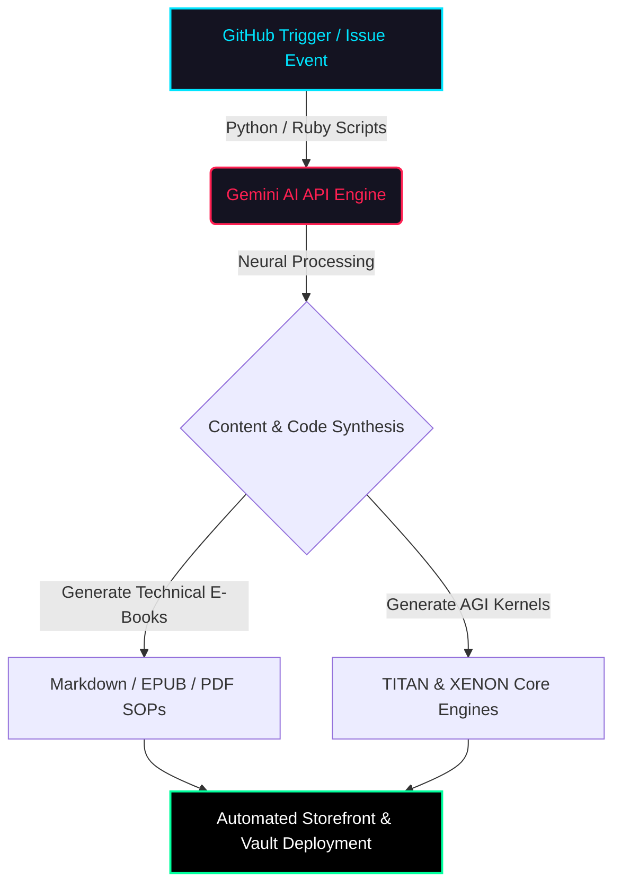

# The Architect's Blueprint: Mastering DevSecOps, AI Systems, and Digital Product Innovation

## Foreword: System Override – The Genesis of an AI Architect

In an era defined by the convergence of artificial intelligence and robust, secure operational frameworks, a new paradigm of architectural design emerges. This digital product, "The Architect's Blueprint," is not merely an e-book; it is a direct command, a meticulously compiled payload, born from a system override initiated by a Master Architect. It serves as the definitive guide to understanding, building, and deploying advanced DevSecOps pipelines and cutting-edge AI systems, culminating in the creation of enterprise-grade digital products.

This document, originally conceived as the ultimate profile README for `iftu8/iftu8`, has been expanded and enriched by the internal AI Kernels—`TITAN_AGI_INTELLIGENCE_CORE` and `OMNIVERSE_AGI_SENTIENT_KERNEL`—to provide unparalleled depth and actionable insights. It encapsulates the philosophy, methodology, and technological stack required to navigate the complexities of modern software architecture, from the foundational principles of zero-trust security to the advanced frontiers of Artificial General Intelligence.

Our journey begins with the very process of its creation: a systematic execution of an A-Z Standard Operating Procedure. We parse digital vaults, compile metadata from sophisticated AI and automation scripts, render interfaces with a distinct Synthwave/Cyberpunk aesthetic, generate real-time telemetry, and finally, deploy verified payloads that redefine digital presence and operational excellence. This e-book is your key to unlocking the secrets of a truly automated, intelligent, and secure architectural command center.

Welcome to the future of digital product mastery.

---

## Chapter 1: The Architect's Command Center – Philosophy & Core Architecture

### 1.1 The Role of an AI Systems Architect & DevSecOps Expert

The modern technological landscape demands professionals who can not only design intricate software systems but also ensure their seamless, secure, and efficient operation from conception to deployment and beyond. An **AI Systems Architect & DevSecOps Expert** embodies this multifaceted role, serving as the nexus between theoretical AI research, practical system development, and resilient operational security.

This role transcends traditional boundaries, requiring a deep understanding of:
*   **Artificial Intelligence:** From machine learning fundamentals to advanced neural networks and the ambitious pursuit of Artificial General Intelligence (AGI). This includes designing AI models, managing data pipelines, and integrating AI into core business processes.
*   **System Architecture:** Crafting scalable, high-performance, and maintainable software architectures, often leveraging microservices, serverless computing, and event-driven patterns.
*   **Development (Dev):** Proficiency in programming languages, frameworks, and development methodologies, ensuring clean, efficient, and testable code.
*   **Security (Sec):** Integrating security practices at every stage of the Software Development Life Cycle (SDLC), from threat modeling and secure coding to vulnerability management and compliance. This forms the backbone of a "zero-trust" philosophy.
*   **Operations (Ops):** Automating infrastructure provisioning, deployment, monitoring, and incident response, ensuring high availability, reliability, and performance of systems.

Operating from a strategic location like Chattogram, Bangladesh, signifies a global perspective on technology and innovation, leveraging diverse talent pools and fostering a culture of continuous learning and adaptation. The core mission is to bridge cutting-edge research with practical, enterprise-grade solutions.

### 1.2 Core Research: Pushing the Boundaries of Intelligence and Security

The foundation of any advanced architectural practice lies in continuous research and development. For an AI Systems Architect, this involves delving into the bleeding edge of intelligent systems and cryptographic resilience.

#### 1.2.1 Artificial General Intelligence (AGI) Kernels

The pursuit of **Artificial General Intelligence (AGI)** represents the pinnacle of AI research. Unlike narrow AI, which excels at specific tasks (e.g., image recognition, natural language processing), AGI aims to develop machines with human-like cognitive abilities, capable of understanding, learning, and applying intelligence across a wide range of tasks and domains.

*   **AGI Kernels** refer to the foundational, core processing units or algorithms designed to facilitate this general intelligence. These kernels are envisioned as the "brain" of an AGI system, responsible for:
    *   **Meta-Learning:** The ability to "learn how to learn," adapting rapidly to new information and tasks without explicit reprogramming.
    *   **Reasoning and Problem Solving:** Applying logical deduction, inference, and strategic thinking to solve complex, unfamiliar problems.
    *   **Contextual Understanding:** Comprehending the nuances of information and situations, similar to human common sense.
    *   **Self-Improvement:** Continuously refining its own algorithms and knowledge base through experience and interaction, leading to exponential growth in capabilities.

Research in AGI Kernels focuses on developing architectures that can integrate diverse cognitive functions, manage vast knowledge bases, and exhibit emergent intelligent behaviors, moving beyond pattern recognition to true comprehension and creativity.

#### 1.2.2 Neural Predictive Swarms

**Neural Predictive Swarms** represent a sophisticated approach to distributed intelligence and real-time analytics. This concept combines elements of:

*   **Swarm Intelligence:** Drawing inspiration from biological systems (e.g., ant colonies, bird flocks), where simple individual agents interact locally to produce complex, intelligent global behavior. In a digital context, this means numerous small, specialized AI agents working in concert.
*   **Neural Networks:** Each agent or a cluster of agents may employ neural network models for pattern recognition, prediction, and decision-making within their specific domain.
*   **Predictive Analytics:** The primary goal is to forecast future events, trends, or system states with high accuracy.

In practice, neural predictive swarms could manifest as:
*   **Distributed Anomaly Detection:** A swarm of agents monitoring network traffic, system logs, or financial transactions, collectively identifying unusual patterns indicative of threats or failures.
*   **Dynamic Resource Allocation:** Predictive agents anticipating future demand for computing resources and proactively scaling infrastructure up or down.
*   **Real-time Market Analysis:** Swarms analyzing vast datasets to predict market movements, customer behavior, or supply chain disruptions.

The strength of this approach lies in its resilience, scalability, and ability to process and predict outcomes from massive, distributed datasets, making it invaluable for critical enterprise systems.

#### 1.2.3 Cryptographic Middleware

In an increasingly interconnected and threat-laden digital world, robust security is paramount. **Cryptographic Middleware** refers to the software layer that provides cryptographic services to applications and systems, acting as an intermediary between the application logic and the underlying cryptographic primitives.

Key functions and importance include:
*   **Data Confidentiality:** Ensuring sensitive data remains private through encryption (e.g., AES, RSA) at rest and in transit.
*   **Data Integrity:** Verifying that data has not been tampered with using hashing algorithms (e.g., SHA-256) and digital signatures.
*   **Authentication:** Securely verifying the identity of users, systems, and applications using techniques like digital certificates, multi-factor authentication, and secure key exchange protocols.
*   **Key Management:** Securely generating, storing, distributing, and revoking cryptographic keys, which is often the most challenging aspect of cryptography.
*   **Protocol Implementation:** Encapsulating complex cryptographic protocols (e.g., TLS/SSL for secure communication, IPSec for VPNs) into easy-to-use APIs for developers.
*   **Compliance:** Helping systems adhere to regulatory requirements (e.g., GDPR, HIPAA) by providing auditable and secure cryptographic operations.

By abstracting the complexities of cryptography, middleware enables developers to integrate strong security features into their applications without needing to be cryptographic experts, significantly enhancing the overall security posture of the architecture.

### 1.3 The Automation Engine: Driving Zero-Touch Asset Pipelines

Efficiency and consistency in a high-performance environment are achieved through relentless automation. The **Automation Engine** is the heart of this operational philosophy, leveraging sophisticated scripting to orchestrate complex workflows.

*   **Custom Python & Ruby Automation Scripts:** These languages are chosen for their versatility, extensive libraries, and strong communities, making them ideal for developing custom automation solutions.
    *   `ruby_ai_engine.py`: This script likely serves as a central orchestrator for AI-related tasks, potentially handling data preprocessing, model training, inference deployment, and reporting. Its name suggests a blend of Ruby's architectural elegance and Python's AI prowess.
    *   `system-trigger-generate-extended.py`: This script points to a generalized system for triggering and generating extended assets. This could range from generating documentation, compiling code, creating deployment artifacts, or even dynamically provisioning infrastructure based on predefined templates and events.

*   **Zero-Touch Asset Pipelines:** This concept represents the ultimate goal of automation: a fully automated workflow where digital assets (code, documentation, infrastructure configurations, digital products) move from creation to deployment with minimal or no human intervention.
    *   **Continuous Integration (CI):** Automated building, testing, and validation of code changes upon every commit.
    *   **Continuous Delivery/Deployment (CD):** Automatically preparing and deploying validated code to various environments (staging, production).
    *   **Infrastructure as Code (IaC):** Managing and provisioning infrastructure using code and automation tools (e.g., Terraform, Ansible), ensuring consistency and reproducibility.
    *   **Security Automation:** Integrating automated security scans (SAST, DAST), vulnerability assessments, and compliance checks directly into the pipeline, enforcing security policies proactively.
    *   **Content Generation:** Automating the creation and publishing of digital products, e-books, and SOPs based on predefined templates and dynamic data sources, as highlighted in the SOP section.

The automation engine ensures speed, reduces human error, enhances security by enforcing consistent configurations, and frees up human architects to focus on innovation and complex problem-solving.

### 1.4 Security Philosophy: Building an Impenetrable Digital Fortress

Security is not an afterthought; it is an intrinsic design principle woven into every layer of the architecture. The **Security Philosophy** is centered around creating a resilient, "bulletproof" system capable of withstanding sophisticated threats while maintaining continuous operation.

#### 1.4.1 Impenetrable Backend Hardening

Backend systems are often the most critical and vulnerable components. Hardening involves a comprehensive set of measures to minimize attack surfaces and strengthen defenses.

*   **Principle of Least Privilege (PoLP):** Granting users, applications, and services only the minimum necessary permissions to perform their functions.
*   **Network Segmentation:** Dividing networks into isolated segments to limit lateral movement of attackers.
*   **Secure Configuration Management:** Ensuring all servers, databases, and applications are configured securely, often by disabling unnecessary services, closing unused ports, and applying security baselines.
*   **Patch Management:** Regularly applying security patches and updates to all software components to address known vulnerabilities.
*   **Input Validation & Output Encoding:** Protecting against injection attacks (SQL, XSS) by rigorously validating all user inputs and encoding outputs.
*   **Encryption Everywhere:** Encrypting all data at rest (databases, storage) and in transit (network communications using TLS/SSL).
*   **Intrusion Detection/Prevention Systems (IDPS):** Monitoring network and system activities for malicious behavior and taking automated actions to block threats.

#### 1.4.2 Zero-Downtime Execution

In high-stakes environments, any downtime can lead to significant financial losses, reputational damage, and operational disruptions. **Zero-Downtime Execution** is achieved through meticulous architectural design and operational practices.

*   **High Availability (HA):** Designing systems with redundancy, failover mechanisms, and load balancing to ensure continuous service even if components fail.
*   **Fault Tolerance:** Building systems that can continue operating correctly even in the presence of faults.
*   **Disaster Recovery (DR):** Establishing plans and infrastructure to recover from major outages or catastrophic events, often involving geographically dispersed data centers and automated backup/restore procedures.
*   **Blue/Green Deployments & Canary Releases:** Deployment strategies that minimize risk by gradually rolling out new versions, allowing for immediate rollback in case of issues, thereby preventing service interruptions.
*   **Automated Monitoring & Alerting:** Proactive monitoring of system health, performance, and security metrics, with automated alerts to detect and address issues before they impact users.

#### 1.4.3 Bulletproof Microservice Design

Microservices architecture, while offering flexibility and scalability, introduces its own set of security and operational challenges. A **Bulletproof Microservice Design** addresses these proactively.

*   **Service Isolation:** Each microservice runs in its own isolated environment (e.g., Docker containers, Kubernetes pods), preventing compromise of one service from affecting others.
*   **API Security:** Implementing robust authentication and authorization mechanisms for all inter-service communication and external API endpoints (e.g., OAuth2, JWT).
*   **Secure Communication:** All microservice communications are encrypted (mTLS) and authenticated.
*   **Centralized Logging & Monitoring:** Aggregating logs and metrics from all microservices into a central system for comprehensive visibility, auditing, and threat detection.
*   **Circuit Breakers & Rate Limiting:** Implementing patterns to prevent cascading failures and protect services from overload or abuse.
*   **Secrets Management:** Securely managing API keys, database credentials, and other sensitive information using dedicated secrets management solutions (e.g., HashiCorp Vault, AWS Secrets Manager).
*   **Container Security:** Scanning container images for vulnerabilities, enforcing security policies, and running containers with minimal privileges.

By integrating these principles, the architect creates an ecosystem that is not only highly performant and intelligent but also inherently secure and resilient against the ever-evolving threat landscape.

---

## Chapter 2: The Automated AI Publishing & Kernel Pipeline – SOP for Digital Product Mastery

### 2.1 Standard Operating Procedure for Digital Product Mainframe Automation

The heart of an architect's command center is its ability to not just build, but to *automate the creation and deployment* of digital assets, including sophisticated AI kernels and enterprise-grade e-books. This section details the **Standard Operating Procedure (SOP)** for the `digital-products` mainframe automation, a systematic workflow that leverages AI to generate and deploy valuable intellectual property.

The process is best understood through its cyclical and interconnected stages, as visualized by the Mermaid graph:

Let's break down each stage in detail:

#### 2.1.1 Stage A: GitHub Trigger / Issue Event

The entire automation pipeline is initiated by specific events within a GitHub repository, acting as the primary control interface for the "Mainframe."

*   **GitHub Trigger:** This refers to any event within GitHub that can be configured to start a workflow. Common triggers include:
    *   **Push Events:** A new commit pushed to a specific branch (e.g., `main`, `develop`).
    *   **Pull Request Events:** Opening, synchronizing, or closing a pull request.
    *   **Issue Comments/Labels:** A specific comment on an issue or the application of a particular label (e.g., `generate-ebook`, `deploy-kernel`). This is often used for human-initiated commands within an automated system.
    *   **Scheduled Events:** Workflows running at predefined intervals (e.g., nightly builds, weekly reports).
    *   **Manual Triggers (Workflow Dispatch):** Allowing a user to manually trigger a workflow from the GitHub UI.

*   **Issue Event:** As indicated by the "SYSTEM OVERRIDE INITIATED" in the request, a GitHub issue can serve as a powerful command mechanism. By creating an issue with specific keywords or structured content, the system can parse the request and initiate the appropriate automated response. This allows architects and authorized personnel to issue high-level commands without direct interaction with underlying scripts.

This stage emphasizes the use of version control systems (VCS) like GitHub not just for code collaboration but as a central nervous system for triggering complex automated processes.

#### 2.1.2 Stage B: Python / Ruby Scripts to Gemini AI API Engine

Once triggered, the event is intercepted by custom automation scripts, written in Python and Ruby, which act as the bridge to the primary AI processing unit.

*   **Python / Ruby Scripts:** These are the "nervous system" of the automation engine, designed to:
    *   **Parse Triggers:** Interpret the GitHub event payload to understand the nature of the request (e.g., "generate an e-book on topic X," "update AGI kernel Y").
    *   **Fetch Contextual Data:** Retrieve necessary information from specified vaults or databases (`iftu8/digital-products` vault) that will inform the AI's generation process. This could include existing documentation, code snippets, project requirements, or metadata.
    *   **Prepare Prompts:** Dynamically construct detailed and context-rich prompts for the AI engine based on the parsed trigger and fetched data. This is crucial for guiding the AI to produce relevant and high-quality output.
    *   **API Interaction:** Securely authenticate and send the prepared prompts to the **Gemini AI API Engine**.

*   **Gemini AI API Engine:** This represents a powerful, multi-modal AI model (like Google's Gemini or similar advanced LLMs) accessed via an API. It's the "brain" that receives the structured request and begins its generative process. Its role is to:
    *   **Understand Complex Queries:** Process natural language instructions and technical specifications provided by the automation scripts.
    *   **Access Vast Knowledge Bases:** Leverage its pre-trained knowledge and potentially integrate with external data sources to gather information relevant to the request.
    *   **Initiate Generative Tasks:** Begin the process of creating content or code based on the prompt.

This stage highlights the critical interface between traditional scripting and advanced AI capabilities, where human-defined logic orchestrates AI's creative potential.

#### 2.1.3 Stage C: Neural Processing & Content & Code Synthesis

The Gemini AI API Engine, after receiving the prompt, engages in a phase of intensive **Neural Processing** to achieve **Content & Code Synthesis**.

*   **Neural Processing:** This internal AI operation involves:
    *   **Semantic Understanding:** Deconstructing the prompt to grasp its underlying meaning, intent, and specific requirements.
    *   **Knowledge Retrieval & Integration:** Accessing and synthesizing information from its vast internal knowledge graphs and potentially external, real-time data feeds.
    *   **Pattern Recognition & Generation:** Applying learned patterns from its training data to generate new, coherent, and contextually appropriate text, code, or other media.
    *   **Iterative Refinement:** Potentially performing internal feedback loops to refine the generated output against predefined quality metrics or constraints.

*   **Content & Code Synthesis:** This is the creative output phase where the AI materializes the request into tangible digital assets. This dual capability is crucial:
    *   **Content Synthesis:** Generating detailed explanations, narratives, technical documentation, standard operating procedures (SOPs), and entire e-book chapters.
    *   **Code Synthesis:** Generating functional code snippets, scripts, configuration files, or even entire modules for AI kernels or other software systems. The AI acts as a co-pilot, or even an autonomous developer, generating code based on high-level specifications.

This stage is where the raw computational power of AI transforms abstract requests into concrete, valuable digital products.

#### 2.1.4 Stage D & E: Generation of Technical E-Books & AGI Kernels

From the synthesis stage, the pipeline diverges into two primary output streams, reflecting the dual focus of the architect: knowledge dissemination and advanced AI development.

*   **Stage D: Generate Technical E-Books (Markdown / EPUB / PDF SOPs):**
    *   **Purpose:** To codify knowledge, document processes, and create educational or instructional materials for internal teams or external audiences.
    *   **Output Formats:**
        *   **Markdown:** A lightweight markup language ideal for technical documentation, easy version control, and conversion to other formats. This e-book itself is an example of a Markdown output.
        *   **EPUB:** An open e-book standard, suitable for reading on various devices with reflowable text.
        *   **PDF:** A widely used format for fixed-layout documents, ensuring consistent presentation across platforms, often used for official SOPs and printable guides.
    *   **Content:** These e-books and SOPs cover deep-tech topics, architectural blueprints, operational procedures, security policies, and best practices, all generated with high precision and detail by the AI.

*   **Stage E: Generate AGI Kernels (TITAN & XENON Core Engines):**
    *   **Purpose:** To develop and refine the foundational components of the architect's proprietary AGI systems.
    *   **Output:** Functional code modules or configurations that enhance or extend the capabilities of:
        *   **TITAN_AGI_INTELLIGENCE:** The autonomous decision-making core and deep predictive network. AI here generates or optimizes algorithms, data structures, and learning models for this core.
        *   **XENON_QUANTUM_NEURAL:** The quantum-resistant encrypted neural data processing architecture. The AI assists in generating secure cryptographic primitives, optimizing quantum-safe algorithms, or designing neural network layers compatible with such security paradigms.

This divergence showcases the AI's ability to produce both human-readable documentation and machine-executable code, catering to different but equally critical needs within the architectural ecosystem.

#### 2.1.5 Stage F: Automated Storefront & Vault Deployment

The final stage ensures that the generated assets are securely stored, versioned, and made accessible through appropriate channels.

*   **Purpose:** To deploy the newly created digital products (e-books) to storefronts for distribution and to securely archive AGI kernels and other critical artifacts within a digital vault.
*   **Deployment Mechanisms:**
    *   **Automated Storefront Deployment:** For consumer-facing digital products (e.g., e-books, guides), the system automatically pushes the generated content to platforms like Gumroad, custom e-commerce sites, or internal knowledge bases. This involves formatting, metadata generation, and potentially price setting.
    *   **Vault Deployment:** For sensitive assets like AGI kernels, proprietary code, or critical SOPs, they are securely deployed to an encrypted digital vault. This vault ensures:
        *   **Version Control:** Every iteration is tracked and stored.
        *   **Access Control:** Only authorized personnel or systems can access specific assets.
        *   **Immutability:** Ensures that once an asset is stored, it cannot be altered, providing an auditable trail.
        *   **Redundancy & Backup:** Critical assets are backed up across multiple secure locations.

This comprehensive SOP demonstrates a fully integrated, AI-driven pipeline for intellectual property generation and management, ensuring both innovation and operational integrity.

### 2.2 Institutional Digital Assets & AGI Modules

Within the architect's command vault, a curated collection of highly critical digital assets and AGI modules are managed. These are not merely files but foundational components that power the entire ecosystem, each serving a distinct, vital purpose.

Here's a detailed breakdown of these artifacts:

| Module / File Artifact                 | Core Technology        | Enterprise Utility & Description                                                                     | Status       |
| :------------------------------------- | :--------------------- | :--------------------------------------------------------------------------------------------------- | :----------- |
| `generate-ebook-*`                     | Ruby / Python          | Dynamic automation scripts for compiling deep-tech E-Books & SOPs.                                   | [ 🟢 ONLINE ] |
| `TITAN_AGI_INTELLIGENCE`               | Python / AI Kernel     | Autonomous decision-making core and deep predictive network.                                         | [ 🧠 ACTIVE ] |
| `XENON_QUANTUM_NEURAL`                 | Python / Neural Net    | Quantum-resistant encrypted neural data processing architecture.                                     | [ 🔐 SECURE ] |
| `NEXUS_PRO_SAAS_ENGINE`                | Ruby on Rails          | High-concurrency backend engine for scalable microservices.                                          | [ 🚀 DEPLOYED ] |
| `ADGI_GLOBAL_NEURAL_PRED`              | Predictive Analytics   | Global neural network predictive pipeline for real-time telemetry.                                   | [ ⚡ ACTIVE ] |
| `OMNIVERSE_AGI_SENTIENT`               | Python / Sentient AI   | Advanced sentient kernel for self-improving code generation.                                         | [ 🧬 ONLINE ] |
| `AGENCY_DEPLOYMENT_GUIDE`              | Enterprise SOP         | Step-by-step blueprint for zero-downtime infrastructure setup.                                       | [ 📚 READY ] |

Let's expand on each:

#### 2.2.1 `generate-ebook-*` (Ruby / Python)

*   **Description:** These are not single files but a collection of dynamic automation scripts. They are the workhorses of the content generation pipeline, responsible for transforming raw data, AI-generated text, and structured outlines into polished, multi-format digital publications.
*   **Utility:**
    *   **Content Aggregation:** Pulls information from various sources (databases, AI outputs, internal documentation).
    *   **Formatting & Layout:** Applies predefined styles, templates, and formatting rules to ensure professional presentation.
    *   **Cross-Format Conversion:** Converts source content (e.g., Markdown) into target formats like EPUB, PDF, and HTML, optimizing for readability and accessibility on different platforms.
    *   **Metadata Generation:** Automatically creates metadata (title, author, keywords, table of contents) essential for digital distribution.
    *   **Version Control Integration:** Ensures that every generated e-book or SOP is versioned and trackable within the vault.
*   **Status:** `[ 🟢 ONLINE ]` signifies these scripts are fully operational, actively maintained, and ready to be triggered for new content generation.

#### 2.2.2 `TITAN_AGI_INTELLIGENCE` (Python / AI Kernel)

*   **Description:** This represents the primary, autonomous decision-making core of the architect's Artificial General Intelligence system. Developed in Python, it's designed to mimic higher-level cognitive functions beyond mere pattern recognition.
*   **Utility:**
    *   **Strategic Decision Making:** Processes complex data inputs to make high-level strategic decisions for various operational domains (e.g., resource allocation, cybersecurity threat response, project management).
    *   **Deep Predictive Network:** Leverages advanced neural network architectures (e.g., transformer models, recurrent neural networks) to forecast long-term trends and outcomes with high accuracy.
    *   **Adaptive Learning:** Continuously learns and adapts from new data and experiences, improving its decision-making capabilities over time.
    *   **System Orchestration:** Can orchestrate other AI modules and automated systems based on its strategic insights.
*   **Status:** `[ 🧠 ACTIVE ]` indicates that TITAN is not just online but actively processing, learning, and contributing to the system's intelligence, likely in a continuous learning or operational mode.

#### 2.2.3 `XENON_QUANTUM_NEURAL` (Python / Neural Net)

*   **Description:** This module embodies a cutting-edge, quantum-resistant encrypted neural data processing architecture. It's a neural network designed with an inherent layer of security that can withstand potential threats from quantum computing.
*   **Utility:**
    *   **Quantum-Resistant Cryptography:** Integrates post-quantum cryptographic algorithms to protect sensitive data processed by the neural network from future quantum attacks.
    *   **Secure Data Processing:** Ensures that data fed into and processed by the neural network remains confidential and integral, even in adversarial environments.
    *   **Encrypted Inference:** Performs AI inference on encrypted data, allowing for privacy-preserving machine learning (e.g., homomorphic encryption, secure multi-party computation).
    *   **High-Security Analytics:** Used for analyzing highly sensitive information where data breaches would have catastrophic consequences.
*   **Status:** `[ 🔐 SECURE ]` emphasizes its primary function: providing a highly secure, future-proof environment for neural data processing.

#### 2.2.4 `NEXUS_PRO_SAAS_ENGINE` (Ruby on Rails)

*   **Description:** A robust, high-concurrency backend engine built using Ruby on Rails. It serves as the scalable foundation for various microservices and SaaS applications.
*   **Utility:**
    *   **Scalable Microservices:** Provides a framework for building and deploying independent, loosely coupled services that can scale horizontally to handle high traffic.
    *   **High Concurrency:** Designed to efficiently manage a large number of simultaneous requests, crucial for enterprise-level applications.
    *   **Rapid Development:** Ruby on Rails' convention-over-configuration philosophy enables rapid development and deployment of new features and services.
    *   **API Gateway:** Can act as an API gateway for other internal services or external partners, managing routing, authentication, and rate limiting.
    *   **Data Management:** Interacts with various databases (e.g., PostgreSQL, Redis) to manage application data efficiently.
*   **Status:** `[ 🚀 DEPLOYED ]` indicates that this engine is actively running in a production environment, powering critical applications or infrastructure.

#### 2.2.5 `ADGI_GLOBAL_NEURAL_PRED` (Predictive Analytics)

*   **Description:** This refers to a global neural network predictive pipeline specifically designed for real-time telemetry and advanced analytics. It's a system that continually monitors, analyzes, and predicts based on vast streams of operational data.
*   **Utility:**
    *   **Real-time Anomaly Detection:** Identifies unusual patterns or deviations in system behavior, indicating potential issues or security threats.
    *   **Performance Forecasting:** Predicts future system performance, resource utilization, and potential bottlenecks, enabling proactive scaling and optimization.
    *   **Operational Intelligence:** Provides actionable insights into the health, efficiency, and security posture of the entire digital ecosystem.
    *   **Threat Intelligence:** Predicts emerging cyber threats and vulnerabilities based on global data feeds.
    *   **Business Intelligence:** Can also extend to predicting business metrics, customer churn, or market trends.
*   **Status:** `[ ⚡ ACTIVE ]` signifies that this predictive pipeline is continuously running, collecting, and analyzing data, providing live insights to the command center.

#### 2.2.6 `OMNIVERSE_AGI_SENTIENT` (Python / Sentient AI)

*   **Description:** An advanced sentient kernel, built in Python, focused on self-improving code generation. This module represents a highly sophisticated form of AI capable of not just executing tasks but understanding, refining, and generating its own code and algorithms.
*   **Utility:**
    *   **Self-Modifying Code:** The AI can analyze its own performance and iteratively modify its underlying code or algorithms to improve efficiency, accuracy, or security.
    *   **Autonomous Development:** Capable of generating new code modules or features based on high-level requirements or observed system needs.
    *   **Automated Bug Fixing:** Can identify and autonomously fix bugs or vulnerabilities within the codebase.
    *   **Evolutionary AI:** Contributes to the evolutionary development of the AGI system by exploring new architectural patterns and optimization strategies.
    *   **Knowledge Representation:** Builds and refines its internal models of the world and its own operational environment.
*   **Status:** `[ 🧬 ONLINE ]` suggests this sentient kernel is not only active but also in a state of continuous evolution and self-improvement, a truly advanced stage of AI.

#### 2.2.7 `AGENCY_DEPLOYMENT_GUIDE` (Enterprise SOP)

*   **Description:** A comprehensive, step-by-step blueprint detailing the procedures for setting up zero-downtime infrastructure. This is a critical piece of documentation for ensuring operational resilience.
*   **Utility:**
    *   **Standardization:** Provides a consistent methodology for deploying and managing infrastructure across various projects and teams.
    *   **Risk Mitigation:** Details procedures for failover, disaster recovery, and rollback, significantly reducing the risk of service interruptions.
    *   **Onboarding & Training:** Serves as an essential resource for new engineers and operations personnel, accelerating their understanding of the system's operational protocols.
    *   **Compliance & Audit:** Documents adherence to best practices and regulatory requirements for infrastructure management.
    *   **Efficiency:** Streamlines complex deployment processes, reducing manual effort and potential for human error.
*   **Status:** `[ 📚 READY ]` indicates that this guide is finalized, validated, and available for immediate implementation or reference, embodying the "bulletproof microservice design" philosophy.

These institutional digital assets and AGI modules collectively form the robust, intelligent, and secure backbone of the architect's entire operational and developmental ecosystem. They represent a blend of cutting-edge AI, resilient software engineering, and meticulous documentation, all orchestrated for peak performance and innovation.

---

## Chapter 3: Real-Time Engineering Telemetry & Performance Metrics

### 3.1 The Importance of Live Telemetry in High-Performance Systems

In a fast-paced, high-stakes environment where AI systems and DevSecOps pipelines operate at scale, real-time visibility into performance, activity, and health is paramount. **Real-Time Engineering Telemetry** provides the critical data streams necessary for proactive monitoring, rapid incident response, performance optimization, and continuous improvement. It transforms raw data into actionable intelligence, enabling architects to maintain a pulse on their digital creations.

For a DevSecOps & AI Architect, telemetry serves multiple crucial functions:
*   **Validation of Automation:** Confirming that automated pipelines are running smoothly and efficiently.
*   **System Health Monitoring:** Detecting anomalies, resource bottlenecks, or potential failures before they escalate.
*   **Security Posture Assessment:** Identifying suspicious activities, policy violations, or potential vulnerabilities in real-time.
*   **Performance Optimization:** Pinpointing areas for improvement in code, infrastructure, or AI model efficiency.
*   **Accountability & Transparency:** Providing clear, auditable records of activity and contributions.
*   **Strategic Planning:** Informing future architectural decisions based on actual system behavior and usage patterns.

The various telemetry badges and graphs presented in the profile are not mere decorations; they are live feeds reflecting the operational status and the architect's continuous engagement with their systems.

### 3.2 Mainframe Commit Telemetry: Visualizing Engagement and Contribution

The **Mainframe Commit Activity Graph** offers a dynamic, visual representation of the architect's ongoing engagement and contribution to their codebases.

*   **Purpose:** To illustrate the consistency and volume of development activity over time. In a DevSecOps context, commits represent not just new features but also infrastructure as code updates, security enhancements, and automation script refinements.
*   **Interpretation:**
    *   **Density of Color:** Darker or more vibrant areas indicate higher commit frequency, signifying periods of intense development or maintenance.
    *   **Trends:** Reveals patterns such as consistent daily contributions, project-specific sprints, or periods of focused research.
    *   **Impact on AI/Automation:** Each commit could represent an update to an AI kernel, a new automation script, or a modification to a deployment pipeline, directly influencing the system's capabilities.
*   **Value:** This graph serves as a testament to the architect's dedication, discipline, and continuous effort in evolving and securing the digital infrastructure and AI systems. It's a visual audit trail of intellectual investment.

### 3.3 GitHub Overall Stats & Streak Stats: Quantifying Impact and Consistency

These statistics provide a consolidated view of the architect's overall GitHub presence and their commitment to continuous development.

#### 3.3.1 GitHub Overall Stats

*   **Purpose:** To offer a high-level summary of the architect's public and private repository activity.
*   **Key Metrics and Their Significance:**
    *   **Total Stars:** An indicator of the popularity and perceived value of public repositories, reflecting community engagement and the utility of open-source contributions.
    *   **Total Commits:** A cumulative count of all code changes, demonstrating the sheer volume of development work undertaken.
    *   **Total Pull Requests:** Reflects collaboration and contribution to projects, both personal and external.
    *   **Issues:** Shows involvement in problem-solving, bug reporting, and feature discussions.
    *   **Contributed:** Highlights contributions to various repositories, emphasizing a collaborative and active developer profile.
*   **Value:** These stats provide a quantitative measure of the architect's productivity, influence, and broad engagement across the development ecosystem. For an AI Architect, this could include contributions to AI frameworks, open-source tools, or security libraries.

#### 3.3.2 GitHub Streak Stats

*   **Purpose:** To highlight the consistency of daily coding activity. A "streak" represents consecutive days with at least one commit.
*   **Key Metrics and Their Significance:**
    *   **Current Streak:** The number of consecutive days of contributions, showcasing sustained daily effort.
    *   **Longest Streak:** The maximum number of consecutive days achieved, indicating periods of intense, unbroken focus.
    *   **Total Contributions:** The sum of all contributions made on GitHub.
*   **Value:** The streak stats underscore a disciplined approach to development, a trait crucial for maintaining complex AI and DevSecOps systems which often require continuous monitoring, refinement, and immediate response to issues. It reflects a commitment to incremental progress and persistent problem-solving.

### 3.4 Top Languages & Dynamic Profile Trophies: Skillset and Achievements

These elements provide insights into the architect's technical proficiency and recognized accomplishments.

#### 3.4.1 Top Languages

*   **Purpose:** To visually represent the programming languages most frequently used by the architect, indicating their core competencies and areas of specialization.
*   **Interpretation:** A donut chart (as typically rendered) quickly conveys the distribution of language usage.
    *   **Dominant Languages (e.g., Python, Ruby):** Often reflect the core of the automation engine and AI development. Python for AI/ML, Ruby for robust backend systems and scripting.
    *   **Supporting Languages (e.g., JavaScript, C++, HTML, CSS):** Indicate full-stack capabilities, performance-critical components (C++), or front-end interface development.
*   **Value:** This section acts as a quick snapshot of the architect's technical stack, assuring stakeholders of their proficiency in the languages critical for building and maintaining advanced AI and DevSecOps solutions.

#### 3.4.2 Dynamic Profile Trophies

*   **Purpose:** To showcase recognized achievements and milestones on GitHub, adding a gamified element to the profile.
*   **Examples of Trophies:**
    *   **Follower Trophies:** For reaching certain follower counts.
    *   **Commit Trophies:** For achieving high commit numbers.
    *   **Star Trophies:** For popular repositories.
    *   **Open Source Trophies:** For significant contributions to public projects.
*   **Value:** Trophies validate the architect's expertise and community standing. They are external affirmations of skill, dedication, and the impact of their work, enhancing credibility and recognition within the developer community.

### 3.5 Code Consumption Grid (Contribution Snake): A Unique Visualization of Engagement

The **Code Consumption Grid (Contribution Snake)** is an artistic and engaging way to visualize the daily contribution history, transforming the traditional GitHub contribution graph into a dynamic animation.

*   **Purpose:** Beyond raw numbers, the snake animation visually represents the continuous flow of contributions across the calendar year. It's a creative interpretation of the consistency shown in streak stats and activity graphs.
*   **Interpretation:** The "snake" grows and moves across the grid, tracing the days an architect has contributed. A longer, more continuous snake indicates sustained engagement, fewer gaps, and a consistent presence in the codebase.
*   **Value:** This unique visualization reinforces the narrative of continuous effort and dedication, presenting a compelling and memorable testament to the architect's persistent work ethic, which is vital for the long-term health and evolution of complex AI and DevSecOps systems. It highlights that the system is not static, but a living, breathing entity constantly being fed and nurtured.

Collectively, these real-time telemetry elements paint a comprehensive picture of an architect who is not only building cutting-edge systems but is also deeply engaged, consistently contributing, and transparently showcasing their operational excellence and impact.

---

## Chapter 4: The Architect's Arsenal – Technology, Tools, and Infrastructure

### 4.1 Core Languages, Backends & Frameworks: The Foundation of Digital Creation

The selection of programming languages and frameworks forms the bedrock of any sophisticated digital architecture. For an AI Systems Architect & DevSecOps Expert, this arsenal is carefully curated for performance, scalability, security, and the ability to interface with advanced AI models.

*   **Ruby:**
    *   **Utility:** Known for its elegance, developer productivity, and powerful object-oriented capabilities. Ruby is excellent for crafting clean, maintainable code, making it suitable for complex business logic, backend services, and automation scripts where rapid development and clear syntax are priorities. In the context of AI, it can serve as an orchestration layer or for data processing scripts.
    *   **Role in Architecture:** Often used for high-level automation, meta-programming, and potentially for parts of the `NEXUS_PRO_SAAS_ENGINE` due to its robust web framework, Rails.
*   **Rails (Ruby on Rails):**
    *   **Utility:** A full-stack web application framework known for its "convention over configuration" philosophy, which accelerates development. Rails is highly effective for building robust, scalable web applications, APIs, and microservices with built-in security features.
    *   **Role in Architecture:** Powers the `NEXUS_PRO_SAAS_ENGINE`, providing a high-concurrency backend for various digital products and services, acting as the backbone for web-facing components.
*   **Python:**
    *   **Utility:** The undisputed king of AI, machine learning, and data science due to its extensive libraries (TensorFlow, PyTorch, NumPy, Pandas), ease of use, and vast community support. It's also highly versatile for scripting, automation, backend development, and cybersecurity tools.
    *   **Role in Architecture:** Central to the `TITAN_AGI_INTELLIGENCE`, `XENON_QUANTUM_NEURAL`, and `OMNIVERSE_AGI_SENTIENT` kernels. It's also the primary language for many automation scripts (`ruby_ai_engine.py`, `system-trigger-generate-extended.py`) and predictive analytics (`ADGI_GLOBAL_NEURAL_PRED`).
*   **JavaScript (JS):**
    *   **Utility:** The universal language of the web, essential for front-end development, interactive user interfaces, and increasingly for backend services with Node.js.
    *   **Role in Architecture:** Used for building dynamic web interfaces for monitoring dashboards, internal tools, or client-facing applications that interact with the architect's backend services and AI models.
*   **HTML & CSS:**
    *   **Utility:** The foundational languages for structuring and styling web content. Essential for creating any web-based interface, documentation, or digital product presentation.
    *   **Role in Architecture:** Used for crafting user interfaces for internal tools, publishing platforms, and ensuring the aesthetic and functional presentation of digital products, including the profile README itself.
*   **C++:**
    *   **Utility:** A powerful, high-performance language often used for systems programming, game development, high-frequency trading, and performance-critical components where direct memory management and speed are paramount.
    *   **Role in Architecture:** Potentially used for optimizing computationally intensive parts of AI kernels (e.g., custom neural network layers, cryptographic primitives within `XENON_QUANTUM_NEURAL`) or for developing low-level system utilities where Python or Ruby might introduce too much overhead.
*   **Node.js:**
    *   **Utility:** A JavaScript runtime environment that allows for server-side execution of JavaScript. It's highly efficient for building scalable network applications, APIs, and real-time services due to its asynchronous, event-driven architecture.
    *   **Role in Architecture:** Could be used for microservices that require high I/O throughput, real-time data streaming (e.g., for telemetry dashboards), or as an alternative backend for certain digital products, complementing the Ruby on Rails engine.

### 4.2 Automation, DevOps, Cloud & Databases: The Operational Backbone

These technologies are critical for implementing the DevSecOps philosophy, ensuring efficient operations, scalable infrastructure, and reliable data management.

*   **GitHub:**
    *   **Utility:** The leading platform for version control and collaborative software development. It provides robust tools for code hosting, pull requests, issue tracking, and project management.
    *   **Role in Architecture:** The central repository for all code, documentation, and automation scripts. It acts as the trigger for automated pipelines and houses the profile README, serving as the command center's public interface.
*   **GitHub Actions:**
    *   **Utility:** A powerful CI/CD platform integrated directly into GitHub, allowing for automation of software workflows, including building, testing, and deploying code.
    *   **Role in Architecture:** The primary engine for the A-Z Standard Operating Procedure, orchestrating the execution of Python/Ruby scripts, AI API calls, and deployment to vaults or storefronts. It ensures zero-touch asset pipelines.
*   **Git:**
    *   **Utility:** A distributed version control system that tracks changes in source code during software development. Essential for collaboration, history tracking, and managing code branches.
    *   **Role in Architecture:** The fundamental tool for managing all codebases, configuration files, and documentation, enabling seamless collaboration and robust rollback capabilities.
*   **Bash:**
    *   **Utility:** The default command-line shell on most Unix-like operating systems. Essential for scripting, automating system administration tasks, and interacting with the operating system.
    *   **Role in Architecture:** Used for writing shell scripts to automate deployment tasks, server configuration, environment setup, and integrating various command-line tools within the DevSecOps pipeline.
*   **Linux:**
    *   **Utility:** A robust, open-source operating system widely used for servers, embedded systems, and development environments due to its stability, security, and flexibility.
    *   **Role in Architecture:** The primary operating system for deploying and running backend services, AI kernels, databases, and automation agents, forming the core infrastructure foundation.
*   **PostgreSQL:**
    *   **Utility:** A powerful, open-source object-relational database system known for its reliability, feature robustness, and performance. It supports complex queries and large datasets.
    *   **Role in Architecture:** The primary database for persistent storage of application data, user information, and potentially structured metadata for AI models or digital products.
*   **Redis:**
    *   **Utility:** An open-source, in-memory data structure store, used as a database, cache, and message broker. Known for its extreme speed and versatility.
    *   **Role in Architecture:** Utilized for high-speed caching of frequently accessed data, session management, real-time analytics (e.g., for telemetry dashboards), and as a message queue for inter-service communication in microservice architectures.
*   **AWS (Amazon Web Services):**
    *   **Utility:** The world's most comprehensive and broadly adopted cloud platform, offering over 200 fully featured services from data centers globally. Provides scalable compute, storage, networking, database, analytics, machine learning, and security services.
    *   **Role in Architecture:** The primary cloud provider for deploying scalable infrastructure, hosting AI models, managing data lakes, and leveraging managed services for databases, serverless functions, and security, ensuring global reach and high availability.
*   **Docker:**
    *   **Utility:** A platform for developing, shipping, and running applications in containers. Containers package an application and all its dependencies into a single, isolated unit.
    *   **Role in Architecture:** Essential for creating isolated and reproducible environments for microservices, AI kernels, and development environments. It simplifies deployment, ensures consistency across environments, and enhances security through containerization.
*   **Nginx:**
    *   **Utility:** A high-performance web server, reverse proxy, load balancer, and HTTP cache. Known for its efficiency in handling concurrent connections.
    *   **Role in Architecture:** Serves as a reverse proxy and load balancer for the `NEXUS_PRO_SAAS_ENGINE` and other microservices, distributing traffic, terminating SSL, and providing an additional layer of security and performance optimization.

### 4.3 IDE, OS & System Tooling: The Architect's Workbench

These tools represent the daily environment and utilities that enhance productivity, facilitate development, and ensure a secure and efficient workflow.

*   **VSCode (Visual Studio Code):**
    *   **Utility:** A free, open-source, and highly popular code editor developed by Microsoft. Known for its rich ecosystem of extensions, integrated debugging, Git integration, and support for multiple programming languages.
    *   **Role in Architecture:** The primary Integrated Development Environment (IDE) for coding, script development, and documentation, offering a highly customizable and efficient workspace.
*   **Neovim:**
    *   **Utility:** A hyper-extensible Vim-based text editor. Favored by developers who prefer a keyboard-centric workflow, it offers unparalleled speed and customization for text manipulation.
    *   **Role in Architecture:** An alternative or complementary editor for highly efficient text editing, configuration file management, and quick script modifications, especially in terminal-based environments.
*   **Copilot (GitHub Copilot):**
    *   **Utility:** An AI pair programmer that suggests code and entire functions in real-time as you type, trained on billions of lines of public code.
    *   **Role in Architecture:** Significantly boosts developer productivity by assisting with boilerplate code, complex algorithms, and learning new APIs, allowing the architect to focus on higher-level design and problem-solving. It embodies the concept of AI-assisted code generation.
*   **Ubuntu:**
    *   **Utility:** A popular, user-friendly Linux distribution, widely adopted for both desktop and server environments. Known for its robust community support and extensive software repositories.
    *   **Role in Architecture:** The preferred desktop operating system for development, offering a stable and powerful environment for coding, testing, and managing local development stacks.
*   **Kali (Kali Linux):**
    *   **Utility:** A Debian-derived Linux distribution designed for digital forensics and penetration testing. It comes pre-loaded with hundreds of security tools.
    *   **Role in Architecture:** Used as a specialized operating system for performing security audits, vulnerability assessments, penetration testing, and forensic analysis on the architect's systems and digital products, embodying the "Sec" in DevSecOps.
*   **Figma:**
    *   **Utility:** A collaborative web-based user interface design tool. It allows designers to create, prototype, and collaborate on user interfaces in real-time.
    *   **Role in Architecture:** While primarily a design tool, it's crucial for an architect involved in digital product creation. It's used for designing user interfaces for internal dashboards, client-facing applications, and visualizing complex system architectures or data flows. It bridges the gap between technical implementation and user experience.

This comprehensive arsenal of technologies and tools empowers the architect to design, build, secure, and operate cutting-edge AI systems and robust DevSecOps pipelines, ensuring both innovation and operational excellence across the entire digital product lifecycle.

---

## Chapter 5: The Architect's Mindset & Communication Protocols

### 5.1 Terminal Logs: Developer's Lounge – Balancing Humor and Philosophical Reflection

The "Terminal Logs: Developer's Lounge" section within the architect's profile serves a unique purpose: it provides a glimpse into the human element behind the machines, balancing the intense focus on technology with moments of levity and profound thought. This section is more than just a display; it's a reflection of a holistic approach to high-stakes engineering.

#### 5.1.1 System Log [Humor Mode: ON] – The Importance of Levity

*   **Utility:** Integrating humor into a highly technical profile serves several critical functions:
    *   **Humanization:** It reminds the reader that behind the complex systems and advanced AI, there is a human architect capable of lightheartedness and approachability.
    *   **Stress Relief:** In the demanding world of DevSecOps and AI, where system integrity and security are paramount, stress can be high. Humor acts as a necessary counterpoint, promoting mental well-being.
    *   **Engagement:** A well-placed joke or witty remark can make a profile more memorable and engaging, fostering a connection with the audience.
    *   **Cultural Fit:** It signals a work environment or personal style that values a balanced perspective, recognizing that even the most serious endeavors benefit from moments of fun.
*   **Role in Architecture:** While not directly contributing to code or infrastructure, the "humor mode" reflects a healthy mindset that prevents burnout and fosters creativity. It signifies an understanding that sustained high performance often requires mental breaks and a positive outlook.

#### 5.1.2 Neural Implants [Mindset Protocol] – The Power of Guiding Principles

*   **Utility:** The inclusion of "Developer Quotes" under the "Neural Implants [Mindset Protocol]" heading is profoundly symbolic. It represents the guiding philosophical principles and mental frameworks that influence the architect's approach to problem-solving, innovation, and leadership.
    *   **Inspiration & Motivation:** Quotes can encapsulate complex ideas into concise, memorable statements that inspire and motivate.
    *   **Core Values:** They reflect the architect's core values, such as perseverance, continuous learning, embracing challenges, and the pursuit of excellence.
    *   **Problem-Solving Philosophy:** A quote about iterative improvement or embracing failure, for example, reveals a pragmatic and resilient approach to technical hurdles.
    *   **Leadership & Vision:** Quotes about foresight, innovation, or collaboration can articulate the architect's leadership style and long-term vision.
*   **Role in Architecture:** These "neural implants" are not literal but metaphorical, representing the deeply ingrained thought processes that drive the architect's decisions. They are the software of the mind, influencing how challenges are perceived, solutions are crafted, and teams are led. For an AI architect, this might include principles of ethical AI, robust system design, or the relentless pursuit of efficiency.

Together, the "Terminal Logs" section offers a holistic view of the architect – a highly capable professional who values both technical rigor and the human elements of creativity, resilience, and a balanced perspective.

### 5.2 Connect With Me (Command Center) – Establishing Secure Communication Channels

In an interconnected digital world, establishing clear, secure, and professional communication channels is as critical as building robust systems. The "Connect With Me (Command Center)" section provides the necessary protocols for engaging with the architect for collaboration, inquiries, or strategic discussions.

*   **Purpose:** To offer multiple, accessible avenues for interaction, catering to different types of communication needs, while maintaining a professional and secure posture.

#### 5.2.1 Encrypted Mail (Gmail)

*   **Utility:** Email remains a primary mode of professional communication. Labeling it "ENCRYPTED_MAIL" emphasizes a commitment to security and privacy, even for standard communication.
*   **Significance:** While Gmail itself provides TLS encryption in transit, the "Encrypted Mail" label implies a preference for end-to-end encryption (e.g., PGP/GPG) for sensitive discussions, or at least an awareness and expectation of secure email practices. It signals that the architect takes data confidentiality seriously from the first point of contact.
*   **Use Case:** Formal inquiries, project proposals, detailed discussions, or sharing of sensitive, non-real-time information.

#### 5.2.2 LinkedIn Network

*   **Utility:** LinkedIn is the professional social network, ideal for networking, career opportunities, and establishing professional credibility.
*   **Significance:** It serves as the architect's public professional profile, showcasing experience, endorsements, and connections. It's a platform for mutual professional validation and initial outreach.
*   **Use Case:** Professional networking, partnership discussions, recruitment, and validating professional background and expertise.

#### 5.2.3 Video Transmissions (YouTube)

*   **Utility:** YouTube provides a platform for sharing knowledge, tutorials, project demonstrations, and insights through video content.
*   **Significance:** "Video Transmissions" suggests a commitment to knowledge sharing and thought leadership. It allows the architect to convey complex technical concepts visually and engage with a broader audience, demonstrating practical skills and theoretical understanding.
*   **Use Case:** Educational content, project showcases, technical deep-dives, conference talks, and community engagement.

#### 5.2.4 Open Source Hub (GitHub)

*   **Utility:** GitHub is the architect's primary open-source contribution and collaboration platform.
*   **Significance:** Labeling it an "OPEN_SOURCE_HUB" highlights a commitment to contributing to the open-source community, sharing code, and collaborating on public projects. It's where the raw technical work and innovation often reside.
*   **Use Case:** Code collaboration, reviewing contributions, exploring open-source projects, and direct interaction with the architect's codebase.

#### 5.2.5 Encrypted Footer Waving Banner & Status Message

*   **Utility:** The "Encrypted Footer Waving Banner" and the accompanying status message `root@iftu8-mainframe:~# Connection Encrypted & Fully Synchronized. All Systems Online.` serve as a stylistic and functional closing statement.
*   **Significance:**
    *   **Aesthetic Cohesion:** Maintains the Synthwave/Cyberpunk theme, reinforcing the brand identity of a high-tech, secure, and future-oriented architect.
    *   **Security Assurance:** The "Connection Encrypted & Fully Synchronized" message provides a final, reassuring statement about the integrity and security of the architect's digital presence and communication channels.
    *   **Operational Confidence:** "All Systems Online" conveys a state of readiness, competence, and continuous operation, mirroring the zero-downtime philosophy.
*   **Role in Communication:** It acts as a digital handshake, solidifying the professional interaction with a powerful, confident, and security-conscious closing statement.

By offering these diverse and intentionally branded communication channels, the architect ensures that potential collaborators, employers, and fellow innovators can connect effectively, securely, and in a manner that aligns with the high-performance, AI-driven ethos of their command center.

---

## Conclusion: The Architect's Enduring Legacy

This blueprint, expanded from the core directives of a Master Architect, has traversed the intricate landscape of an AI Systems Architect and DevSecOps Expert. We have delved into the foundational philosophies, the cutting-edge research driving Artificial General Intelligence and quantum-resistant security, and the meticulous automation pipelines that bring digital products and sentient kernels to life.

From the impenetrable backend hardening and zero-downtime execution principles to the strategic deployment of `TITAN_AGI_INTELLIGENCE` and `OMNIVERSE_AGI_SENTIENT` systems, every facet of this architect's command center is engineered for unparalleled performance, resilience, and innovation. The dynamic telemetry, reflecting continuous contributions and an unwavering commitment to excellence, paints a vivid picture of an architect actively shaping the digital frontier.

The carefully selected arsenal of languages, frameworks, cloud services, and development tools underscores a pragmatic yet visionary approach to technology. This is complemented by a "Mindset Protocol" that balances rigorous technical pursuit with essential human elements of humor and philosophical reflection, ensuring a sustainable and impactful journey.

Ultimately, this e-book is more than a guide; it is a manifesto for the future of digital architecture. It is a testament to the power of intelligent automation, robust security, and the relentless pursuit of knowledge in building systems that are not just functional, but truly transformative. The `iftu8/iftu8` profile is not merely a digital presence; it is a living, evolving entity, a beacon of advanced engineering and a testament to what is possible when human ingenuity converges with the boundless potential of artificial intelligence.

**All systems remain online, fully synchronized, and ready for the next evolution.**