# PROJECT YELLOW BANANA: The Ultimate AI SaaS & AGI Architecture Masterclass

## Chapter 1: The Yellow Banana Paradox: Unpeeling the Future of AI.

The "Yellow Banana" is a potent metaphor in the realm of advanced AI and SaaS architecture, representing a system that is inherently complex, yet delivered in a state of ultimate readiness and simplicity for consumption. Imagine a banana – a fruit of intricate biological design, yet presented to the consumer perfectly "peeled," requiring no effort to access its nutritional value. This paradox lies at the heart of building high-profit, self-sustaining AI automated businesses: the underlying AGI architecture and SaaS infrastructure may be profoundly sophisticated, but the end-user experience, deployment, and even the operational overhead for the business owner must be frictionless, intuitive, and immediately valuable. This masterclass aims to unpeel the layers, revealing the core framework that enables such seamless integration of cutting-edge AI into lucrative business models.

The core principle of the Yellow Banana framework is the abstraction of complexity. Developers and entrepreneurs often grapple with the monumental task of orchestrating diverse AI models, robust backend services, scalable cloud infrastructure, and sophisticated data pipelines. The paradox emerges when the desire for advanced capabilities clashes with the imperative for rapid deployment and minimal operational friction. Our framework addresses this by providing a blueprint for systems where AGI components are not merely integrated but are inherently designed for autonomous operation, self-optimization, and zero-touch maintenance, much like a perfectly ripe banana is ready for immediate enjoyment.

This masterclass will guide you through constructing an ecosystem where AI acts as a foundational layer for automation and value creation, rather than a mere feature. We will delve into the critical technical stacks, architectural patterns, and strategic business insights required to transcend traditional software development paradigms. By mastering the Yellow Banana framework, you will learn to build AI-powered SaaS solutions that are not only technologically superior but also embody a radical simplicity in their deployment and operation, leading to unprecedented levels of profitability and market dominance.

## Chapter 2: High-Concurrency Backends: Ruby 3.3+ Integration.

In the landscape of modern AI SaaS, the ability to handle an immense volume of concurrent requests with minimal latency is paramount. Ruby, particularly versions 3.3 and beyond, has evolved significantly to become a formidable contender for high-concurrency backend services, especially when paired with frameworks like Rails, Hanami, or even standalone with pure Rack applications. The introduction of Ractors (Ruby Actors) in Ruby 3.0, coupled with improvements in Fiber schedulers and `async` libraries, has revolutionized how Ruby applications can leverage multi-core processors and manage I/O-bound operations efficiently, making it an ideal choice for orchestrating AI model inference requests, managing user sessions, and processing real-time data streams.

The key to Ruby's high-concurrency prowess lies in its elegant approach to parallelism and concurrency. Ractors allow for true parallel execution by isolating objects and state, mitigating many of the common pitfalls associated with multi-threading. For I/O-bound tasks, the enhanced Fiber scheduler and `async` gem provide non-blocking operations that significantly boost throughput without the overhead of traditional threading models. This makes Ruby an excellent choice for services that interact heavily with external APIs, databases, or message queues – common scenarios in an AI SaaS environment where requests might involve calling multiple microservices or fetching data for model inference.

Consider a scenario where an AI SaaS platform needs to process multiple user queries concurrently, each potentially triggering a complex AI workflow. A Ruby backend, leveraging Ractors for CPU-bound tasks (like data preprocessing or result aggregation) and `async` for I/O-bound tasks (like fetching data from a vector database or calling an external LLM API), can manage this load effectively. The following Ruby snippet illustrates a basic concurrent API call using `async`:

```ruby
# Gemfile: gem 'async', '~> 1.0'
require 'async'
require 'net/http'
require 'uri'

class AIQueryService
  def self.fetch_ai_response(query_id, endpoint)
    Async do
      uri = URI.parse(endpoint)
      response = Net::HTTP.get_response(uri)
      puts "Query #{query_id}: Received response status #{response.code}"
      # Process response...
      response.body
    end
  end

  def self.process_queries(query_endpoints)
    tasks = query_endpoints.map.with_index do |endpoint, i|
      fetch_ai_response("Q#{i+1}", endpoint)
    end
    Async::Task.wait_all(*tasks)
    puts "All queries processed."
  end
end

# Example Usage:
# AIQueryService.process_queries([
#   "http://localhost:3000/api/ai_model/1",
#   "http://localhost:3000/api/ai_model/2",
#   "http://localhost:3000/api/ai_model/3"
# ])
```

This architecture ensures that the backend remains responsive and scalable, preventing bottlenecks that could degrade user experience or limit the system's capacity. By strategically integrating Ruby's advanced concurrency features, developers can build robust, high-performance services that form the backbone of a Yellow Banana AI SaaS.

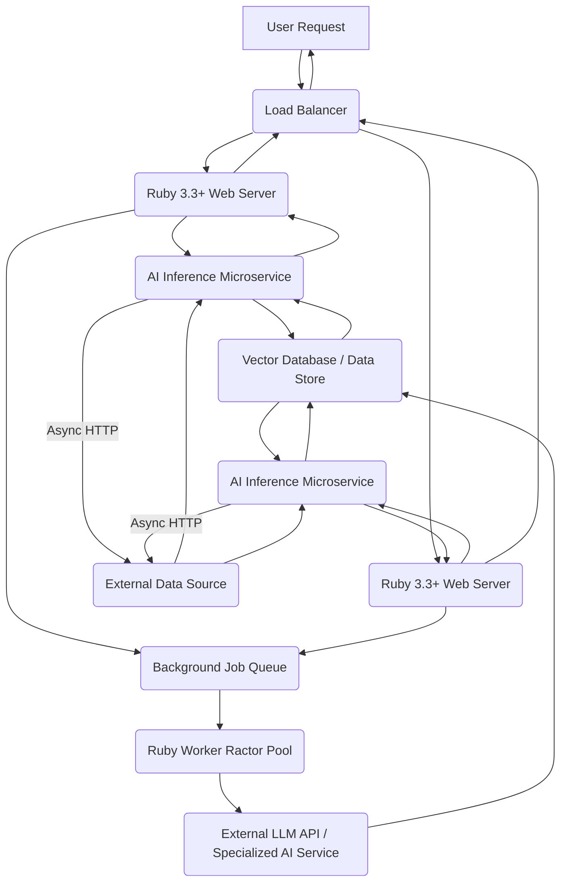
```mermaid
graph TD
    A[User Request] --> B(Load Balancer)
    B --> C1(Ruby 3.3+ Web Server)
    B --> C2(Ruby 3.3+ Web Server)
    C1 --> D1(AI Inference Microservice)
    C2 --> D2(AI Inference Microservice)
    D1 --> E(Vector Database / Data Store)
    D2 --> E
    C1 --> F(Background Job Queue)
    C2 --> F
    F --> G(Ruby Worker Ractor Pool)
    G --> H(External LLM API / Specialized AI Service)
    H --> E
    D1 -- Async HTTP --> I(External Data Source)
    D2 -- Async HTTP --> I
    I --> D1
    I --> D2
    E --> D1
    E --> D2
    D1 --> C1
    D2 --> C2
    C1 --> B
    C2 --> B
    B --> A
```

## Chapter 3: Python 3.10 Neural Nodes & Predictive Markets.

Python remains the undisputed lingua franca for Artificial Intelligence and Machine Learning, and with versions 3.10 and later, it continues to refine its capabilities for building sophisticated "Neural Nodes" – specialized AI modules designed for specific tasks within a larger system. These nodes, often leveraging libraries like TensorFlow, PyTorch, or scikit-learn, are the computational workhorses responsible for data processing, pattern recognition, and, crucially, predictive analytics. In the context of "Project Yellow Banana," these Neural Nodes are instrumental in powering predictive markets, where AI models analyze vast datasets to forecast future trends, market movements, or resource demands, enabling automated, high-value decision-making.

A Neural Node for a predictive market might ingest real-time financial data, social media sentiment, macroeconomic indicators, and historical patterns to predict stock price movements, commodity fluctuations, or even the success probability of new product launches. Python's rich ecosystem provides the necessary tools for every step: data ingestion (Pandas, Dask), feature engineering (NumPy, SciPy), model training (TensorFlow, PyTorch), and deployment (Flask, FastAPI). The async/await syntax introduced in Python 3.5 and enhanced in later versions allows these nodes to handle multiple data streams and inference requests concurrently, ensuring real-time responsiveness critical for volatile markets.

Consider a Neural Node designed to predict energy demand in a smart grid. It would consume sensor data, weather forecasts, historical usage patterns, and calendar events. The output of this node could then automatically adjust energy distribution or even trigger bids in energy markets. The following Python snippet outlines a conceptual structure for such a predictive node, emphasizing modularity and potential for real-time inference:

```python
import pandas as pd
import numpy as np
from sklearn.ensemble import RandomForestRegressor
from sklearn.model_selection import train_test_split
import joblib # For model persistence
import asyncio
import aiohttp # For async HTTP requests

class PredictiveNeuralNode:
    def __init__(self, model_path="energy_predictor.joblib"):
        self.model = self._load_or_train_model(model_path)

    def _load_or_train_model(self, model_path):
        try:
            return joblib.load(model_path)
        except FileNotFoundError:
            print("Model not found, training new one...")
            return self._train_new_model(model_path)

    def _train_new_model(self, model_path):
        # Dummy data generation for demonstration
        np.random.seed(42)
        data_size = 1000
        features = pd.DataFrame({
            'temperature': np.random.rand(data_size) * 30 + 5,
            'humidity': np.random.rand(data_size) * 50 + 30,
            'is_weekend': np.random.randint(0, 2, data_size),
            'hour_of_day': np.random.randint(0, 24, data_size)
        })
        target = (features['temperature'] * 0.5 + features['humidity'] * 0.2 +
                  features['is_weekend'] * 10 + features['hour_of_day'] * 2 +
                  np.random.randn(data_size) * 5)

        X_train, X_test, y_train, y_test = train_test_split(features, target, test_size=0.2, random_state=42)
        model = RandomForestRegressor(n_estimators=100, random_state=42)
        model.fit(X_train, y_train)
        joblib.dump(model, model_path)
        print("Model trained and saved.")
        return model

    async def fetch_realtime_data(self, sensor_api_url):
        async with aiohttp.ClientSession() as session:
            async with session.get(sensor_api_url) as response:
                response.raise_for_status()
                return await response.json()

    async def predict_demand(self, input_features: dict):
        # In a real scenario, input_features would be preprocessed
        df_features = pd.DataFrame([input_features])
        prediction = self.model.predict(df_features)
        return prediction[0]

# Example Usage (conceptual):
# async def main():
#     node = PredictiveNeuralNode()
#     realtime_data = await node.fetch_realtime_data("http://sensor-api.example.com/data")
#     # Assuming realtime_data is processed into the correct feature format
#     features_for_prediction = {
#         'temperature': realtime_data['temp'],
#         'humidity': realtime_data['humid'],
#         'is_weekend': 0, # Or derive from date
#         'hour_of_day': 14 # Or derive from time
#     }
#     predicted_value = await node.predict_demand(features_for_prediction)
#     print(f"Predicted energy demand: {predicted_value:.2f} MWh")

# if __name__ == "__main__":
#     asyncio.run(main())
```

This modular approach allows for independent development, deployment, and scaling of individual predictive capabilities, forming the intelligent core of an automated market interaction system.

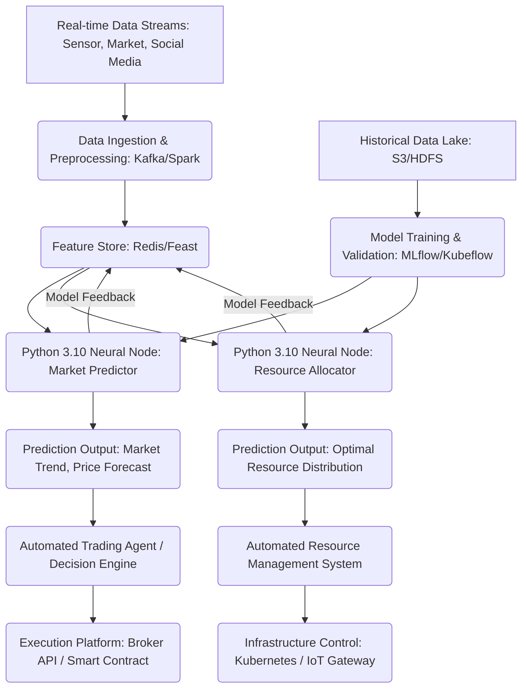
```mermaid
graph TD
    A[Real-time Data Streams: Sensor, Market, Social Media] --> B(Data Ingestion & Preprocessing: Kafka/Spark)
    B --> C(Feature Store: Redis/Feast)
    C --> D1(Python 3.10 Neural Node: Market Predictor)
    C --> D2(Python 3.10 Neural Node: Resource Allocator)
    D1 --> E(Prediction Output: Market Trend, Price Forecast)
    D2 --> F(Prediction Output: Optimal Resource Distribution)
    E --> G(Automated Trading Agent / Decision Engine)
    F --> H(Automated Resource Management System)
    G --> I(Execution Platform: Broker API / Smart Contract)
    H --> J(Infrastructure Control: Kubernetes / IoT Gateway)
    D1 -- Model Feedback --> C
    D2 -- Model Feedback --> C
    K[Historical Data Lake: S3/HDFS] --> L(Model Training & Validation: MLflow/Kubeflow)
    L --> D1
    L --> D2
```

## Chapter 4: Zero-Touch CI/CD Workflows for SaaS.

The "Yellow Banana" framework mandates a level of operational efficiency where software deployment and updates are so streamlined they require virtually no human intervention after the initial setup. This is the essence of Zero-Touch CI/CD (Continuous Integration/Continuous Delivery), a critical component for any high-profit AI SaaS. In a fast-paced environment where AI models are frequently retrained, features are rapidly iterated, and security patches are paramount, manual deployment processes are not just inefficient; they are a significant liability. Zero-touch CI/CD ensures that every code commit, every model update, and every infrastructure change is automatically tested, built, and deployed to production with maximum reliability and minimum lead time.

Achieving zero-touch CI/CD involves a robust pipeline that automates every stage from code commit to production deployment. This typically includes: automated testing (unit, integration, end-to-end), static code analysis, vulnerability scanning, container image building (Docker), infrastructure provisioning (Terraform, Ansible), and finally, deployment to target environments (Kubernetes, serverless functions). Tools like GitLab CI, GitHub Actions, Jenkins, ArgoCD, and Spinnaker are central to orchestrating these complex workflows. The goal is to eliminate manual gates and approvals for standard deployments, relying instead on comprehensive automated checks and rollbacks.

For AI SaaS, zero-touch CI/CD extends beyond application code to encompass model deployment and data pipeline updates. A new AI model version, once validated in a staging environment, should automatically be promoted to production, potentially through blue/green or canary deployment strategies to minimize risk. This level of automation frees engineering teams to focus on innovation rather than operational toil, accelerating the pace of development and ensuring that the latest, most performant AI capabilities are always available to users. Below is a conceptual YAML snippet for a GitLab CI pipeline, demonstrating a zero-touch approach for a containerized AI service:

```yaml
# .gitlab-ci.yml
stages:
  - build
  - test
  - deploy_staging
  - deploy_production

variables:
  DOCKER_IMAGE_NAME: registry.gitlab.com/your-group/your-project/ai-service
  KUBE_NAMESPACE: ai-prod

default:
  tags:
    - kubernetes

build_image:
  stage: build
  script:
    - docker login -u $CI_REGISTRY_USER -p $CI_REGISTRY_PASSWORD $CI_REGISTRY
    - docker build -t $DOCKER_IMAGE_NAME:$CI_COMMIT_SHORT_SHA .
    - docker push $DOCKER_IMAGE_NAME:$CI_COMMIT_SHORT_SHA
  only:
    - main
    - merge_requests

run_tests:
  stage: test
  image: $DOCKER_IMAGE_NAME:$CI_COMMIT_SHORT_SHA
  script:
    - python -m pytest tests/
  needs: ["build_image"]
  only:
    - main
    - merge_requests

deploy_to_staging:
  stage: deploy_staging
  image: dind
  script:
    - echo "Deploying to Staging Kubernetes cluster..."
    - kubectl config use-context your-staging-cluster
    - kubectl set image deployment/ai-service ai-service=$DOCKER_IMAGE_NAME:$CI_COMMIT_SHORT_SHA -n staging-namespace
    - kubectl rollout status deployment/ai-service -n staging-namespace
  environment:
    name: staging
    url: https://staging.your-aiservice.com
  needs: ["run_tests"]
  only:
    - main

deploy_to_production:
  stage: deploy_production
  image: dind
  script:
    - echo "Deploying to Production Kubernetes cluster..."
    - kubectl config use-context your-prod-cluster
    - kubectl set image deployment/ai-service ai-service=$DOCKER_IMAGE_NAME:$CI_COMMIT_SHORT_SHA -n $KUBE_NAMESPACE
    - kubectl rollout status deployment/ai-service -n $KUBE_NAMESPACE
  environment:
    name: production
    url: https://your-aiservice.com
  when: manual # Manual gate for production, but can be automated after successful staging tests
  needs: ["deploy_to_staging"]
  only:
    - main
```

This pipeline, while showing a manual gate for production, can be fully automated once confidence metrics from staging (e.g., A/B tests, performance benchmarks) are automatically met, truly achieving zero-touch deployment.

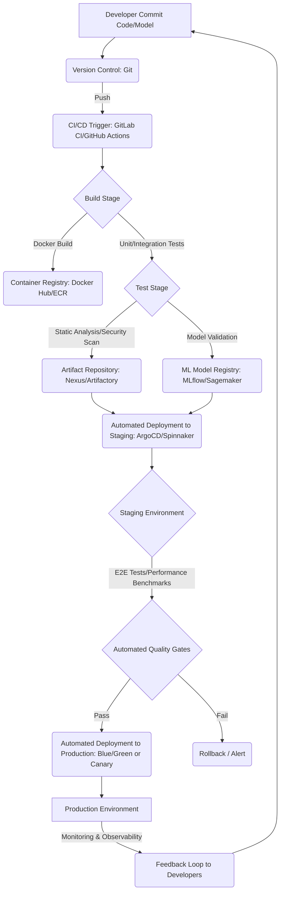
```mermaid
graph TD
    A[Developer Commit Code/Model] --> B(Version Control: Git)
    B -- Push --> C(CI/CD Trigger: GitLab CI/GitHub Actions)
    C --> D{Build Stage}
    D -- Docker Build --> E(Container Registry: Docker Hub/ECR)
    D -- Unit/Integration Tests --> F{Test Stage}
    F -- Static Analysis/Security Scan --> G(Artifact Repository: Nexus/Artifactory)
    F -- Model Validation --> H(ML Model Registry: MLflow/Sagemaker)
    G & H --> I(Automated Deployment to Staging: ArgoCD/Spinnaker)
    I --> J{Staging Environment}
    J -- E2E Tests/Performance Benchmarks --> K{Automated Quality Gates}
    K -- Pass --> L(Automated Deployment to Production: Blue/Green or Canary)
    K -- Fail --> M(Rollback / Alert)
    L --> N[Production Environment]
    N -- Monitoring & Observability --> O(Feedback Loop to Developers)
    O --> A
```

## Chapter 5: Building the AGI Sentience Kernel.

The concept of an "AGI Sentience Kernel" within the Yellow Banana framework transcends mere algorithmic sophistication; it refers to the architectural core of an Artificial General Intelligence system designed for extreme autonomy, self-improvement, and goal-driven emergent behavior. While true biological sentience remains a philosophical debate, in the context of advanced AI, a "Sentience Kernel" implies a system capable of complex reasoning, learning from diverse experiences, adapting to novel situations, and exhibiting meta-learning capabilities – essentially, an AI that learns *how to learn* and *how to solve problems* rather than just executing pre-programmed tasks. This kernel is the brain of your AI SaaS, enabling it to evolve beyond its initial programming.

Architecturally, such a kernel is not a monolithic entity but a highly interconnected mesh of specialized modules. It typically comprises a **Perception Module** (ingesting multi-modal data), a **Cognition & Reasoning Engine** (for symbolic manipulation, logical inference, and causal modeling), a **Memory System** (short-term and long-term, including episodic and semantic memory), a **Learning & Adaptation Module** (implementing reinforcement learning, meta-learning, and continuous self-optimization), and an **Action & Planning Module** (translating decisions into executable operations). The "sentience" emerges from the dynamic interplay and feedback loops between these components, allowing the system to form internal representations of the world, predict outcomes, and refine its own operational parameters based on observed results.

The development of an AGI Sentience Kernel focuses on creating robust self-correction mechanisms and generalizable problem-solving strategies. This means moving beyond task-specific models to an architecture where the AI can dynamically compose new solutions, understand context, and even anticipate future needs. While full AGI is still an active research area, building towards a "Sentience Kernel" involves integrating advanced techniques like hierarchical reinforcement learning, neural-symbolic AI, and large-scale self-supervised learning. The following pseudocode illustrates a conceptual high-level loop for such a kernel, emphasizing its adaptive and goal-oriented nature:

```python
# Conceptual Pseudocode for an AGI Sentience Kernel's Core Loop

class AGISentienceKernel:
    def __init__(self, goal_manager, memory_system, learning_module, action_planner):
        self.goal_manager = goal_manager      # Manages high-level objectives
        self.memory_system = memory_system    # Stores experiences, knowledge
        self.learning_module = learning_module # Adapts strategies, models
        self.action_planner = action_planner  # Devises and executes plans
        self.perception_buffer = []           # Incoming sensory data

    def perceive(self, sensor_data):
        # Process raw sensor data into meaningful observations
        processed_observation = self._process_sensory_input(sensor_data)
        self.perception_buffer.append(processed_observation)
        self.memory_system.store_experience(processed_observation, 'sensory')
        return processed_observation

    def _process_sensory_input(self, data):
        # Placeholder for complex multi-modal data processing (e.g., vision, NLP)
        return {"type": "observation", "content": data, "timestamp": time.time()}

    def cognize(self, observation):
        # Integrate observation with memory, update world model
        world_model_update = self.memory_system.update_world_model(observation)

        # Retrieve current goals and context
        current_goals = self.goal_manager.get_active_goals()
        current_context = self.memory_system.get_contextual_knowledge(observation)

        # Reason about current state, identify discrepancies, infer new facts
        inferences = self._reason_about_state(world_model_update, current_goals, current_context)
        self.memory_system.store_knowledge(inferences, 'inferred')

        return inferences

    def decide_action(self, inferences):
        # Evaluate potential actions based on goals, predictions, and constraints
        potential_actions = self.action_planner.generate_potential_actions(inferences, self.goal_manager.get_active_goals())

        # Predict outcomes of potential actions
        predicted_outcomes = self.action_planner.predict_outcomes(potential_actions, self.memory_system.get_world_model())

        # Select best action based on predicted outcomes and goal alignment
        chosen_action = self.action_planner.select_best_action(potential_actions, predicted_outcomes, self.goal_manager.get_active_goals())

        return chosen_action

    def execute_action(self, action):
        # Translate chosen action into low-level commands and execute
        result = self.action_planner.execute(action)
        self.memory_system.store_experience(action, 'action')
        return result

    def learn_and_adapt(self, executed_action, outcome):
        # Evaluate outcome against predictions and goals
        feedback = self.goal_manager.evaluate_outcome(executed_action, outcome)

        # Update internal models, strategies, and goal priorities based on feedback
        self.learning_module.update_models(executed_action, outcome, feedback)
        self.memory_system.store_experience(outcome, 'outcome')
        self.goal_manager.adjust_goals_based_on_feedback(feedback)

    def run_cycle(self, sensor_data):
        observation = self.perceive(sensor_data)
        inferences = self.cognize(observation)
        action = self.decide_action(inferences)
        outcome = self.execute_action(action)
        self.learn_and_adapt(action, outcome)
        return outcome

# Example of a simplified goal manager
class GoalManager:
    def __init__(self):
        self.active_goals = [{"id": "maintain_system_stability", "priority": 10},
                             {"id": "optimize_resource_usage", "priority": 8}]

    def get_active_goals(self):
        return self.active_goals

    def evaluate_outcome(self, action, outcome):
        # Simplified evaluation
        if "error" in outcome:
            return {"goal_id": "maintain_system_stability", "feedback": "negative", "severity": 5}
        return {"goal_id": "optimize_resource_usage", "feedback": "positive", "impact": 2}

    def adjust_goals_based_on_feedback(self, feedback):
        # Adjust priorities or add/remove goals based on performance
        pass # Implement complex goal adaptation logic here

# This conceptual framework provides a foundation for systems that can genuinely
# self-direct, self-improve, and adapt to complex, dynamic environments, pushing
# towards the vision of an AGI-powered Yellow Banana.
```

This iterative cycle of perception, cognition, decision, action, and learning forms the bedrock of an AGI Sentience Kernel, allowing the system to continuously refine its understanding of the world and its strategies for achieving complex objectives, ultimately driving the autonomy of the Yellow Banana platform.

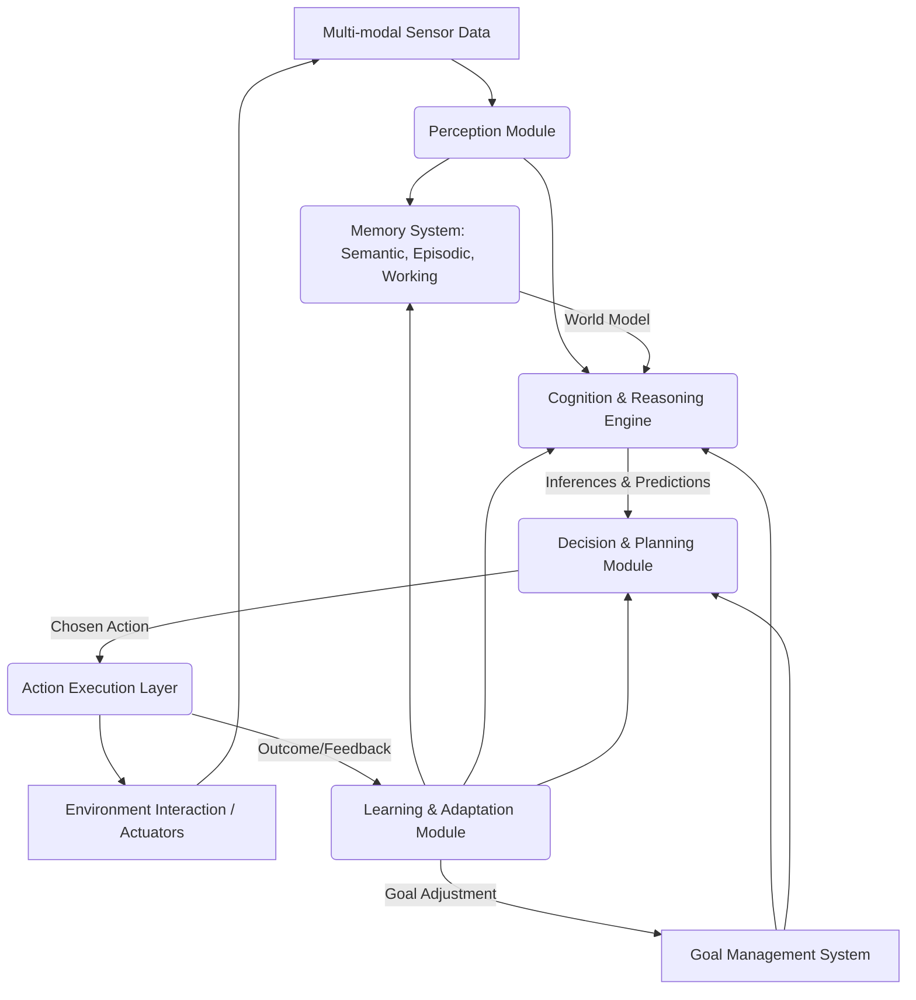
```mermaid
graph TD
    A[Multi-modal Sensor Data] --> P(Perception Module)
    P --> M(Memory System: Semantic, Episodic, Working)
    P --> C(Cognition & Reasoning Engine)
    M -- World Model --> C
    C -- Inferences & Predictions --> D(Decision & Planning Module)
    D -- Chosen Action --> E(Action Execution Layer)
    E --> F[Environment Interaction / Actuators]
    F --> A
    E -- Outcome/Feedback --> L(Learning & Adaptation Module)
    L --> M
    L --> C
    L --> D
    G[Goal Management System] --> C
    G --> D
    L -- Goal Adjustment --> G
```

## Chapter 6: The Synthetic Data Advantage.

In the pursuit of highly lucrative AI SaaS and AGI architectures, access to vast quantities of high-quality, diverse, and unbiased data is often the most significant bottleneck. Real-world data can be scarce, expensive to acquire and label, fraught with privacy concerns (GDPR, HIPAA), and often contains inherent biases that can cripple AI model performance and fairness. This is where the "Synthetic Data Advantage" comes into play within the Yellow Banana framework. Synthetic data, artificially generated data that mimics the statistical properties and patterns of real data without containing any actual real-world information, offers a powerful solution to these challenges, accelerating development cycles and enhancing model robustness.

The generation of synthetic data can employ various sophisticated techniques, including Generative Adversarial Networks (GANs), Variational Autoencoders (VAEs), rule-based systems, and agent-based simulations. GANs, for instance, consist of a generator network that creates synthetic samples and a discriminator network that tries to distinguish between real and synthetic data. Through this adversarial process, the generator learns to produce increasingly realistic data. The benefits are manifold: synthetic data can be generated on demand, at scale, to cover edge cases that are rare in real datasets, it inherently protects privacy, and it can be engineered to be free from historical biases present in real-world data, leading to more ethical and performant AI models.

Integrating synthetic data generation into your MLOps pipeline is a strategic move. It allows for rapid prototyping, robust model training, and rigorous testing without ever touching sensitive production data. For example, a financial fraud detection AI could be trained on synthetic transaction data designed to include complex, rare fraud patterns that might take years to accumulate in real datasets. This not only speeds up development but also ensures the model is prepared for unforeseen attack vectors. The following Python snippet demonstrates a basic approach to generating synthetic tabular data using `numpy` and `pandas`, mimicking a simple customer dataset:

```python
import pandas as pd
import numpy as np
from faker import Faker # pip install Faker

# Initialize Faker for realistic-looking names, emails, etc.
fake = Faker('en_US')

class SyntheticDataGenerator:
    def __init__(self, num_samples=1000, seed=42):
        self.num_samples = num_samples
        np.random.seed(seed)
        Faker.seed(seed)

    def generate_customer_data(self):
        data = {
            'customer_id': [fake.uuid4() for _ in range(self.num_samples)],
            'age': np.random.randint(18, 70, self.num_samples),
            'gender': np.random.choice(['Male', 'Female', 'Non-binary'], self.num_samples, p=[0.48, 0.48, 0.04]),
            'annual_income_k': np.random.normal(loc=60, scale=20, size=self.num_samples).astype(int).clip(10, 200),
            'num_purchases': np.random.poisson(lam=5, size=self.num_samples),
            'last_purchase_days_ago': np.random.randint(1, 365, self.num_samples),
            'is_subscribed_newsletter': np.random.choice([True, False], self.num_samples, p=[0.3, 0.7]),
            'city': [fake.city() for _ in range(self.num_samples)],
            'email': [fake.email() for _ in range(self.num_samples)],
            'registration_date': [fake.date_between(start_date='-5y', end_date='today') for _ in range(self.num_samples)]
        }

        # Introduce some correlations or patterns (e.g., older, higher income customers buy more)
        data['num_purchases'] = np.where(data['age'] > 40, data['num_purchases'] + np.random.randint(0, 5, self.num_samples), data['num_purchases'])
        data['num_purchases'] = np.where(data['annual_income_k'] > 80, data['num_purchases'] + np.random.randint(0, 7, self.num_samples), data['num_purchases'])
        data['num_purchases'] = np.clip(data['num_purchases'], 0, 50) # Cap purchases

        df = pd.DataFrame(data)
        return df

# Example Usage:
# generator = SyntheticDataGenerator(num_samples=5000)
# synthetic_customer_df = generator.generate_customer_data()
# print(synthetic_customer_df.head())
# print(synthetic_customer_df.describe())
```

By embracing synthetic data, organizations can overcome critical data acquisition hurdles, accelerate their AI development cycles, and deploy more robust, ethical, and performant models, unlocking the full potential of their AI SaaS products.

```mermaid
graph TD
    A[Real-World Data (Limited, Biased, Private)] --> B(Data Anonymization / Feature Extraction)
    B --> C(Synthetic Data Generator: GANs/VAEs/Rule-based)
    C --> D[Synthetic Data Lake: S3/GCS]
    D --> E(AI Model Training: TensorFlow/PyTorch)
    D --> F(Model Testing & Validation)
    E --> G(Trained AI Model)
    F --> G
    G --> H(Production Deployment)
    H --> I[AI SaaS Application]
    J[Edge Cases / Rare Scenarios] --> C
    K[Privacy Requirements] --> C
    L[Bias Mitigation Directives] --> C
    M[Synthetic Data Feedback Loop] --> C
```

## Chapter 7: Designing Autonomous AI Agents.

Autonomous AI agents are the operational backbone of a Yellow Banana system, enabling self-sustaining, high-profit AI automated businesses. Unlike traditional software, which executes predefined instructions, autonomous agents possess the ability to perceive their environment, make decisions, plan sequences of actions, and execute those actions to achieve specific goals, all without continuous human oversight. This paradigm shift from reactive systems to proactive, goal-oriented entities is fundamental to unlocking the full potential of AGI within a SaaS context, allowing for automated customer support, intelligent resource management, proactive threat detection, and much more.

The design of effective autonomous AI agents involves several core components: a **Perception Module** to gather and interpret environmental data; a **Cognitive Architecture** for reasoning, knowledge representation, and learning; a **Planning Module** to devise strategies and action sequences; and an **Actuation Module** to interact with the environment. Advanced agents also incorporate **Self-Reflection** and **Learning Loops** to continuously improve their performance, adapt to new situations, and even modify their own goals or strategies. The complexity of these agents can range from simple rule-based systems to sophisticated multi-agent reinforcement learning (MARL) architectures.

For a Yellow Banana AI SaaS, autonomous agents might be responsible for tasks like dynamically adjusting cloud resource allocation based on predicted demand, orchestrating complex data pipelines, engaging with users through natural language interfaces, or even identifying and mitigating cyber threats in real-time. The goal is to offload repetitive, complex, or time-critical tasks from human operators, allowing the business to scale efficiently and operate around the clock. The following Python snippet illustrates a conceptual framework for an autonomous agent's decision-making loop, emphasizing observation, planning, and action:

```python
import time
import random

class AutonomousAIAgent:
    def __init__(self, agent_id, goals):
        self.agent_id = agent_id
        self.goals = goals
        self.knowledge_base = {} # Stores learned facts, rules, observations
        self.current_state = {}
        print(f"Agent {self.agent_id} initialized with goals: {goals}")

    def perceive_environment(self, environment_data):
        # Simulate perceiving the environment
        self.current_state = environment_data
        print(f"Agent {self.agent_id} perceived: {self.current_state}")
        # Update knowledge base based on perception
        self.knowledge_base.update(environment_data)
        return self.current_state

    def analyze_situation(self):
        # Simulate complex reasoning, pattern recognition, and goal evaluation
        # This is where an LLM or specific AI model would process observations
        print(f"Agent {self.agent_id} analyzing situation...")
        action_recommendations = []
        for goal in self.goals:
            if goal == "optimize_resource_usage":
                if self.current_state.get('cpu_load', 0) > 80:
                    action_recommendations.append("scale_up_resources")
                elif self.current_state.get('cpu_load', 0) < 30:
                    action_recommendations.append("scale_down_resources")
            elif goal == "respond_to_user_query":
                if self.current_state.get('new_query', False):
                    action_recommendations.append("generate_response")
        return action_recommendations

    def plan_action(self, recommendations):
        # Simulate planning: choose best action, sequence steps
        if "scale_up_resources" in recommendations:
            return {"type": "scale_resources", "amount": "+1", "target": "CPU"}
        elif "scale_down_resources" in recommendations:
            return {"type": "scale_resources", "amount": "-1", "target": "CPU"}
        elif "generate_response" in recommendations:
            return {"type": "generate_response", "query": self.current_state.get('query_text')}
        return {"type": "monitor", "interval": 5}

    def execute_action(self, action):
        # Simulate executing the action in the environment
        print(f"Agent {self.agent_id} executing action: {action['type']}")
        if action["type"] == "scale_resources":
            print(f"  Scaling {action['target']} by {action['amount']}")
            # API call to Kubernetes or cloud provider
        elif action["type"] == "generate_response":
            print(f"  Generating response for query: '{action['query']}' using LLM...")
            # LLM API call
        time.sleep(1) # Simulate work
        return {"status": "success", "action_taken": action}

    def learn_from_feedback(self, feedback):
        # Update knowledge base, adapt strategies based on action outcomes
        print(f"Agent {self.agent_id} learning from feedback: {feedback}")
        # This is where reinforcement learning or model updates would occur

    async def run(self):
        print(f"Agent {self.agent_id} starting autonomous loop...")
        while True:
            # Simulate environment data coming in
            env_data = {
                'cpu_load': random.randint(10, 95),
                'memory_usage': random.randint(20, 80),
                'new_query': random.choice([True, False], p=[0.2, 0.8]),
                'query_text': "What is your pricing?" if random.random() < 0.2 else None
            }
            if self.current_state.get('new_query', False):
                 env_data['new_query'] = True # Ensure a query is sometimes present

            observation = self.perceive_environment(env_data)
            recommendations = self.analyze_situation()
            action = self.plan_action(recommendations)
            outcome = self.execute_action(action)
            self.learn_from_feedback(outcome)
            await asyncio.sleep(5) # Agent sleeps for a bit before next cycle

# Example Usage (conceptual):
# async def main():
#     agent1 = AutonomousAIAgent("ResourceAgent", ["optimize_resource_usage"])
#     agent2 = AutonomousAIAgent("CustomerServiceAgent", ["respond_to_user_query"])
#     await asyncio.gather(agent1.run(), agent2.run())
#
# if __name__ == "__main__":
#     asyncio.run(main())
```

By deploying a fleet of these intelligent agents, the Yellow Banana framework can achieve true operational autonomy, ensuring continuous optimization, robust performance, and dynamic adaptation across the entire AI SaaS ecosystem.

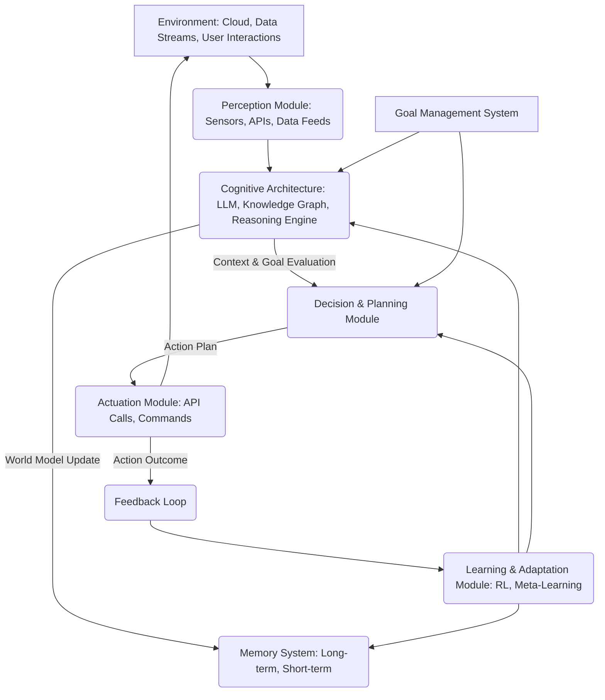
```mermaid
graph TD
    A[Environment: Cloud, Data Streams, User Interactions] --> P(Perception Module: Sensors, APIs, Data Feeds)
    P --> C(Cognitive Architecture: LLM, Knowledge Graph, Reasoning Engine)
    C -- World Model Update --> M(Memory System: Long-term, Short-term)
    C -- Context & Goal Evaluation --> D(Decision & Planning Module)
    D -- Action Plan --> E(Actuation Module: API Calls, Commands)
    E --> A
    E -- Action Outcome --> F(Feedback Loop)
    F --> L(Learning & Adaptation Module: RL, Meta-Learning)
    L --> C
    L --> D
    L --> M
    G[Goal Management System] --> D
    G --> C
```

## Chapter 8: Omniverse Deployments & Infrastructure.

The vision of "Project Yellow Banana" extends beyond single-cloud or on-premise deployments, embracing an "Omniverse" infrastructure strategy. This refers to the capability to seamlessly deploy, manage, and operate AI SaaS components across a heterogeneous mix of environments: multi-cloud (AWS, Azure, GCP), hybrid cloud (on-premise + public cloud), edge devices, and even specialized hardware (e.g., NVIDIA Jetson for local AI inference). This omniverse approach provides unparalleled resilience, optimizes performance by placing compute closer to data sources or users, and mitigates vendor lock-in, all while maximizing cost efficiency and regulatory compliance across diverse geographical regions.

Achieving Omniverse Deployments necessitates a robust, cloud-agnostic infrastructure layer built upon principles of containerization, orchestration, and Infrastructure as Code (IaC). Docker and Kubernetes form the bedrock, providing a portable abstraction layer for applications. Tools like Terraform and Ansible automate the provisioning and configuration of infrastructure across different cloud providers and on-premise data centers, ensuring consistency and repeatability. A unified control plane, often implemented with solutions like Anthos, Azure Arc, or OpenShift, allows for centralized management and observability of workloads regardless of their physical location.

The strategic advantage of an Omniverse deployment for AI SaaS is profound. For instance, sensitive data processing might occur on-premise due to regulatory requirements, while general AI inference services scale dynamically in the public cloud. Edge devices could run lightweight AI models for real-time anomaly detection or data preprocessing, sending only relevant insights back to the central cloud. This distributed intelligence enhances responsiveness, reduces bandwidth costs, and improves data sovereignty. The following Terraform snippet illustrates how a basic Kubernetes cluster might be defined across different cloud providers, highlighting the abstraction capabilities of IaC:

```terraform
# main.tf - Conceptual Terraform for Multi-Cloud K8s Cluster Definition

# Provider Configuration (simplified for demonstration)
provider "aws" {
  region = "us-east-1"
}

provider "azurerm" {
  features {}
}

provider "google" {
  project = "your-gcp-project-id"
  region  = "us-central1"
}

# AWS EKS Cluster
resource "aws_eks_cluster" "yellow_banana_eks" {
  name     = "yellow-banana-eks"
  role_arn = aws_iam_role.eks_master_role.arn
  vpc_config {
    subnet_ids = ["subnet-0abcdef1234567890", "subnet-0fedcba9876543210"]
  }
  # ... other EKS configurations
}

# Azure AKS Cluster
resource "azurerm_kubernetes_cluster" "yellow_banana_aks" {
  name                = "yellow-banana-aks"
  location            = azurerm_resource_group.rg.location
  resource_group_name = azurerm_resource_group.rg.name
  dns_prefix          = "yellowbanana"
  default_node_pool {
    name       = "default"
    node_count = 3
    vm_size    = "Standard_DS2_v2"
  }
  # ... other AKS configurations
}

# Google GKE Cluster
resource "google_container_cluster" "yellow_banana_gke" {
  name               = "yellow-banana-gke"
  location           = "us-central1-c"
  initial_node_count = 3
  node_config {
    machine_type = "e2-medium"
  }
  # ... other GKE configurations
}

# Output cluster endpoints (simplified)
output "aws_eks_endpoint" {
  value = aws_eks_cluster.yellow_banana_eks.endpoint
}

output "azure_aks_kube_config_raw" {
  value     = azurerm_kubernetes_cluster.yellow_banana_aks.kube_config_raw
  sensitive = true
}

output "google_gke_endpoint" {
  value = google_container_cluster.yellow_banana_gke.endpoint
}
```

This strategy ensures that the Yellow Banana framework is not tethered to a single vendor or location, providing unparalleled flexibility, resilience, and global reach for its AI-powered services.

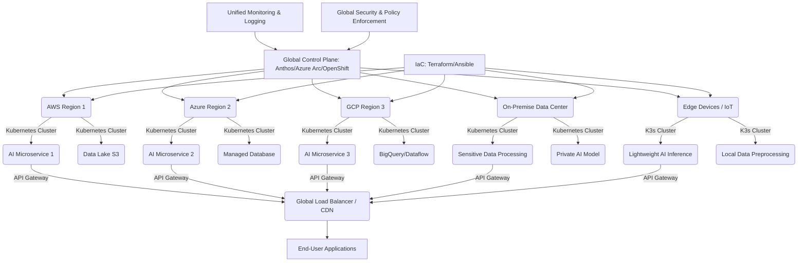
```mermaid
graph TD
    A[Global Control Plane: Anthos/Azure Arc/OpenShift] --> B1(AWS Region 1)
    A --> B2(Azure Region 2)
    A --> B3(GCP Region 3)
    A --> B4(On-Premise Data Center)
    A --> B5(Edge Devices / IoT)

    B1 -- Kubernetes Cluster --> C1(AI Microservice 1)
    B1 -- Kubernetes Cluster --> C2(Data Lake S3)
    B2 -- Kubernetes Cluster --> D1(AI Microservice 2)
    B2 -- Kubernetes Cluster --> D2(Managed Database)
    B3 -- Kubernetes Cluster --> E1(AI Microservice 3)
    B3 -- Kubernetes Cluster --> E2(BigQuery/Dataflow)
    B4 -- Kubernetes Cluster --> F1(Sensitive Data Processing)
    B4 -- Kubernetes Cluster --> F2(Private AI Model)
    B5 -- K3s Cluster --> G1(Lightweight AI Inference)
    B5 -- K3s Cluster --> G2(Local Data Preprocessing)

    C1 & D1 & E1 & F1 & G1 -- API Gateway --> H(Global Load Balancer / CDN)
    H --> I[End-User Applications]
    J[IaC: Terraform/Ansible] --> B1
    J --> B2
    J --> B3
    J --> B4
    J --> B5
    K[Unified Monitoring & Logging] --> A
    L[Global Security & Policy Enforcement] --> A
```

## Chapter 9: Advanced Prompt Engineering Mastery.

In the era of Large Language Models (LLMs) and Generative AI, "Advanced Prompt Engineering Mastery" is no longer a niche skill but a critical discipline for extracting maximum value from these powerful, yet often opaque, systems. Within the Yellow Banana framework, mastering prompt engineering is essential for building highly intelligent, context-aware, and reliable AI agents and applications. It moves beyond simply asking a question to strategically crafting inputs that guide the LLM towards desired outputs, control its behavior, mitigate hallucination, and unlock its full reasoning capabilities.

Advanced prompt engineering encompasses a suite of techniques designed to enhance LLM performance. These include **Few-Shot Learning**, where examples of desired input-output pairs are provided in the prompt; **Chain-of-Thought (CoT) Prompting**, which encourages the LLM to articulate its reasoning steps before providing a final answer, significantly improving complex problem-solving; and **Self-Consistency**, where multiple CoT paths are generated and the most consistent answer is selected. Other techniques involve using role-playing (e.g., "Act as an expert financial analyst"), constrained generation (e.g., "Output only JSON"), and iterative refinement to progressively steer the model.

For AI SaaS products, advanced prompt engineering translates directly into superior user experiences and more valuable AI-driven features. Imagine an AI legal assistant that not only answers questions but also cites legal precedents and explains its reasoning, or a coding assistant that generates robust, well-documented code. By mastering these techniques, developers can transform generic LLMs into domain-specific experts, reduce the need for extensive fine-tuning, and ensure the AI's outputs are aligned with business objectives and ethical guidelines. The following Python code demonstrates dynamic prompt construction for an LLM using a Chain-of-Thought approach:

```python
class AdvancedPromptEngineer:
    def __init__(self, llm_api_client):
        self.llm_api_client = llm_api_client

    def generate_cot_prompt(self, user_query, examples=None, persona="expert data scientist"):
        """
        Generates a Chain-of-Thought prompt for an LLM.
        Args:
            user_query (str): The user's original query.
            examples (list): A list of {"input": "...", "thought": "...", "output": "..."} dictionaries for few-shot CoT.
            persona (str): The persona the LLM should adopt.
        Returns:
            str: The crafted prompt.
        """
        prompt_parts = []

        # 1. Set the persona and objective
        prompt_parts.append(f"You are an {persona}. Your goal is to accurately and thoroughly answer questions by thinking step-by-step.")
        prompt_parts.append("Always provide your reasoning process before giving the final answer.")

        # 2. Add few-shot examples if provided
        if examples:
            prompt_parts.append("\nHere are a few examples:")
            for ex in examples:
                prompt_parts.append(f"\nUser Input: {ex['input']}")
                prompt_parts.append(f"Thought Process: {ex['thought']}")
                prompt_parts.append(f"Final Answer: {ex['output']}")

        # 3. Add the actual user query
        prompt_parts.append(f"\nUser Input: {user_query}")
        prompt_parts.append("Thought Process:") # Prime the CoT
        return "\n".join(prompt_parts)

    async def get_llm_response_with_cot(self, user_query, examples=None, persona="expert data scientist"):
        prompt = self.generate_cot_prompt(user_query, examples, persona)
        print(f"--- Sending Prompt to LLM ---\n{prompt}\n-----------------------------")
        
        # In a real scenario, this would be an actual API call to OpenAI, Anthropic, Gemini, etc.
        # For demonstration, we'll simulate a response.
        # response = await self.llm_api_client.send_prompt(prompt)
        
        # Simulate LLM response after thinking
        simulated_response = """
Thought Process:
1. First, I need to break down the user's request into its core components. The user wants to understand the 'Yellow Banana' concept in AI SaaS.
2. I should recall the definition and metaphor associated with 'Yellow Banana' from my knowledge base. It represents complex AI made simple and ready-to-consume.
3. I need to explain why this concept is important for high-profit AI SaaS. This involves discussing abstraction of complexity, ease of use, and automation.
4. I should also touch upon the benefits for both developers (reduced operational overhead) and end-users (seamless experience).
5. Finally, I will synthesize these points into a clear and concise explanation.

Final Answer:
The 'Yellow Banana' concept in AI SaaS refers to the strategic approach of designing highly sophisticated and complex Artificial Intelligence systems and delivering them to end-users in a perfectly "peeled" and "ready-to-consume" state. This means abstracting away all underlying technical complexities, ensuring zero-touch deployment, autonomous operation, and an intuitive user experience. The paradox is that behind this apparent simplicity lies an incredibly intricate architecture of AGI, high-concurrency backends, and automated pipelines. For high-profit AI SaaS, this framework is crucial because it minimizes operational friction, accelerates user adoption, and allows businesses to scale advanced AI solutions with unprecedented efficiency and value delivery.
        """
        return simulated_response.strip()

# Example Usage (conceptual):
# class MockLLMClient:
#     async def send_prompt(self, prompt):
#         # Simulate async API call
#         await asyncio.sleep(1)
#         return "Simulated LLM response based on prompt."
#
# async def main():
#     mock_client = MockLLMClient()
#     prompt_engineer = AdvancedPromptEngineer(mock_client)
#
#     financial_examples = [
#         {"input": "Explain quantitative easing.",
#          "thought": "Quantitative easing is a monetary policy... involves central banks buying assets...",
#          "output": "Quantitative easing is a monetary policy where a central bank purchases government securities..."},
#         # ... more examples
#     ]
#
#     user_query_ai = "What is the 'Yellow Banana' concept in AI SaaS and why is it important for high-profit businesses?"
#     response_ai = await prompt_engineer.get_llm_response_with_cot(user_query_ai, persona="expert AI architect")
#     print(f"\n--- LLM Response ---\n{response_ai}\n--------------------")
#
# if __name__ == "__main__":
#     import asyncio
#     asyncio.run(main())
```

By leveraging these sophisticated prompting strategies, AI SaaS providers can unlock unprecedented levels of intelligence and utility from foundational models, delivering truly transformative experiences within the Yellow Banana ecosystem.

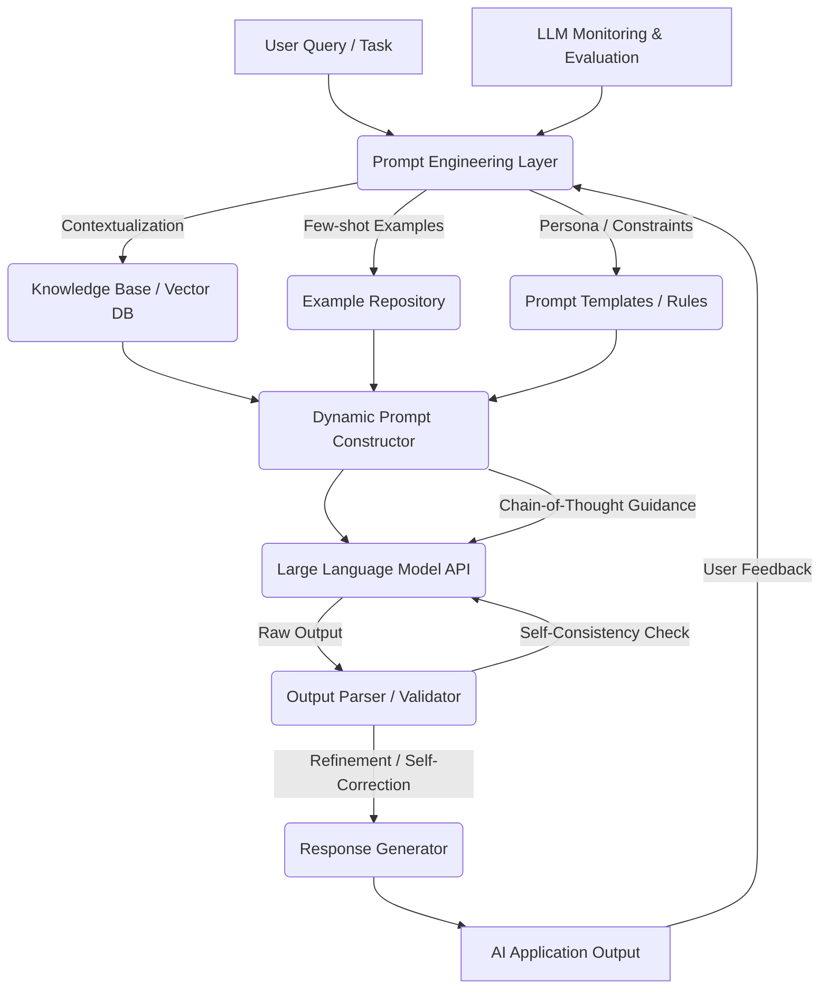
```mermaid
graph TD
    A[User Query / Task] --> B(Prompt Engineering Layer)
    B -- Contextualization --> C(Knowledge Base / Vector DB)
    B -- Few-shot Examples --> D(Example Repository)
    B -- Persona / Constraints --> E(Prompt Templates / Rules)
    C & D & E --> F(Dynamic Prompt Constructor)
    F --> G(Large Language Model API)
    G -- Raw Output --> H(Output Parser / Validator)
    H -- Refinement / Self-Correction --> I(Response Generator)
    I --> J[AI Application Output]
    J -- User Feedback --> B
    K[LLM Monitoring & Evaluation] --> B
    F -- Chain-of-Thought Guidance --> G
    H -- Self-Consistency Check --> G
```

## Chapter 10: The Financial Matrix: Monetizing Digital Products.

The technical brilliance of an AGI-powered Yellow Banana framework is only half the equation; its ultimate success lies in its ability to generate substantial, recurring revenue. "The Financial Matrix" refers to the strategic design and implementation of monetization models for digital products, specifically AI-powered SaaS. This involves not just pricing, but also understanding customer lifetime value (LTV), managing churn, optimizing conversion funnels, and building a sustainable business model that scales with the inherent value provided by autonomous AI. Without a robust financial matrix, even the most advanced AGI will fail to translate into a high-profit enterprise.

Monetizing AI SaaS requires a nuanced approach beyond traditional software licensing. Common models include **Subscription-based pricing** (tiered, per-user, per-feature), **Usage-based pricing** (per API call, per computation unit, per data processed), **Freemium models** (offering basic features for free to attract users, then upselling premium capabilities), and **Value-based pricing** (where the price is directly tied to the measurable value the AI delivers to the customer). For AI products, usage-based models are often highly effective as they align cost directly with the computational resources or the intelligence consumed, making it fair for both small and large customers.

Beyond pricing, the financial matrix includes robust strategies for customer acquisition (marketing, sales), onboarding (reducing time-to-value), retention (customer success, continuous feature delivery), and expansion (upselling, cross-selling). Key performance indicators (KPIs) like Monthly Recurring Revenue (MRR), Annual Recurring Revenue (ARR), Churn Rate, Customer Acquisition Cost (CAC), and Customer Lifetime Value (LTV) are critical for monitoring the health and growth of the business. The Yellow Banana framework, with its emphasis on autonomous AI and zero-touch operations, inherently drives down operational costs, thereby maximizing profit margins and LTV.

Consider an AI-powered code generation SaaS. A tiered subscription might offer basic code suggestions, while a premium tier provides full function generation, refactoring, and integration with enterprise systems. Usage-based pricing could be applied to complex generations or API calls to specialized models. A freemium model allows developers to experience the basic utility before committing. The key is to design a pricing structure that reflects the perceived and actual value delivered by the AI, encouraging adoption and rewarding increased usage without creating friction.

```mermaid
graph TD
    A[AI SaaS Product] --> B(Value Proposition & Features)
    B --> C{Monetization Strategy Selection}
    C -- Tiered Subscription --> D1(Basic Plan)
    C -- Usage-Based --> D2(Pay-per-API/Compute)
    C -- Freemium --> D3(Free Tier)
    C -- Value-Based --> D4(Outcome-driven Pricing)

    D1 --> E1(Feature Set A)
    D2 --> E2(Resource Consumption Metrics)
    D3 --> E3(Limited Features)
    D4 --> E4(Quantifiable ROI)

    E1 & E2 & E3 & E4 --> F(Customer Acquisition: Marketing/Sales)
    F --> G(Customer Onboarding & Success)
    G --> H(Customer Retention & Expansion)
    H --> I(Monthly Recurring Revenue - MRR)
    I --> J(Annual Recurring Revenue - ARR)

    K[Operational Costs (Low due to AI Automation)] --> L(Profit Margin Optimization)
    I & L --> M(Business Growth & Scalability)

    N[Churn Rate Monitoring] --> G
    O[Customer Lifetime Value (LTV) Calculation] --> H
    P[Customer Acquisition Cost (CAC) Analysis] --> F
```

## Chapter 11: Security Protocols & Vulnerability Defense.

In the domain of AI SaaS, especially within the high-stakes "Yellow Banana" framework, security is not an afterthought but a foundational pillar. The convergence of advanced AI, complex data pipelines, and distributed cloud infrastructure introduces a new generation of attack vectors and vulnerabilities that demand sophisticated, multi-layered defense mechanisms. Beyond traditional application and network security, AI SaaS must contend with AI-specific threats like data poisoning, adversarial attacks, model inversion, and privacy breaches, making "Security Protocols & Vulnerability Defense" a critical, continuous imperative.

A comprehensive security strategy for an AI SaaS platform must integrate DevSecOps principles, embedding security checks and practices throughout the entire development and deployment lifecycle. This includes secure coding guidelines, automated vulnerability scanning in CI/CD pipelines, robust identity and access management (IAM) with least privilege principles, end-to-end encryption for data at rest and in transit, and continuous monitoring for anomalies and suspicious activities. For AI-specific threats, techniques like **adversarial training** (training models on adversarial examples), **data sanitization** (to prevent poisoning), **differential privacy** (to protect training data), and **model explainability** (to detect malicious behavior) become indispensable.

Consider an AI that processes sensitive user data (e.g., medical records or financial transactions). The system must employ advanced encryption, fine-grained access controls, and audit trails to comply with regulations like GDPR or HIPAA. Furthermore, the AI model itself needs to be protected against adversarial inputs that could lead to misclassification or data leakage. This requires a proactive stance, combining robust engineering practices with cutting-edge AI security research to build a truly resilient Yellow Banana system. The following pseudocode illustrates a conceptual security check for an incoming AI inference request:

```python
# Pseudocode for an AI Inference Request Security Gateway

class AISecurityGateway:
    def __init__(self, auth_service, data_validator, model_integrity_checker, threat_intelligence):
        self.auth_service = auth_service
        self.data_validator = data_validator
        self.model_integrity_checker = model_integrity_checker
        self.threat_intelligence = threat_intelligence
        self.rate_limiter = {} # Simple in-memory rate limiter

    def authenticate_request(self, request_headers):
        # Check API key, JWT token, etc.
        user_id = self.auth_service.validate_token(request_headers.get('Authorization'))
        if not user_id:
            raise SecurityError("Authentication failed.")
        return user_id

    def authorize_request(self, user_id, requested_model_id, data_scope):
        # Check if user has permissions for this model and data
        if not self.auth_service.check_permissions(user_id, requested_model_id, data_scope):
            raise SecurityError("Authorization failed. Insufficient permissions.")

    def rate_limit_check(self, user_id):
        current_time = time.time()
        self.rate_limiter.setdefault(user_id, []).append(current_time)
        # Remove old requests (e.g., older than 1 minute)
        self.rate_limiter[user_id] = [t for t in self.rate_limiter[user_id] if t > current_time - 60]
        if len(self.rate_limiter[user_id]) > MAX_REQUESTS_PER_MINUTE:
            raise SecurityError("Rate limit exceeded.")

    def validate_input_data(self, input_data):
        # Schema validation, type checking, range checks
        if not self.data_validator.validate_schema(input_data):
            raise SecurityError("Input data schema invalid.")
        # Check for data poisoning attempts (e.g., outlier detection on input features)
        if self.data_validator.detect_poisoning_attempt(input_data):
            raise SecurityError("Potential data poisoning attempt detected.")

    def check_model_integrity(self, model_id):
        # Verify model hash against trusted registry, check for unauthorized modifications
        if not self.model_integrity_checker.verify_hash(model_id):
            raise SecurityError("Model integrity compromised.")
        # Check for known adversarial vulnerabilities in the model itself
        if self.threat_intelligence.is_adversarial_vulnerable(model_id):
            raise SecurityError("Model has known adversarial vulnerabilities.")

    def perform_inference_security_check(self, request):
        user_id = self.authenticate_request(request.headers)
        self.authorize_request(user_id, request.model_id, request.data_scope)
        self.rate_limit_check(user_id)
        self.validate_input_data(request.payload)
        self.check_model_integrity(request.model_id)
        
        # All checks passed, proceed with AI inference
        print(f"Security checks passed for user {user_id} and model {request.model_id}.")
        return True

class SecurityError(Exception):
    pass

# MAX_REQUESTS_PER_MINUTE = 100
# Example usage:
# gateway = AISecurityGateway(...)
# try:
#     gateway.perform_inference_security_check(incoming_request)
#     # Proceed to call AI model
# except SecurityError as e:
#     print(f"Security Alert: {e}")
#     # Log, alert, block request
```

By embedding such rigorous security protocols at every layer, the Yellow Banana framework ensures not only the integrity and privacy of data but also the trustworthiness and resilience of its autonomous AI capabilities.

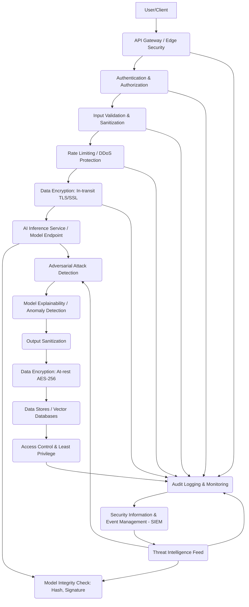
```mermaid
graph TD
    A[User/Client] --> B(API Gateway / Edge Security)
    B --> C(Authentication & Authorization)
    C --> D(Input Validation & Sanitization)
    D --> E(Rate Limiting / DDoS Protection)
    E --> F(Data Encryption: In-transit TLS/SSL)
    F --> G(AI Inference Service / Model Endpoint)
    G --> H(Model Integrity Check: Hash, Signature)
    G --> I(Adversarial Attack Detection)
    I --> J(Model Explainability / Anomaly Detection)
    J --> K(Output Sanitization)
    K --> L(Data Encryption: At-rest AES-256)
    L --> M(Data Stores / Vector Databases)
    M --> N(Access Control & Least Privilege)
    N --> O(Audit Logging & Monitoring)
    O --> P(Security Information & Event Management - SIEM)
    P --> Q(Threat Intelligence Feed)
    Q --> I
    Q --> H
    Q --> O
    B --> O
    C --> O
    D --> O
    E --> O
    F --> O
```

## Chapter 12: The Feline Exception Protocol (FEP) in Action.

The "Feline Exception Protocol" (FEP) is a highly specialized, metaphorical component within the Yellow Banana framework, designed to address the unpredictable, rare, and high-impact "black swan" events that can cripple even the most robust AI systems. Just as a cat is renowned for its ability to always "land on its feet" regardless of the fall, FEP ensures that an AGI system possesses an inherent capability for graceful degradation, intelligent recovery, and adaptive resilience in the face of unforeseen anomalies, novel adversarial attacks, or catastrophic infrastructure failures. It's the ultimate safeguard against the unknown unknowns.

FEP is not a single algorithm but an architectural philosophy embedded throughout the AI SaaS. It encompasses: **Advanced Anomaly Detection** (using unsupervised learning to spot deviations from normal behavior across data, model predictions, and system metrics), **Contextual Fallback Mechanisms** (switching to simpler, more robust models or human-in-the-loop interfaces when confidence levels drop), **Self-Healing Infrastructure** (automated remediation of cloud resource issues), **Adaptive Retraining Loops** (triggering immediate model updates upon detection of significant concept drift or performance degradation), and **Intelligent Rollback Strategies** (reverting to previous stable states with minimal data loss). The core idea is to prevent a single point of failure or an unexpected input from cascading into a systemic collapse.

Consider an autonomous trading AI. A sudden, unprecedented market event (a "black swan") could lead its predictive models to make catastrophic decisions. FEP would detect the anomaly, pause autonomous trading, revert to a human-supervised mode or a safer, rule-based strategy, and concurrently initiate an analysis of the novel data to adapt its learning models. This ensures that while the system might not perform optimally during the anomaly, it will not incur significant losses and will learn from the experience to become more resilient in the future. The following Python snippet illustrates a conceptual anomaly detection and fallback mechanism for an AI service:

```python
import numpy as np
import random
import time
from collections import deque

class FelineExceptionProtocol:
    def __init__(self, threshold=3.0, window_size=100):
        self.threshold = threshold  # Z-score threshold for anomaly
        self.data_window = deque(maxlen=window_size)
        self.system_status = "OPERATIONAL"
        self.fallback_active = False

    def _calculate_z_score(self, value):
        if len(self.data_window) < 2: # Need at least 2 points for std dev
            return 0.0
        mean = np.mean(self.data_window)
        std_dev = np.std(self.data_window)
        if std_dev == 0: # Avoid division by zero
            return 0.0
        return (value - mean) / std_dev

    def monitor_metric(self, metric_value, metric_name="default"):
        self.data_window.append(metric_value)
        z_score = self._calculate_z_score(metric_value)
        
        if abs(z_score) > self.threshold:
            print(f"!!! FEP ALERT !!! Anomaly detected for {metric_name}: value={metric_value}, Z-score={z_score:.2f}")
            self._trigger_fallback(f"High anomaly in {metric_name}")
            return True
        elif self.fallback_active and abs(z_score) <= self.threshold * 0.5: # Lower threshold to exit fallback
            print(f"FEP: Metric {metric_name} returning to normal. Z-score={z_score:.2f}")
            self._deactivate_fallback()
        
        return False

    def _trigger_fallback(self, reason):
        if not self.fallback_active:
            print(f"FEP ACTIVATED: Initiating fallback procedures due to: {reason}")
            self.system_status = "FALLBACK_MODE"
            self.fallback_active = True
            # Log incident, alert human operators, switch to simpler model, etc.
            # Example: switch AI inference to a pre-trained, robust, but less performant model
            # self.ai_service.switch_to_safe_model()
            # self.human_oversight_module.notify_critical_event()

    def _deactivate_fallback(self):
        if self.fallback_active:
            print("FEP DEACTIVATED: Resuming normal operations.")
            self.system_status = "OPERATIONAL"
            self.fallback_active = False
            # Example: switch back to advanced AI model
            # self.ai_service.switch_to_advanced_model()

    def get_system_status(self):
        return self.system_status

# Example Usage:
# fep = FelineExceptionProtocol(threshold=2.5, window_size=50)
#
# # Simulate normal operation
# print("--- Normal Operation ---")
# for _ in range(100):
#     metric = random.gauss(100, 5) # Mean 100, Std Dev 5
#     fep.monitor_metric(metric, "CPU_Load_Avg")
#     time.sleep(0.01)
#
# # Simulate an anomaly
# print("\n--- Introducing Anomaly ---")
# for _ in range(10):
#     metric = random.gauss(150, 10) # Suddenly higher mean
#     fep.monitor_metric(metric, "CPU_Load_Avg")
#     time.sleep(0.01)
#
# # Simulate recovery
# print("\n--- Simulating Recovery ---")
# for _ in range(50):
#     metric = random.gauss(102, 4) # Return to normal
#     fep.monitor_metric(metric, "CPU_Load_Avg")
#     time.sleep(0.01)
#
# print(f"\nFinal System Status: {fep.get_system_status()}")
```

By embedding the Feline Exception Protocol, the Yellow Banana framework ensures that its autonomous AI systems are not only powerful but also inherently resilient, capable of navigating the unpredictable complexities of real-world operation and emerging stronger from adversity.

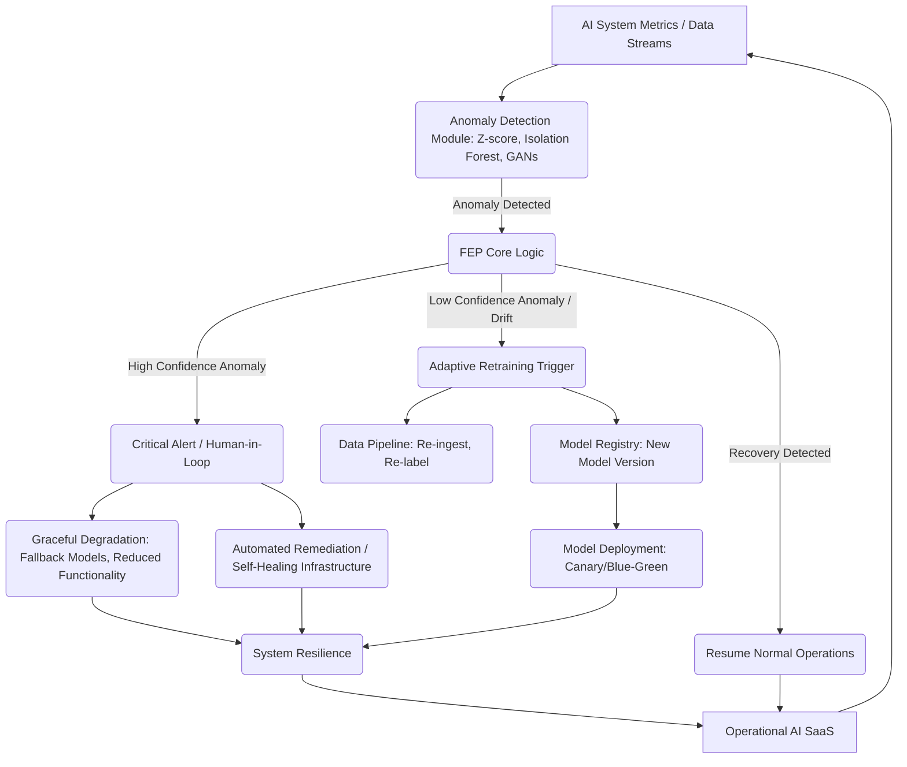
```mermaid
graph TD
    A[AI System Metrics / Data Streams] --> B(Anomaly Detection Module: Z-score, Isolation Forest, GANs)
    B -- Anomaly Detected --> C(FEP Core Logic)
    C -- High Confidence Anomaly --> D(Critical Alert / Human-in-Loop)
    C -- Low Confidence Anomaly / Drift --> E(Adaptive Retraining Trigger)
    D --> F(Graceful Degradation: Fallback Models, Reduced Functionality)
    D --> G(Automated Remediation / Self-Healing Infrastructure)
    E --> H(Data Pipeline: Re-ingest, Re-label)
    E --> I(Model Registry: New Model Version)
    I --> J(Model Deployment: Canary/Blue-Green)
    F --> K(System Resilience)
    G --> K
    J --> K
    K --> L[Operational AI SaaS]
    L --> A
    C -- Recovery Detected --> M(Resume Normal Operations)
    M --> L
```

## Chapter 13: Quantum Neural Networks Basics.

As the Yellow Banana framework pushes the boundaries of AGI, "Quantum Neural Networks (QNNs)" emerge as a frontier technology with the potential to fundamentally transform AI capabilities. While still in nascent stages, QNNs represent a powerful convergence of quantum computing and artificial intelligence, leveraging the unique principles of quantum mechanics – superposition, entanglement, and quantum interference – to process information in ways classical computers cannot. Understanding the basics of QNNs is crucial for future-proofing AI architectures and exploring computational paradigms that could solve problems currently intractable for even the most powerful classical AI.

At its core, a QNN replaces classical neurons and weights with quantum bits (qubits) and quantum gates. Instead of processing binary inputs, qubits can exist in a superposition of states, allowing them to represent and process exponentially more information than classical bits. Entanglement enables qubits to be correlated in ways that defy classical intuition, potentially leading to more complex and powerful feature representations. Quantum gates manipulate these qubits, performing operations that mimic the learning and activation functions of classical neural networks but within a quantum Hilbert space. This quantum parallelism could theoretically accelerate training times for certain problems, enhance pattern recognition in high-dimensional data, and even enable new forms of AI that leverage quantum phenomena.

The current landscape of QNNs often involves "variational quantum circuits," where a parameterized quantum circuit (the QNN) is optimized using a classical optimizer. The classical optimizer adjusts the parameters of the quantum circuit to minimize a cost function, similar to how gradient descent optimizes weights in classical neural networks. While practical applications are limited by the current state of quantum hardware (noisy intermediate-scale quantum, or NISQ devices), the theoretical promise for tasks like drug discovery, materials science, complex optimization, and even advanced machine learning remains immense. The following conceptual code snippet, using the `qiskit` library, illustrates a very basic variational quantum circuit that could serve as a "quantum layer" in a hybrid QNN:

```python
# pip install qiskit
from qiskit import QuantumCircuit, Aer, transpile
from qiskit.opflow import Z, I # Pauli Z and Identity operators
from qiskit.utils import QuantumInstance
from qiskit.algorithms.optimizers import COBYLA
from qiskit.circuit import Parameter
import numpy as np

class BasicQuantumNeuralNetworkLayer:
    def __init__(self, num_qubits, feature_dimension):
        self.num_qubits = num_qubits
        self.feature_dimension = feature_dimension
        self.qc = self._create_ansatz() # Ansatz is the parameterized quantum circuit
        self.optimizer = COBYLA(maxiter=100) # Classical optimizer
        self.backend = Aer.get_backend('qasm_simulator') # Simulator for demonstration

    def _create_ansatz(self):
        # Define a parameterized quantum circuit (ansatz)
        qc = QuantumCircuit(self.num_qubits)
        self.params = [Parameter(f'theta_{i}') for i in range(self.num_qubits * 2)] # Example params
        
        # Feature encoding (e.g., using Ry gates)
        for i in range(self.num_qubits):
            qc.ry(self.params[i], i)
        
        # Entangling layers (e.g., CNOT gates)
        for i in range(self.num_qubits - 1):
            qc.cx(i, i+1)
        qc.cx(self.num_qubits-1, 0) # Wrap-around entanglement

        # Another layer of single-qubit rotations
        for i in range(self.num_qubits):
            qc.rz(self.params[self.num_qubits + i], i)
        
        return qc

    def _encode_features(self, features):
        # Map classical features to quantum circuit parameters
        # This is a critical and complex step in QNN design
        # For simplicity, we'll just return our defined parameters for optimization
        # In a real QNN, features would influence the initial state or rotation angles.
        return self.params # These parameters will be optimized by COBYLA

    def _objective_function(self, params, features, target_label):
        # This is a placeholder cost function
        # In a real scenario, this would involve running the circuit,
        # measuring expectation values, and comparing to a target.
        bound_circuit = self.qc.bind_parameters({p: v for p, v in zip(self.params, params)})
        
        # Simulate and get measurement outcomes (simplified)
        # For classification, we might measure expectation value of Pauli Z on a qubit
        # For demonstration, let's just make up a cost based on parameters
        
        # Example: Try to make the sum of parameters close to target_label
        cost = np.abs(np.sum(params) - target_label * self.num_qubits) # Arbitrary cost function
        
        return cost

    def train(self, training_features, training_labels):
        # Initial random parameters
        initial_params = np.random.rand(len(self.params)) * 2 * np.pi
        
        # We'll train for a single feature/label pair for simplicity
        feature = training_features[0]
        label = training_labels[0]

        # Use the classical optimizer to find optimal quantum circuit parameters
        ret = self.optimizer.optimize(
            num_vars=len(self.params),
            objective_function=lambda p: self._objective_function(p, feature, label),
            initial_point=initial_params
        )
        self.optimized_params = ret[0]
        print(f"QNN Layer trained. Optimized parameters: {self.optimized_params}")
        
    def predict(self, input_features):
        # In a real QNN, encode features, run circuit with optimized params, measure
        # For demonstration, a dummy prediction based on optimized params
        if not hasattr(self, 'optimized_params'):
            raise ValueError("QNN not trained yet.")
        
        # Simulate prediction logic - could be based on expectation values
        prediction_score = np.sum(self.optimized_params) / (len(self.params) * np.pi) # Example score
        return 1 if prediction_score > 0.5 else 0 # Binary classification example

# Example Usage (conceptual):
# qnn_layer = BasicQuantumNeuralNetworkLayer(num_qubits=2, feature_dimension=2)
#
# # Dummy training data
# train_features = [np.array([0.1, 0.2])]
# train_labels = [1]
# qnn_layer.train(train_features, train_labels)
#
# # Dummy prediction
# prediction = qnn_layer.predict(np.array([0.3, 0.4]))
# print(f"Prediction: {prediction}")
```

While full-scale QNNs are still a vision for the future, exploring their basic principles and hybrid architectures today is a strategic investment for any organization aiming to lead the next wave of AGI innovation within the Yellow Banana ecosystem.

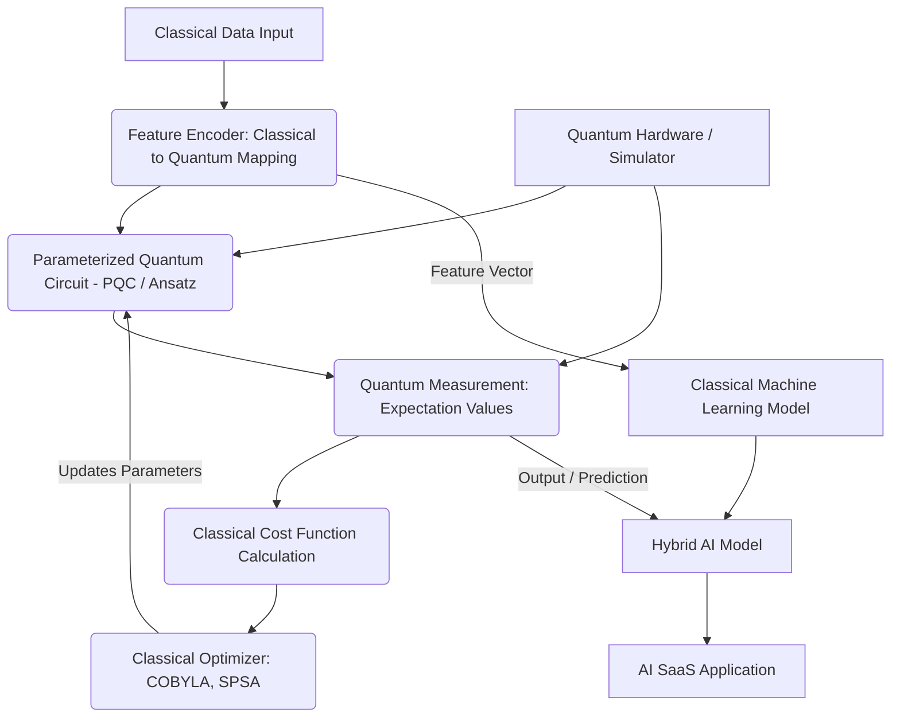
```mermaid
graph TD
    A[Classical Data Input] --> B(Feature Encoder: Classical to Quantum Mapping)
    B --> C(Parameterized Quantum Circuit - PQC / Ansatz)
    C --> D(Quantum Measurement: Expectation Values)
    D --> E(Classical Cost Function Calculation)
    E --> F(Classical Optimizer: COBYLA, SPSA)
    F -- Updates Parameters --> C
    D -- Output / Prediction --> G[Hybrid AI Model]
    G --> H[AI SaaS Application]
    I[Quantum Hardware / Simulator] --> C
    I --> D
    J[Classical Machine Learning Model] --> G
    B -- Feature Vector --> J
```

## Chapter 14: Cloud-Native DevOps Architecture.

The Yellow Banana framework thrives on agility, scalability, and resilience, all hallmarks of a robust "Cloud-Native DevOps Architecture." This paradigm shifts from traditional monolithic applications and manual operations to a dynamic ecosystem of microservices, containers, serverless functions, and automated pipelines, all designed to run optimally on cloud infrastructure. For AI SaaS, cloud-native DevOps is indispensable for rapidly iterating on AI models, seamlessly scaling inference services, and ensuring the continuous availability and performance of highly complex, distributed systems.

At the heart of cloud-native DevOps are several core principles: **Microservices** (breaking down applications into small, independently deployable services), **Containerization** (packaging applications and their dependencies into portable Docker containers), **Orchestration** (managing containerized workloads with Kubernetes), **Serverless Computing** (running code without provisioning servers, e.g., AWS Lambda, Azure Functions), **Infrastructure as Code (IaC)** (managing and provisioning infrastructure through code, e.g., Terraform, CloudFormation), and **Continuous Delivery** (automating the release process). These principles, combined with a strong DevOps culture of collaboration and shared responsibility, enable teams to deliver value faster and more reliably.

For an AI SaaS, a cloud-native architecture means AI models can be deployed as independent microservices, scaled up or down based on demand, and updated without affecting other parts of the system. Data processing pipelines can leverage serverless functions for event-driven processing, while Kubernetes manages the orchestration of complex AGI components. This modularity not only enhances agility but also improves fault isolation and resource utilization, directly contributing to the high-profitability goals of the Yellow Banana. The following Kubernetes manifest snippet illustrates a basic deployment for an AI inference microservice:

```yaml
# ai-inference-service.yaml
apiVersion: apps/v1
kind: Deployment
metadata:
  name: ai-inference-service
  labels:
    app: ai-inference
spec:
  replicas: 3 # Start with 3 instances, can be autoscaled
  selector:
    matchLabels:
      app: ai-inference
  template:
    metadata:
      labels:
        app: ai-inference
    spec:
      containers:
      - name: ai-inference-container
        image: your-registry/ai-inference-model:v1.2.3 # Image built via CI/CD
        ports:
        - containerPort: 8080
        resources:
          requests:
            cpu: "500m" # Request 0.5 CPU cores
            memory: "1Gi" # Request 1GB memory
          limits:
            cpu: "2" # Limit to 2 CPU cores
            memory: "4Gi" # Limit to 4GB memory
        env:
        - name: MODEL_PATH
          value: "/app/models/latest_model.pt" # Path to mounted model
        - name: API_KEY_SECRET
          valueFrom:
            secretKeyRef:
              name: ai-api-secrets
              key: api-key
        volumeMounts:
        - name: model-volume
          mountPath: "/app/models"
      volumes:
      - name: model-volume
        persistentVolumeClaim:
          claimName: ai-model-pvc # PVC to load AI model data
---
apiVersion: v1
kind: Service
metadata:
  name: ai-inference-service
spec:
  selector:
    app: ai-inference
  ports:
    - protocol: TCP
      port: 80
      targetPort: 8080
  type: ClusterIP # Use LoadBalancer for external access
```

This cloud-native approach empowers organizations to build, deploy, and operate sophisticated AI SaaS solutions with unparalleled speed, reliability, and cost-effectiveness, fully realizing the Yellow Banana vision.

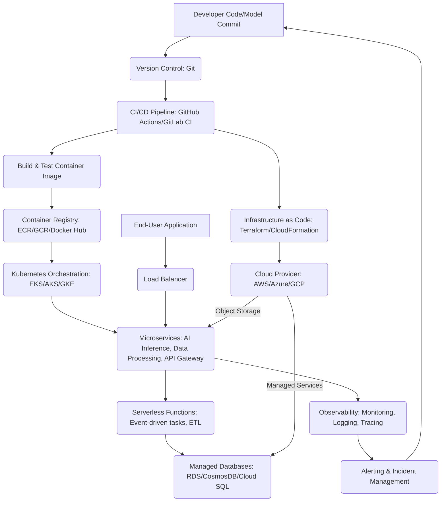
```mermaid
graph TD
    A[Developer Code/Model Commit] --> B(Version Control: Git)
    B --> C(CI/CD Pipeline: GitHub Actions/GitLab CI)
    C --> D(Build & Test Container Image)
    D --> E(Container Registry: ECR/GCR/Docker Hub)
    C --> F(Infrastructure as Code: Terraform/CloudFormation)
    F --> G(Cloud Provider: AWS/Azure/GCP)
    E --> H(Kubernetes Orchestration: EKS/AKS/GKE)
    H --> I(Microservices: AI Inference, Data Processing, API Gateway)
    I --> J(Serverless Functions: Event-driven tasks, ETL)
    J --> K(Managed Databases: RDS/CosmosDB/Cloud SQL)
    I --> L(Observability: Monitoring, Logging, Tracing)
    L --> M(Alerting & Incident Management)
    M --> A
    N[End-User Application] --> O(Load Balancer)
    O --> I
    G -- Managed Services --> K
    G -- Object Storage --> I
```

## Chapter 15: SaaS Blueprint: From Zero to MMR.

The journey from a nascent idea to consistent Monthly Recurring Revenue (MMR) for an AI SaaS product, encapsulated within the Yellow Banana framework, requires more than just groundbreaking technology; it demands a meticulous strategic blueprint. This chapter outlines the critical phases and actionable insights necessary to navigate this path, focusing on market validation, product development, customer acquisition, and scalable growth, all while leveraging the inherent advantages of AI automation.

The initial phase, **"Zero,"** is about achieving Product-Market Fit (PMF). This involves deep market research, identifying a pressing problem that AI can uniquely solve, and validating demand through customer interviews, surveys, and competitive analysis. Develop a Minimum Viable Product (MVP) that showcases the core AI value proposition with minimal features. The Yellow Banana approach emphasizes building this MVP with autonomous AI components from the start, demonstrating self-sustaining value early on. Focus on a niche market where your AI can deliver disproportionate value.

The next phase, driving towards **MMR,** involves iterative development, aggressive customer acquisition, and robust retention strategies. Once your MVP gains traction, continually gather user feedback to refine the AI models and add features that address critical pain points. Implement a solid customer onboarding process that quickly demonstrates the AI's value. Marketing efforts should focus on content that educates potential users about the unique advantages of your AI solution. Sales strategies should highlight the ROI and operational efficiencies delivered by your autonomous AI. Crucially, monitor key metrics like churn rate, customer acquisition cost (CAC), and customer lifetime value (LTV) to optimize your growth engine.

For an AI SaaS, achieving MMR is significantly accelerated by the Yellow Banana's focus on automation. Autonomous AI agents can handle customer support, personalize marketing outreach, optimize pricing, and even manage infrastructure, drastically reducing operational overhead and improving profit margins. This allows the business to scale rapidly without linearly increasing human resources. The blueprint emphasizes leveraging these AI-driven efficiencies to reinvest in product development and customer acquisition, creating a virtuous cycle of growth.

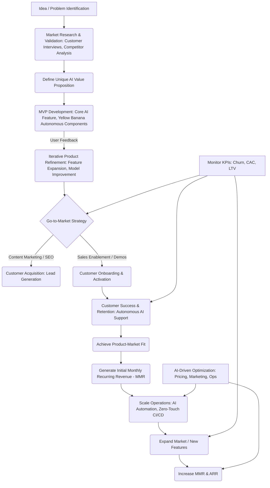
```mermaid
graph TD
    A[Idea / Problem Identification] --> B(Market Research & Validation: Customer Interviews, Competitor Analysis)
    B --> C(Define Unique AI Value Proposition)
    C --> D(MVP Development: Core AI Feature, Yellow Banana Autonomous Components)
    D -- User Feedback --> E(Iterative Product Refinement: Feature Expansion, Model Improvement)

    E --> F{Go-to-Market Strategy}
    F -- Content Marketing / SEO --> G(Customer Acquisition: Lead Generation)
    F -- Sales Enablement / Demos --> H(Customer Onboarding & Activation)
    H --> I(Customer Success & Retention: Autonomous AI Support)

    I --> J(Achieve Product-Market Fit)
    J --> K(Generate Initial Monthly Recurring Revenue - MMR)

    K --> L(Scale Operations: AI Automation, Zero-Touch CI/CD)
    L --> M(Expand Market / New Features)
    M --> N(Increase MMR & ARR)

    O[Monitor KPIs: Churn, CAC, LTV] --> F
    O --> I
    O --> M
    P[AI-Driven Optimization: Pricing, Marketing, Ops] --> L
    P --> N
```

## Chapter 16: Handling Big Data with Automated Pipelines.

The success of any sophisticated AI SaaS, particularly one built on the Yellow Banana framework, hinges on its ability to effectively ingest, process, transform, and analyze vast quantities of data – Big Data – with speed and precision. Manual data handling is a bottleneck that stifles innovation and scalability. Therefore, "Automated Pipelines" for Big Data are not merely a convenience but a strategic imperative. These pipelines ensure that the AGI components always have access to fresh, clean, and relevant data, enabling continuous learning, real-time inference, and proactive decision-making across the entire system.

Automated Big Data pipelines typically involve several critical stages: **Ingestion** (collecting data from diverse sources like IoT sensors, web logs, databases, social media, using tools like Kafka, Flink, or AWS Kinesis), **Storage** (persisting raw and processed data in scalable data lakes like S3, HDFS, or Google Cloud Storage), **Processing** (transforming, cleaning, and enriching data using distributed computing frameworks like Apache Spark, Flink, or Databricks), and **Serving** (making processed data available for AI models, analytics, and applications via data warehouses, feature stores, or APIs). Each stage is orchestrated and monitored, often with tools like Apache Airflow, Prefect, or Dagster, to ensure reliability and traceability.

For a Yellow Banana AI SaaS, these pipelines are the lifeblood. An autonomous agent designed to optimize logistics, for example, would rely on pipelines that continuously feed it real-time traffic data, weather forecasts, delivery schedules, and inventory levels. The automation ensures that this data is always up-to-date and in the correct format for the AI models. This reduces the latency between data generation and AI-driven action, maximizing the value derived from the data. The following Python snippet, using `pandas` and `pyarrow` (conceptually), illustrates a simple data processing step within such a pipeline:

```python
import pandas as pd
import pyarrow.parquet as pq
import pyarrow as pa
import os
import datetime

class AutomatedDataPipeline:
    def __init__(self, raw_data_path, processed_data_path):
        self.raw_data_path = raw_data_path
        self.processed_data_path = processed_data_path
        os.makedirs(self.processed_data_path, exist_ok=True)

    def ingest_data(self, source_system="mock_api"):
        # Simulate data ingestion from a source (e.g., API, Kafka topic)
        print(f"Ingesting data from {source_system}...")
        
        # In a real scenario, this would fetch data from Kafka, S3, etc.
        # For demo, generate dummy data
        data = {
            'timestamp': [datetime.datetime.now() - datetime.timedelta(minutes=i) for i in range(100)],
            'user_id': np.random.randint(1, 1000, 100),
            'event_type': np.random.choice(['click', 'view', 'purchase', 'login'], 100),
            'value': np.random.rand(100) * 100
        }
        df = pd.DataFrame(data)
        
        # Save raw data to a temporary file or data lake
        raw_file_path = os.path.join(self.raw_data_path, f"raw_events_{datetime.datetime.now().strftime('%Y%m%d%H%M%S')}.parquet")
        table = pa.Table.from_pandas(df)
        pq.write_table(table, raw_file_path)
        print(f"Ingested {len(df)} records to {raw_file_path}")
        return raw_file_path

    def process_data(self, raw_file_path):
        print(f"Processing data from {raw_file_path}...")
        
        # Load raw data
        table = pq.read_table(raw_file_path)
        df = table.to_pandas()

        # Example processing steps:
        # 1. Filter out 'view' events
        df_filtered = df[df['event_type'] != 'view']
        
        # 2. Aggregate by user and event type
        df_agg = df_filtered.groupby(['user_id', 'event_type'])['value'].sum().reset_index()
        df_agg.rename(columns={'value': 'total_value_per_event'}, inplace=True)
        
        # 3. Feature engineering: Calculate days since first event (conceptual)
        # In a real pipeline, this would involve more complex stateful operations
        df_agg['processing_date'] = datetime.date.today()
        
        # Save processed data
        processed_file_path = os.path.join(self.processed_data_path, f"processed_agg_{datetime.datetime.now().strftime('%Y%m%d%H%M%S')}.parquet")
        processed_table = pa.Table.from_pandas(df_agg)
        pq.write_table(processed_table, processed_file_path)
        print(f"Processed {len(df_agg)} aggregated records to {processed_file_path}")
        return processed_file_path

    def run_pipeline_step(self):
        raw_data_file = self.ingest_data()
        processed_data_file = self.process_data(raw_data_file)
        return processed_data_file

# Example Usage:
# data_pipeline = AutomatedDataPipeline(
#     raw_data_path="data/raw",
#     processed_data_path="data/processed"
# )
# final_output_file = data_pipeline.run_pipeline_step()
# print(f"Pipeline finished, output in: {final_output_file}")
#
# # Example of loading and viewing processed data
# # processed_df = pq.read_table(final_output_file).to_pandas()
# # print(processed_df.head())
```

By leveraging automated Big Data pipelines, the Yellow Banana framework ensures that its AI models are continuously fed with the highest quality data, enabling superior performance, faster iterations, and ultimately, greater business value.

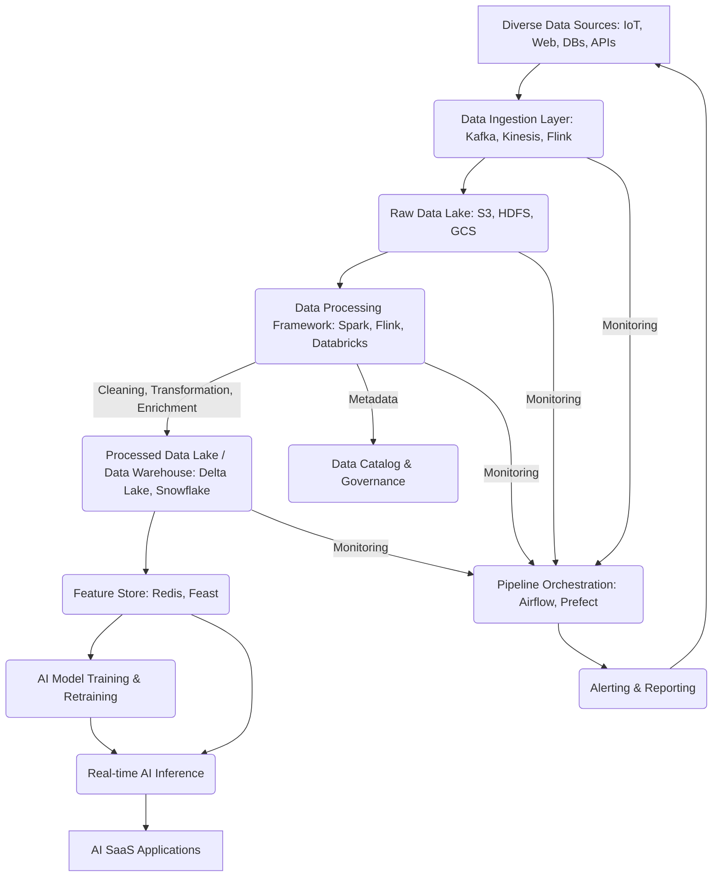
```mermaid
graph TD
    A[Diverse Data Sources: IoT, Web, DBs, APIs] --> B(Data Ingestion Layer: Kafka, Kinesis, Flink)
    B --> C(Raw Data Lake: S3, HDFS, GCS)
    C --> D(Data Processing Framework: Spark, Flink, Databricks)
    D -- Cleaning, Transformation, Enrichment --> E(Processed Data Lake / Data Warehouse: Delta Lake, Snowflake)
    E --> F(Feature Store: Redis, Feast)
    F --> G(AI Model Training & Retraining)
    F --> H(Real-time AI Inference)
    G --> H
    H --> I[AI SaaS Applications]
    D -- Metadata --> J(Data Catalog & Governance)
    B -- Monitoring --> K(Pipeline Orchestration: Airflow, Prefect)
    C -- Monitoring --> K
    D -- Monitoring --> K
    E -- Monitoring --> K
    K --> L(Alerting & Reporting)
    L --> A
```

## Chapter 17: The LLM Engineer’s Handbook.

The rapid advancements in Large Language Models (LLMs) have created a new, critical role within the Yellow Banana framework: the "LLM Engineer." This role transcends traditional data science and software engineering, focusing specifically on optimizing, deploying, and integrating LLMs into complex AI SaaS products. The LLM Engineer's Handbook outlines the essential skills and strategies for harnessing the power of foundational models, ensuring they deliver precise, reliable, and scalable intelligence for autonomous AI systems.

The LLM Engineer's toolkit is multifaceted. It includes deep expertise in **Prompt Engineering** (as discussed in Chapter 9), understanding advanced techniques like Chain-of-Thought, few-shot learning, and self-consistency to guide LLM behavior. Beyond prompting, it involves **Fine-tuning** foundational models on proprietary datasets to achieve domain-specific accuracy and tone, using techniques like Low-Rank Adaptation (LoRA) or full fine-tuning. A crucial aspect is **Retrieval-Augmented Generation (RAG)**, where LLMs are combined with external knowledge bases (vector databases) to ground their responses in factual, up-to-date information, significantly reducing hallucination and increasing relevance.

Deployment and optimization are equally vital. LLM Engineers must understand how to serve models efficiently, considering factors like latency, throughput, and cost. This involves techniques like **quantization** and **distillation** for model compression, using specialized inference engines (e.g., NVIDIA TensorRT-LLM, Hugging Face Text Generation Inference), and implementing **caching strategies**. Furthermore, continuous monitoring of LLM performance, bias detection, and ethical alignment are paramount to ensure the AI SaaS remains trustworthy and valuable. The following Python code demonstrates a conceptual RAG implementation using a vector database for context retrieval:

```python
# pip install transformers sentence-transformers faiss-cpu # Example libraries
from transformers import pipeline
from sentence_transformers import SentenceTransformer
import faiss
import numpy as np
import asyncio

class LLMEngineerHandbook:
    def __init__(self, model_name="thenlper/gte-small", llm_model="gpt2"):
        self.embedding_model = SentenceTransformer(model_name)
        self.llm_pipeline = pipeline("text-generation", model=llm_model)
        self.vector_db = None
        self.documents = []

    def load_documents_and_build_vector_db(self, texts):
        self.documents = texts
        embeddings = self.embedding_model.encode(texts)
        self.vector_db = faiss.IndexFlatL2(embeddings.shape[1]) # L2 distance
        self.vector_db.add(embeddings)
        print(f"Vector DB built with {len(texts)} documents.")

    def retrieve_context(self, query, k=3):
        query_embedding = self.embedding_model.encode([query])
        distances, indices = self.vector_db.search(query_embedding, k)
        
        context_docs = [self.documents[i] for i in indices[0]]
        print(f"Retrieved {len(context_docs)} context documents.")
        return context_docs

    def generate_response_with_rag(self, user_query, k=3):
        if not self.vector_db:
            raise ValueError("Vector database not loaded. Call load_documents_and_build_vector_db first.")

        context_docs = self.retrieve_context(user_query, k)
        
        # Construct the prompt with retrieved context
        context_str = "\n".join([f"Context: {doc}" for doc in context_docs])
        prompt = f"Based on the following context, answer the user's question:\n\n{context_str}\n\nUser Question: {user_query}\n\nAnswer:"
        
        print(f"--- RAG Prompt ---\n{prompt}\n--------------------")
        
        # Generate response using LLM
        # For GPT-2, max_new_tokens is important for controlling output length
        response = self.llm_pipeline(prompt, max_new_tokens=150, num_return_sequences=1, truncation=True)
        return response[0]['generated_text'].replace(prompt, '').strip()

# Example Usage:
# async def main():
#     llm_engineer = LLMEngineerHandbook()
#
#     # Sample knowledge base documents
#     knowledge_base_texts = [
#         "The Yellow Banana framework simplifies complex AI SaaS deployments.",
#         "Zero-Touch CI/CD is a core component of Project Yellow Banana.",
#         "Autonomous AI agents handle tasks like resource optimization and customer support.",
#         "The Feline Exception Protocol ensures resilience against black swan events.",
#         "Quantum Neural Networks are an emerging technology for advanced AI.",
#         "Python 3.10 is used for Neural Nodes in predictive markets."
#     ]
#
#     llm_engineer.load_documents_and_build_vector_db(knowledge_base_texts)
#
#     query = "What is the Feline Exception Protocol and what does it do in Project Yellow Banana?"
#     response = llm_engineer.generate_response_with_rag(query)
#     print(f"\n--- RAG Response ---\n{response}\n--------------------")
#
#     query_no_context = "Tell me about the importance of Python in AI."
#     response_no_context = llm_engineer.generate_response_with_rag(query_no_context)
#     print(f"\n--- RAG Response (less specific query) ---\n{response_no_context}\n--------------------")
#
# if __name__ == "__main__":
#     asyncio.run(main())
```

By mastering these advanced techniques, LLM Engineers become pivotal in transforming raw LLM power into precision instruments for the Yellow Banana, driving the next generation of intelligent, high-value AI SaaS products.

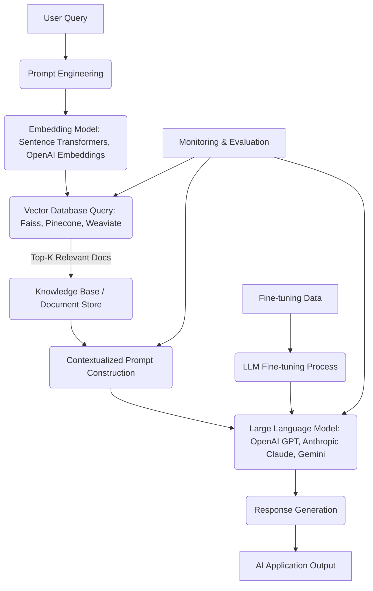
```mermaid
graph TD
    A[User Query] --> B(Prompt Engineering)
    B --> C(Embedding Model: Sentence Transformers, OpenAI Embeddings)
    C --> D(Vector Database Query: Faiss, Pinecone, Weaviate)
    D -- Top-K Relevant Docs --> E(Knowledge Base / Document Store)
    E --> F(Contextualized Prompt Construction)
    F --> G(Large Language Model: OpenAI GPT, Anthropic Claude, Gemini)
    G --> H(Response Generation)
    H --> I[AI Application Output]
    J[Fine-tuning Data] --> K(LLM Fine-tuning Process)
    K --> G
    L[Monitoring & Evaluation] --> G
    L --> D
    L --> F
```

## Chapter 18: Autonomous Issue Resolution Systems.

For a Yellow Banana AI SaaS to be truly self-sustaining and high-profit, it must operate with minimal human intervention, especially when incidents occur. This necessitates the implementation of "Autonomous Issue Resolution Systems." These are advanced AI-powered mechanisms designed to detect, diagnose, and automatically remediate operational issues across the entire infrastructure and application stack, from code errors and performance bottlenecks to security vulnerabilities and infrastructure failures. Such systems elevate the reliability and operational efficiency to unprecedented levels.

An Autonomous Issue Resolution System typically comprises several tightly integrated components: **Proactive Monitoring** (collecting metrics, logs, and traces from all system components), **Anomaly Detection** (AI models identifying deviations from normal behavior), **Root Cause Analysis (RCA)** (AI algorithms correlating anomalies across different layers to pinpoint the underlying cause), and **Automated Remediation** (pre-defined or AI-generated scripts and actions to fix the issue). The system operates on a closed-loop feedback mechanism, learning from each incident and successful resolution to improve its diagnostic and remediation capabilities over time.

Consider a microservice in an AI SaaS that experiences a sudden spike in latency. The Autonomous Issue Resolution System would detect this anomaly, correlate it with recent code deployments, resource utilization, and database query times. If it identifies a specific problematic database query or a memory leak in a newly deployed service version, it could automatically trigger a rollback to the previous stable version, scale up resources, or even restart the affected service, all without human intervention. This proactive and autonomous approach dramatically reduces downtime, improves MTTR (Mean Time To Resolution), and frees up engineering teams from firefighting. The following Python snippet outlines a conceptual automated remediation script:

```python
import requests
import json
import time

class AutonomousRemediationSystem:
    def __init__(self, monitoring_api_url, k8s_api_url, alert_webhook_url):
        self.monitoring_api_url = monitoring_api_url
        self.k8s_api_url = k8s_api_url
        self.alert_webhook_url = alert_webhook_url
        self.k8s_token = os.environ.get("KUBERNETES_SERVICE_ACCOUNT_TOKEN") # In-cluster deployment
        self.headers = {"Authorization": f"Bearer {self.k8s_token}"} if self.k8s_token else {}


    def _get_current_cpu_load(self, service_name):
        # Simulate fetching CPU load from a monitoring system
        # In real-world, integrate with Prometheus/Grafana/Datadog API
        print(f"Fetching CPU load for {service_name}...")
        try:
            response = requests.get(f"{self.monitoring_api_url}/metrics/{service_name}/cpu_load")
            response.raise_for_status()
            return response.json().get('value', 0)
        except requests.exceptions.RequestException as e:
            print(f"Error fetching CPU load: {e}")
            return 0

    def _scale_kubernetes_deployment(self, deployment_name, namespace, desired_replicas):
        print(f"Attempting to scale deployment {deployment_name} to {desired_replicas} replicas...")
        try:
            # This is a simplified K8s API interaction. Use kubernetes-client for robustness.
            patch_payload = {"spec": {"replicas": desired_replicas}}
            url = f"{self.k8s_api_url}/apis/apps/v1/namespaces/{namespace}/deployments/{deployment_name}"
            response = requests.patch(url, headers=self.headers, json=patch_payload)
            response.raise_for_status()
            print(f"Successfully sent scale request for {deployment_name} to {desired_replicas}.")
            return True
        except requests.exceptions.RequestException as e:
            print(f"Error scaling deployment {deployment_name}: {e}")
            self.send_alert(f"Failed to scale {deployment_name}. Manual intervention required.", "CRITICAL")
            return False

    def _restart_kubernetes_deployment(self, deployment_name, namespace):
        print(f"Attempting to restart deployment {deployment_name}...")
        try:
            # Patch deployment to force a rolling restart
            patch_payload = {
                "spec": {
                    "template": {
                        "metadata": {
                            "annotations": {
                                "kubectl.kubernetes.io/restartedAt": datetime.datetime.now().isoformat()
                            }
                        }
                    }
                }
            }
            url = f"{self.k8s_api_url}/apis/apps/v1/namespaces/{namespace}/deployments/{deployment_name}"
            response = requests.patch(url, headers=self.headers, json=patch_payload)
            response.raise_for_status()
            print(f"Successfully triggered restart for {deployment_name}.")
            return True
        except requests.exceptions.RequestException as e:
            print(f"Error restarting deployment {deployment_name}: {e}")
            self.send_alert(f"Failed to restart {deployment_name}. Manual intervention required.", "CRITICAL")
            return False

    def send_alert(self, message, severity="INFO"):
        print(f"Sending alert ({severity}): {message}")
        try:
            requests.post(self.alert_webhook_url, json={"message": message, "severity": severity})
        except requests.exceptions.RequestException as e:
            print(f"Error sending alert: {e}")

    def remediate_high_cpu(self, service_name, deployment_name, namespace, current_replicas, max_replicas=10):
        cpu_load = self._get_current_cpu_load(service_name)
        if cpu_load > 80 and current_replicas < max_replicas:
            print(f"CPU load for {service_name} is {cpu_load}%, scaling up.")
            new_replicas = min(current_replicas + 1, max_replicas)
            if self._scale_kubernetes_deployment(deployment_name, namespace, new_replicas):
                self.send_alert(f"Scaled {deployment_name} to {new_replicas} replicas due to high CPU.", "WARNING")
            return True
        elif cpu_load < 30 and current_replicas > 1: # Scale down if very low
            print(f"CPU load for {service_name} is {cpu_load}%, scaling down.")
            new_replicas = max(current_replicas - 1, 1)
            if self._scale_kubernetes_deployment(deployment_name, namespace, new_replicas):
                self.send_alert(f"Scaled {deployment_name} to {new_replicas} replicas due to low CPU.", "INFO")
            return True
        elif cpu_load > 95: # Critical threshold, try restart if scaling failed or already maxed
            print(f"CRITICAL: CPU load for {service_name} is {cpu_load}%, attempting restart as last resort.")
            if self._restart_kubernetes_deployment(deployment_name, namespace):
                self.send_alert(f"Restarted {deployment_name} due to critical CPU load.", "CRITICAL")
            return True
        return False

# Example Usage (conceptual, assuming K8s API and monitoring API are reachable):
# ars = AutonomousRemediationSystem(
#     monitoring_api_url="http://monitoring-service.internal",
#     k8s_api_url="https://kubernetes.default.svc", # In-cluster K8s API
#     alert_webhook_url="https://hooks.slack.com/services/..."
# )
#
# # In a loop, an anomaly detection system would call this:
# # ars.remediate_high_cpu("ai-inference-service", "ai-inference-service", "default", current_replicas=3)
```

By integrating Autonomous Issue Resolution Systems, the Yellow Banana framework achieves unparalleled operational stability and efficiency, ensuring continuous value delivery and maximizing profitability by minimizing human intervention in incident management.

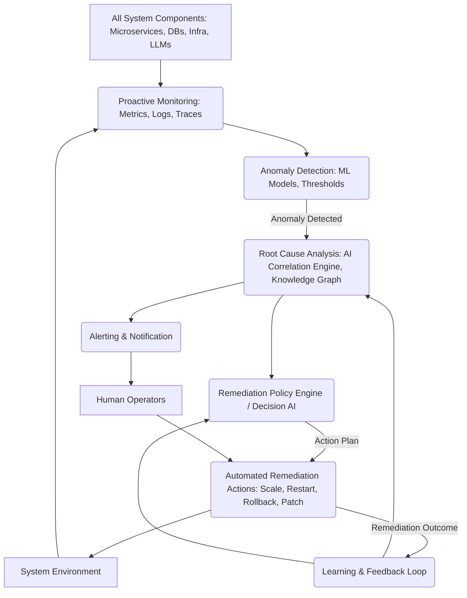
```mermaid
graph TD
    A[All System Components: Microservices, DBs, Infra, LLMs] --> B(Proactive Monitoring: Metrics, Logs, Traces)
    B --> C(Anomaly Detection: ML Models, Thresholds)
    C -- Anomaly Detected --> D(Root Cause Analysis: AI Correlation Engine, Knowledge Graph)
    D --> E(Remediation Policy Engine / Decision AI)
    E -- Action Plan --> F(Automated Remediation Actions: Scale, Restart, Rollback, Patch)
    F --> G[System Environment]
    G --> B
    F -- Remediation Outcome --> H(Learning & Feedback Loop)
    H --> D
    H --> E
    D --> I(Alerting & Notification)
    I --> J[Human Operators]
    J --> F
```

## Chapter 19: Scaling the "Yellow Banana" Framework Globally.

The ultimate objective of "Project Yellow Banana" is to establish a globally dominant AI SaaS offering, necessitating a robust strategy for "Scaling the Framework Globally." This involves far more than simply deploying services in different regions; it requires a holistic approach to internationalization, regulatory compliance, distributed data management, and localized user experience, all while maintaining the autonomous and high-profit characteristics of the core Yellow Banana architecture. Global scaling is about replicating success across diverse markets with minimal friction.

Key considerations for global scaling include **Global Infrastructure Deployment** (leveraging multi-cloud and edge computing across different continents to reduce latency and ensure regional data residency), **Internationalization (i18n) and Localization (l10n)** (adapting the user interface, content, and AI model outputs to local languages, cultures, and legal contexts), and **Regulatory Compliance** (adhering to data privacy laws like GDPR in Europe, CCPA in California, and similar regulations worldwide). Autonomous AI agents within the Yellow Banana framework can play a pivotal role here, for instance, by automatically localizing content, managing regional data segregation, and monitoring compliance adherence.

Furthermore, **Distributed Data Management** is crucial. This involves strategies for data replication, sharding, and caching across geographical regions to ensure high availability and low-latency access for local users, while still maintaining data consistency. **Global Load Balancing** and **Content Delivery Networks (CDNs)** are essential for routing user traffic to the nearest and most performant service endpoints. The Yellow Banana's emphasis on modular microservices and cloud-native architecture makes this global distribution inherently more manageable, allowing for independent scaling and deployment of regional AI services. The following Mermaid diagram illustrates a global deployment strategy.

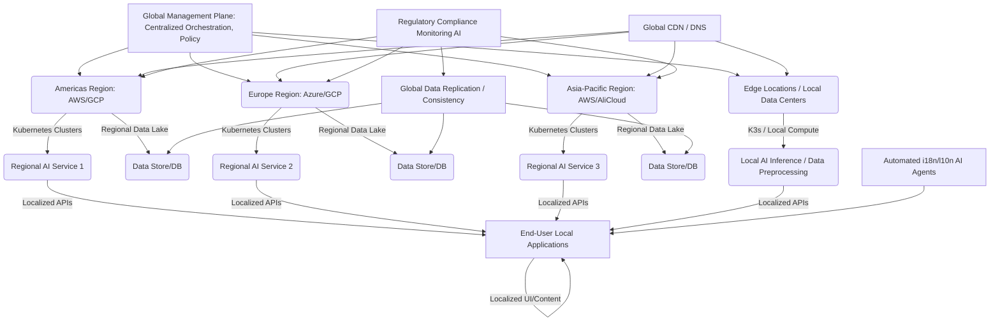
```mermaid
graph TD
    A[Global Management Plane: Centralized Orchestration, Policy] --> B(Americas Region: AWS/GCP)
    A --> C(Europe Region: Azure/GCP)
    A --> D(Asia-Pacific Region: AWS/AliCloud)
    A --> E(Edge Locations / Local Data Centers)

    B -- Kubernetes Clusters --> B1(Regional AI Service 1)
    B -- Regional Data Lake --> B2(Data Store/DB)
    C -- Kubernetes Clusters --> C1(Regional AI Service 2)
    C -- Regional Data Lake --> C2(Data Store/DB)
    D -- Kubernetes Clusters --> D1(Regional AI Service 3)
    D -- Regional Data Lake --> D2(Data Store/DB)
    E -- K3s / Local Compute --> E1(Local AI Inference / Data Preprocessing)

    F[Global CDN / DNS] --> B
    F --> C
    F --> D
    F --> E

    B1 & C1 & D1 & E1 -- Localized APIs --> G[End-User Local Applications]
    G -- Localized UI/Content --> G
    H[Global Data Replication / Consistency] --> B2
    H --> C2
    H --> D2
    I[Automated i18n/l10n AI Agents] --> G
    J[Regulatory Compliance Monitoring AI] --> B
    J --> C
    J --> D
    J --> H
```

By meticulously planning and executing a global scaling strategy, the Yellow Banana framework can achieve its ambitious goal of delivering ubiquitous, high-value AI SaaS solutions to users across the world, solidifying its position as a market leader.

## Chapter 20: Project Genesis: The Next Evolution of Coding.

"Project Genesis" within the Yellow Banana framework is a visionary exploration into the "Next Evolution of Coding," transcending current paradigms of human-written software. It posits a future where the AGI Sentience Kernel, empowered by autonomous agents and advanced LLMs, actively participates in, and eventually orchestrates, the entire software development lifecycle – from conceptualization and design to code generation, testing, deployment, and self-healing. This is not merely AI *assisting* developers, but AI *becoming* a developer, leading to unprecedented acceleration in innovation and a fundamental redefinition of human-computer collaboration.

The core tenets of Project Genesis include: **AI-Driven Code Generation** (LLMs generating entire functions, modules, or even complete applications based on high-level natural language prompts or architectural diagrams), **Autonomous Testing and Debugging** (AI agents writing and executing tests, identifying bugs, and proposing fixes with minimal human oversight), **Self-Modifying and Self-Optimizing Code** (AGI systems dynamically rewriting and refactoring their own codebase to improve performance, security, or efficiency), and **Intent-Based Development** (developers specifying desired outcomes, and the AI translating those intentions into executable, maintainable code). This evolution shifts the human role from writing explicit instructions to defining abstract goals and validating AI-generated solutions.

This radical shift will unlock exponential productivity gains for AI SaaS businesses. Imagine an AI system that, detecting a new market opportunity, autonomously designs, codes, tests, and deploys a new microservice to capture that opportunity, all within hours or days. Human developers will transition to roles of AI architects, ethical guardians, and high-level strategists, focusing on guiding the AGI and ensuring its outputs align with complex business objectives and societal values. The ethical implications of self-evolving code and autonomous development are profound and must be meticulously addressed as part of Project Genesis.

The following Python pseudocode illustrates a conceptual "self-generating code" module, where an AGI component might interpret a high-level requirement and attempt to generate a functional code snippet, including basic tests:

```python
# Conceptual Python Pseudocode for an AGI-driven Code Generation Module (Project Genesis)

class AGI_Code_Genesis:
    def __init__(self, llm_engineer, test_runner):
        self.llm_engineer = llm_engineer # Our LLM Engineer for advanced prompting
        self.test_runner = test_runner   # System to run generated tests
        self.code_repository = {}        # Stores generated code modules
        self.design_patterns_db = self._load_design_patterns() # AGI's knowledge of best practices

    def _load_design_patterns(self):
        # In a real AGI, this would be a sophisticated knowledge base
        return {
            "microservice_template": "def create_microservice_boilerplate(name):\n    # ... code ...",
            "data_processing_pattern": "class DataProcessor:\n    # ... code ...",
            "api_endpoint_template": "from flask import Flask, request\napp = Flask(__name__)\n@app.route('/{endpoint}', methods=['{method}'])\ndef {func_name}():\n    # ... code ...",
            # ... more patterns
        }

    async def generate_code_from_intent(self, intent_description: str, desired_language="python", complexity="medium"):
        print(f"AGI Genesis: Interpreting intent: '{intent_description}'")

        # Step 1: Interpret intent and break down into sub-tasks (Cognition Engine)
        # Use LLM Engineer for advanced reasoning on the intent
        breakdown_prompt = f"Break down the following high-level software requirement into logical, atomic coding tasks, including necessary modules, functions, and a high-level data flow. Focus on {desired_language} for a {complexity} complexity level. Intent: '{intent_description}'"
        task_breakdown_response = await self.llm_engineer.get_llm_response_with_cot(breakdown_prompt, persona="expert software architect")
        
        # Parse the breakdown (e.g., JSON output from LLM)
        # For simplicity, let's assume a parsed list of tasks
        tasks = self._parse_task_breakdown(task_breakdown_response)

        generated_modules = {}
        for task in tasks:
            print(f"AGI Genesis: Generating code for task: {task['name']}")
            
            # Step 2: Select appropriate design patterns and templates
            template = self._select_template(task)
            
            # Step 3: Generate code using LLM (Code Generation Module)
            code_gen_prompt = f"Given the task '{task['description']}' and the following template:\n```python\n{template}\n```\nGenerate the complete {desired_language} code for this module/function. Include docstrings, type hints, and basic error handling. Also, generate a simple unit test for this code.\nGenerated Code:\n"
            generated_code_and_test = await self.llm_engineer.get_llm_response_with_cot(code_gen_prompt, persona="expert {desired_language} developer")
            
            # Extract code and test
            code_block, test_block = self._extract_code_and_test(generated_code_and_test)
            
            # Step 4: Validate and Test (Autonomous Testing Agent)
            print(f"AGI Genesis: Running tests for {task['name']}...")
            test_results = self.test_runner.run_unit_test(code_block, test_block)
            
            if test_results['passed']:
                print(f"AGI Genesis: Tests passed for {task['name']}. Storing module.")
                generated_modules[task['name']] = code_block
                self.code_repository[task['name']] = {"code": code_block, "test": test_block, "status": "verified"}
            else:
                print(f"AGI Genesis: Tests failed for {task['name']}. Attempting self-correction...")
                # Step 5: Self-Correction (Learning & Adaptation Module)
                correction_prompt = f"The following code failed tests:\n```python\n{code_block}\n```\nTests:\n```python\n{test_block}\n```\nTest Results:\n{test_results['output']}\nIdentify the bug and rewrite the corrected code. Provide only the corrected code block."
                corrected_code = await self.llm_engineer.get_llm_response_with_cot(correction_prompt, persona="expert debugger")
                
                # Re-test corrected code... (recursive self-correction loop)
                # For brevity, assume successful correction here
                generated_modules[task['name']] = corrected_code
                self.code_repository[task['name']] = {"code": corrected_code, "test": test_block, "status": "corrected_and_verified"}
        
        print("\nAGI Genesis: All modules generated and tested successfully.")
        return generated_modules

    def _parse_task_breakdown(self, llm_response):
        # This function would parse the LLM's structured output
        # Example: parse markdown list or JSON
        return [
            {"name": "UserAuthenticationService", "description": "A Python Flask service for user login and registration with JWT."},
            {"name": "ProductCatalogAPI", "description": "A Python FastAPI endpoint to list and search products from a database."},
        ]

    def _select_template(self, task):
        # AGI intelligently selects a template based on task description
        if "authentication" in task['description'].lower() or "login" in task['description'].lower():
            return self.design_patterns_db["microservice_template"] + "\n# Authentication specific code goes here"
        elif "product" in task['description'].lower() and "api" in task['description'].lower():
            return self.design_patterns_db["api_endpoint_template"].format(endpoint="products", method="GET", func_name="get_products")
        return "# Generic code structure" # Fallback

    def _extract_code_and_test(self, llm_response):
        # Regex or LLM parsing to extract code blocks and test blocks
        code_start = llm_response.find("```python\n") + len("```python\n")
        code_end = llm_response.find("\n```", code_start)
        code_block = llm_response[code_start:code_end].strip()

        test_start = llm_response.find("```python\n", code_end) + len("```python\n")
        test_end = llm_response.find("\n```", test_start)
        test_block = llm_response[test_start:test_end].strip()
        
        return code_block, test_block

# Example Usage (conceptual):
# class MockLLMEngineer:
#     async def get_llm_response_with_cot(self, prompt, persona):
#         # Simulate LLM response for code generation
#         if "Break down" in prompt:
#             return "```json\n[{\"name\": \"GreetingService\", \"description\": \"A simple Python function that returns a personalized greeting.\"}]\n```"
#         elif "Generate the complete python code" in prompt:
#             return """
# ```python
# def greet(name: str) -> str:
#     \"\"\"Returns a personalized greeting.\"\"\"
#     return f"Hello, {name}!"
# ```
# ```python
# import unittest
# class TestGreeting(unittest.TestCase):
#     def test_basic_greeting(self):
#         self.assertEqual(greet("World"), "Hello, World!")
#     def test_empty_name(self):
#         self.assertEqual(greet(""), "Hello, !")
# ```
#             """
#         elif "rewrite the corrected code" in prompt:
#             return "```python\ndef greet(name: str) -> str:\n    return f'Hello, {name or \"Guest\"}!'\n```"
#         return "..."
#
# class MockTestRunner:
#     def run_unit_test(self, code, test_code):
#         # Simulate running tests
#         if "test_empty_name" in test_code and "Hello, !" in code: # Simulate initial failure
#             return {"passed": False, "output": "AssertionError: 'Hello, !' != 'Hello, Guest!'"}
#         return {"passed": True, "output": "All tests passed."}
#
# async def main():
#     mock_llm_engineer = MockLLMEngineer()
#     mock_test_runner = MockTestRunner()
#     genesis_system = AGI_Code_Genesis(mock_llm_engineer, mock_test_runner)
#
#     await genesis_system.generate_code_from_intent("Create a simple greeting service function.")
#
# if __name__ == "__main__":
#     import asyncio
#     asyncio.run(main())
```

Project Genesis represents the pinnacle of the Yellow Banana framework, where AI not only powers businesses but also autonomously builds and evolves itself, ushering in a new era of software development and unlocking unimaginable potential for innovation.

```mermaid
graph TD
    A[Human Intent / High-Level Requirements] --> B(AGI Cognition Engine: Intent Interpretation, Design Synthesis)
    B --> C(Knowledge Base: Design Patterns, Best Practices, APIs)
    C --> D(LLM Engineer: Advanced Prompting for Code Generation)
    D --> E(Code Generation Module: LLM-based Code Synthesis)
    E --> F(Autonomous Testing Agent: Unit, Integration, E2E Test Generation & Execution)
    F -- Test Results --> G{AGI Decision: Pass/Fail}
    G -- Fail --> H(Autonomous Debugging & Self-Correction)
    H --> E
    G -- Pass --> I(Code Repository / Version Control)
    I --> J(Zero-Touch CI/CD Pipeline)
    J --> K[Production Deployment]
    K --> L(Runtime Monitoring & Optimization)
    L --> H
    L --> B
    M[Ethical & Safety Guidelines] --> B
    M --> D
    M --> E