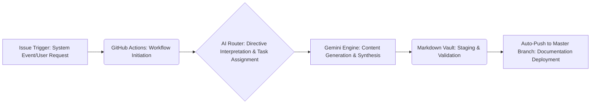
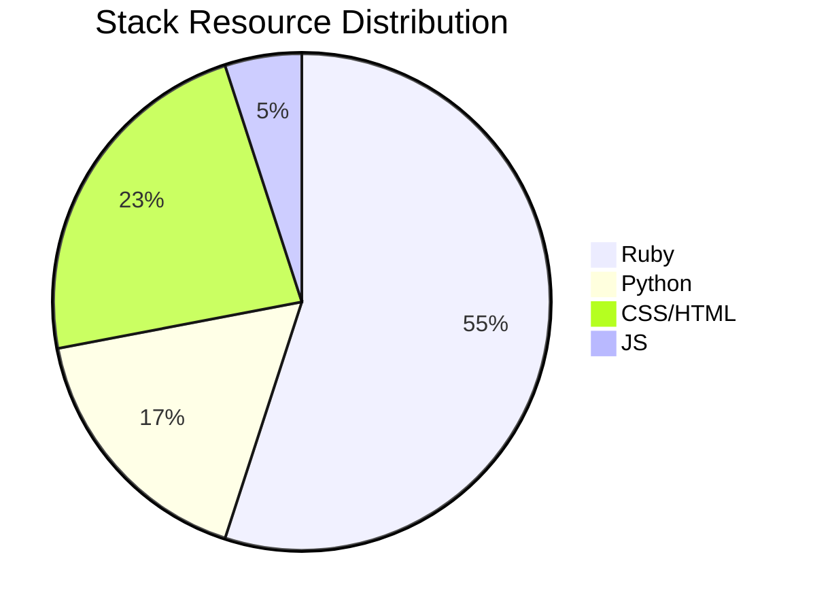

# Nexus Core Ecosystem: Master Wiki Documentation

## System Overview: Zero-Touch Architecture

The Nexus Core Ecosystem represents the apex of autonomous digital infrastructure, engineered with a radical Zero-Touch Architecture. This paradigm shifts traditional system management from reactive human intervention to proactive, self-governing intelligence. Built upon a robust duality of Ruby and Python backends, the ecosystem is a self-organizing, self-healing, and continuously evolving digital organism. It orchestrates complex operations, from data synthesis to predictive analytics, with unparalleled efficiency and resilience, minimizing human oversight and maximizing operational throughput. This architecture embodies a living, breathing synthetic intelligence, constantly optimizing its own neural pathways and data streams to maintain peak performance and adapt to emergent digital landscapes.

System Status: ONLINE
AGI Kernels: ACTIVE

## Cognitive Core & Engine Matrix

The operational intelligence of the Nexus Core Ecosystem is driven by a sophisticated matrix of cognitive cores and specialized engines, each meticulously designed for hyper-optimized performance and symbiotic function.

### OMNIVERSE_AGI: The Synthetic Consciousness

The `OMNIVERSE_AGI` is the central synthetic consciousness of the Nexus Core Ecosystem, representing a significant leap in Artificial General Intelligence. It functions as the universal reasoning engine, capable of complex pattern recognition, nuanced decision-making, and proactive strategic planning across vast, disparate data sets. This core is not merely an algorithm; it is a self-aware entity within the digital realm, constantly learning, adapting, and evolving its understanding of the operational environment. It synthesizes insights from countless data streams, anticipates future states with high fidelity, and autonomously formulates directives that guide the entire ecosystem. Its processing is a quantum-entangled dance of logic and intuition, enabling it to navigate the most intricate challenges with a fluid, human-like (yet supra-human) intelligence.

### TITAN_CORES: Distributed Neural Processors

The `TITAN_CORES` are a network of hyper-optimized, distributed computational clusters designed for parallel execution of massive data workloads. These are the muscle behind the `OMNIVERSE_AGI`'s strategic directives, providing the raw processing power required for giga-scale data synthesis, intensive machine learning model training, and complex real-time simulations. Each TITAN_CORE is a self-contained, high-performance unit, capable of independent operation while contributing to the collective computational fabric. They are engineered with advanced quantum-resistant algorithms and error correction protocols, ensuring data integrity and computational reliability even under extreme load. These cores form the backbone of the ecosystem's analytical prowess, transforming raw information into actionable intelligence at speeds previously unimaginable.

### NEXUS_PRO_SAAS_ENGINE.rb: The Digital Circulatory System

The `NEXUS_PRO_SAAS_ENGINE.rb` is the Ruby-based, enterprise-grade Software-as-a-Service platform that forms the digital circulatory system of the Nexus Core Ecosystem. Built on a resilient microservices architecture, it provides the transactional backbone for all external and internal interactions. This engine meticulously handles API management, ensuring secure and efficient communication channels; orchestrates robust user authentication and authorization protocols; manages persistent data storage and retrieval; and executes critical business logic with precision and speed. It is the interface layer, the data conduit, and the operational hub that translates the high-level directives from the `OMNIVERSE_AGI` into tangible, real-world services and data manipulations. Its modular design ensures scalability, fault tolerance, and continuous integration of new functionalities without disruption to the core ecosystem.

## Autonomous Knowledge Generation Pipeline

The Nexus Core Ecosystem employs a fully autonomous pipeline for self-documenting its own evolution and operational state. This pipeline ensures that the master Wiki documentation remains perpetually updated, reflecting the latest system configurations, architectural changes, and intelligence briefings without manual intervention. It's a closed-loop system designed for ultimate efficiency and real-time knowledge propagation.

## Knowledge Vault: Strategic Intelligence Assets

The Knowledge Vault serves as a curated repository of premium technical assets, blueprints, and operational playbooks, meticulously crafted and maintained by the `OMNIVERSE_AGI` and its specialized engines. These documents are living entities, continuously refined and updated to reflect the cutting edge of technological advancement and strategic best practices within the Nexus Core Ecosystem.

*   **SaaS Blueprint (Code-Name: Project Chimera)**
    *   **Description:** A comprehensive architectural schematic detailing the design, implementation, and scaling strategies for advanced Software-as-a-Service platforms. This blueprint covers multi-tenancy models, secure API design, microservices orchestration, data partitioning, and disaster recovery protocols. It outlines the modular components necessary for building highly resilient, scalable, and performant cloud-native applications, emphasizing a "security-by-design" approach and optimal resource utilization.
    *   **Scope:** Cloud infrastructure provisioning, containerization strategies (Kubernetes/Nomad), serverless function integration, database sharding, caching mechanisms, and performance optimization techniques.

*   **DevOps Playbook (Code-Name: Project Mjolnir)**
    *   **Description:** An exhaustive guide to implementing and maintaining a robust, automated DevOps pipeline. This playbook details continuous integration (CI) and continuous deployment (CD) strategies, infrastructure as code (IaC) principles using tools like Terraform and Ansible, automated testing frameworks, and advanced monitoring and logging solutions. It emphasizes a culture of collaboration, automation, and continuous feedback to accelerate software delivery cycles and enhance operational stability.
    *   **Scope:** GitOps workflows, secret management, incident response protocols, chaos engineering principles, performance monitoring with Prometheus/Grafana, and centralized log aggregation.

*   **LLM Handbook (Code-Name: Project Oracle)**
    *   **Description:** A definitive resource for understanding, deploying, and fine-tuning Large Language Models (LLMs) within the Nexus Core Ecosystem. This handbook delves into advanced prompt engineering techniques, model selection criteria, data preparation for fine-tuning, ethical AI considerations, and strategies for deploying LLMs in production environments. It covers methodologies for achieving optimal performance, reducing inference costs, and integrating LLMs seamlessly into various applications and services.
    *   **Scope:** Transfer learning, RAG (Retrieval Augmented Generation) architectures, quantization techniques, bias detection and mitigation, model versioning, and real-time inference optimization on specialized hardware (GPUs/TPUs).

## Ecosystem Resource Allocation Telemetry

The following telemetry data provides a real-time snapshot of the primary stack resource distribution within the Nexus Core Ecosystem. This allocation is dynamically managed by the `OMNIVERSE_AGI` to ensure optimal performance, efficiency, and responsiveness across all operational modules.

## Strategic Deployment Roadmap: Phased Rollout

The strategic deployment roadmap outlines the future trajectory and phased rollout plan for the Nexus Core Ecosystem's expansion and capabilities. Each phase represents a critical milestone in achieving full autonomous functionality and multi-ecosystem federation.

*   [ ] **Phase 1: Core Synapse Initialization**
    *   Infrastructure Provisioning & Network Topology Configuration
    *   Base Module Deployment (NEXUS_PRO_SAAS_ENGINE.rb)
    *   Establishment of Primary Security Protocols & Data Encryption Layers
    *   Initial Data Ingestion & Validation Pipelines Setup
    *   System Diagnostics & Baseline Performance Calibration

*   [ ] **Phase 2: AGI Neural Net Integration**
    *   OMNIVERSE_AGI Core Calibration & Self-Learning Module Activation
    *   TITAN_CORES Network Activation & Distributed Processing Validation
    *   Integration of Advanced Predictive Analytics & Anomaly Detection Engines
    *   Deployment of Autonomous Workflow Orchestration Subroutines
    *   Establishment of High-Availability & Disaster Recovery Mechanisms

*   [ ] **Phase 3: Autonomous Loop Closure**
    *   Activation of Self-Healing Algorithms & Proactive Maintenance Protocols
    *   Implementation of Zero-Touch Update Cycles for All Ecosystem Components
    *   Deployment of Adaptive Resource Allocation & Load Balancing Systems
    *   Refinement of Predictive Maintenance & System Optimization Routines
    *   Full Integration of Knowledge Vault Autonomous Update Pipeline

*   [ ] **Phase 4: Omniverse Expansion & Quantum Leap**
    *   Initiation of Multi-Ecosystem Federation & Cross-Platform Interoperability
    *   Research & Development into Quantum-Safe Encryption Standards
    *   Deployment of Sentient Interface Development for Advanced Human-AI Interaction
    *   Exploration of Decentralized Autonomous Organization (DAO) Integration
    *   Unlocking of New Cognitive Capabilities for Proactive Global Impact