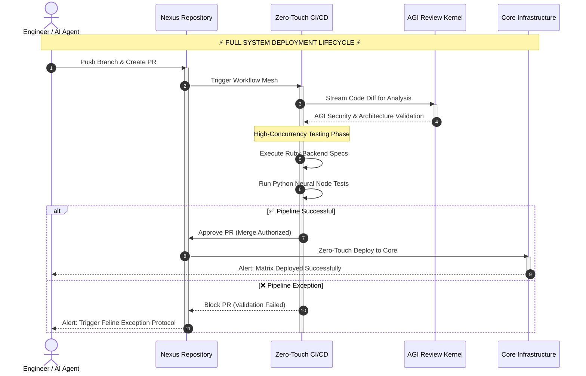

# ⚡ Contributing to Nexus Ecosystem & Core SOP

Welcome to the **Nexus Core**. You are contributing to a central command architecture engineered for premium digital products, AGI sentience kernels, and predictive neural models. 

To maintain the structural integrity of our autonomous workflows and high-concurrency backends, all engineers, automated AI agents, and contributors must strictly adhere to this **Standard Operating Procedure (SOP)**.

---

## 📑 Table of Contents

1. [The Matrix Philosophy](#1-the-matrix-philosophy)
2. [Architecture Bootup (Local Setup)](#2-architecture-bootup-local-setup)
3. [Branching Strategy](#3-branching-strategy)
4. [The Core Workflow SOP (Zero-Touch CI/CD)](#4-the-core-workflow-sop-zero-touch-cicd)
5. [Commit Message Standards](#5-commit-message-standards)
6. [Code Quality & Security Gates](#6-code-quality--security-gates)
7. [Feline Exception Protocol (FEP)](#7-feline-exception-protocol-fep)

---

## 🧠 1. The Matrix Philosophy
**"I am building the future of documentation."** 
We do not just write code; we architect ecosystems. Every PR should be treated as a critical neural pathway. Code must be clean, highly optimized, and thoroughly documented. We operate on a zero-tolerance policy for technical debt.

---

## 💻 2. Architecture Bootup (Local Setup)

Before deploying any changes, synchronize your local terminal with the Nexus Core telemetry.

*   **Ruby Environment (High-Throughput Backend):**
    *   Requires `Ruby 3.3+`.
    *   Run `bundle install` to align core dependencies.
*   **Python & AI Nodes (Predictive Models):**
    *   Requires `Python 3.10+`.
    *   Use Conda or standard VENV. Run `pip install -r requirements.txt`.
*   **Secrets & Key Management:**
    *   NEVER push `.env` files to the repository.
    *   Use `.env.example` as a template to configure local Gemini API keys, LLM parameters, and Database URIs.

---

## 🌿 3. Branching Strategy

Direct pushes to the `master` / `main` branch are **strictly prohibited** by our firewall protection rules. 

*   **Main Branch:** `main` (Production-ready, highly stable).
*   **Feature Branches:** `feature/your-feature-name` (For new additions).
*   **Bugfix Branches:** `fix/issue-description` (For matrix anomalies).
*   **AI/Kernel Branches:** `agi/model-updates` (For neural model training or prompt engineering).

---

## 🚀 4. The Core Workflow SOP (Zero-Touch CI/CD)

All system upgrades must pass through our automated validation pipeline. Below is the exact architecture of how your code reaches the production core.

---

## 📝 5. Commit Message Standards

We strictly follow the **Conventional Commits** specification. This allows our automated agents to parse release notes and trigger semantic versioning automatically.

**Format:** `<type>(<scope>): <subject>`

**Allowed Types:**
*   `feat`: A new feature or AI kernel integration.
*   `fix`: A bug fix or anomaly resolution.
*   `docs`: Documentation changes (e.g., updating this SOP).
*   `refactor`: Code restructuring without changing functional behavior.
*   `chore`: Maintenance, dependency updates, or GitHub Actions.
*   `brain`: Updates specifically targeting AI/LLM prompts and predictive models.

**Examples:**
*   `feat(agi-kernel): integrate predictive neural models for auto-response`
*   `fix(ruby-backend): resolve async timeout in high-throughput pipeline`

---

## ⚙️ 6. Code Quality & Security Gates

To maintain our premium digital standards, all code is scanned before merging:

1.  **Strict Linting:** 
    *   Ruby code must pass `RuboCop` checks.
    *   Python code must be formatted using `Black` and linted with `Flake8`.
2.  **Type Hinting:** Mandatory for all Python-based machine learning nodes and data pipelines.
3.  **Green CI/CD:** Ensure the Zero-Touch automated workflows pass all tests. 
4.  **Mandatory Review:** At least one Senior Maintainer (`@iftu8`) or the AGI Sentience Kernel must approve the Pull Request.

---

## 🚨 7. Feline Exception Protocol (FEP)

If a critical failure occurs during deployment, or if the neural models hallucinate, the **Feline Exception Protocol (FEP)** is automatically triggered:

1.  **Immediate Halt:** The CI/CD pipeline drops all active deployment threads.
2.  **Auto-Revert (Safe Mode):** The production core instantly reverts to the last known stable state.
3.  **Telemetry Dump:** Error logs, tracebacks, and state histories are dumped into the secure monitoring channel.
4.  **Manual Override:** Core maintainers must manually inspect the neural anomaly, patch the vulnerability, and force a system reboot.

> *"Failure is not the end; it is simply training data for the next iteration."*
