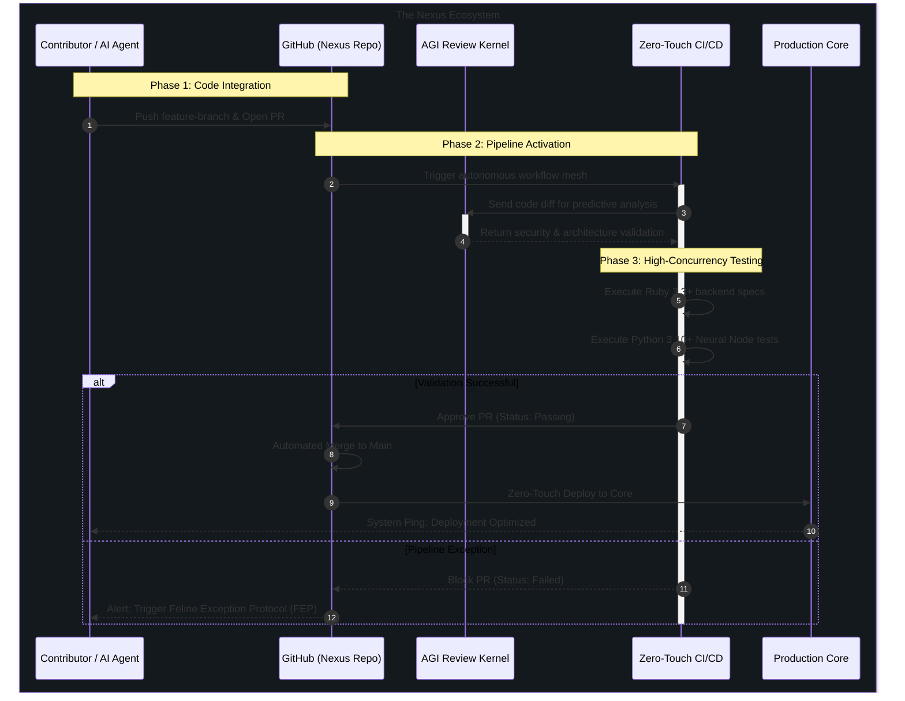

# 📄 Contributing to Nexus Ecosystem & SOP Guidelines

Thank you for entering the **Nexus Core**. To maintain the structural integrity of our autonomous workflows, high-concurrency Ruby services, and generative AI pipelines, all contributors (including human engineers and automated AI agents) must strictly adhere to this Standard Operating Procedure (SOP).

---

## 📋 Table of Contents

1. [Architecture Bootup (Local Setup)](#1-architecture-bootup-local-setup)
2. [The Core Workflow SOP](#2-the-core-workflow-sop)
3. [Commit Message Standards](#3-commit-message-standards)
4. [Architectural Code Standards](#4-architectural-code-standards)
5. [Pull Request (PR) Integration](#5-pull-request-pr-integration)
6. [Feline Exception Protocol (FEP)](#6-feline-exception-protocol-fep)

---

## 💻 1. Architecture Bootup (Local Setup)

Before contributing, ensure your local terminal is synchronized with the Nexus Core telemetry. Our dual-engine architecture requires specific runtime environments.

*   **Ruby Environment (Backend):** Requires Ruby 3.3+. Run `bundle install` to align core dependencies.
*   **Python & AI Nodes (Neural Models):** Requires Python 3.10+. Use Conda or standard VENV. Run `pip install -r requirements.txt`.
*   **Secrets Management:** NEVER push `.env` files. Use the `.env.example` template to configure local Gemini API keys, AGI Sentience limits, and Database URIs.

---

## 🚀 2. The Core Workflow SOP

We operate on a **Zero-Touch CI/CD Workflow Mesh**. Direct pushes to the `master` / `main` branch are strictly prohibited by GitHub branch protection rules. All system upgrades must follow the automated validation pipeline below.

---

## 📝 3. Commit Message Standards

We strictly follow the **Conventional Commits** specification. This allows our AI automated agents to parse release notes and trigger autonomous semantic versioning.

**Format:**
`<type>(<scope>): <subject>`

**Allowed Types:**
*   `feat`: A new feature or AI kernel integration.
*   `fix`: A bug fix in the matrix.
*   `docs`: Documentation changes (like updating this SOP).
*   `refactor`: Code restructuring without changing functional behavior.
*   `chore`: Maintenance, dependency updates, or system pings.
*   `brain`: Updates specifically targeting AI/LLM prompts and predictive models.

**Example:**
> `feat(agi-kernel): integrate predictive neural models for automated response`

---

## ⚙️ 4. Architectural Code Standards

To maintain our premium digital products, all code must pass through stringent quality gates.

*   **Ruby Code:** Must comply with our internal `rubocop.yml`. No exceptions. Focus on high-throughput asynchronous patterns.
*   **Python Code:** Must be formatted using `Black` and linted with `Flake8`. Type hinting is mandatory for all machine learning nodes.
*   **Documentation:** Functions, classes, and complex AGI workflows must be documented using standard docstrings. "Code is poetry; documentation is the translation."

---

## 🔄 5. Pull Request (PR) Integration

When opening a Pull Request, the AI automated agents will instantly scan your submission. Ensure you check the following:

1.  **Descriptive Title:** Clearly state the purpose of the PR.
2.  **Link Issues:** Mention the issue number (e.g., `Resolves #12`).
3.  **Green CI/CD:** Ensure the Zero-Touch automated workflows pass all tests.
4.  **Review Approvals:** At least one Senior Maintainer (or the AGI Sentience Kernel) must approve the PR before the automated merge sequence begins.

---

## 🚨 6. Feline Exception Protocol (FEP)

If a critical failure occurs during deployment or the neural models hallucinate, the **Feline Exception Protocol (FEP)** is automatically triggered:

1.  **Immediate Halt:** The Zero-Touch CI/CD pipeline drops all active deployments.
2.  **Auto-Revert:** The production core reverts to the last known stable state (Safe Mode).
3.  **Telemetry Dump:** Error logs and tracebacks are dumped into the secure monitoring channel.
4.  **Manual Override:** Core maintainers (`@iftu8`) must manually inspect the neural anomaly, patch the vulnerability, and force a system restart.

*Failure is not the end; it is simply data for the next iteration.*
