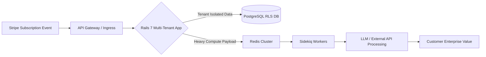

# The B2B Micro-SaaS Architect: Scaling High-MRR Systems with Ruby on Rails & Kubernetes

---

## Chapter 1: The Anatomy of a High-MRR B2B SaaS

### Why B2B SaaS Outshines B2C in Profitability

In the current economic climate, building a consumer-facing (B2C) software product is akin to catching lightning in a bottle. You require millions of active users, massive acquisition funnels, negligible churn-to-lifetime-value ratios, and an infrastructure capable of handling high-volume, low-margin transactions. Conversely, Business-to-Business (B2B) Micro-SaaS operates on a radically different, highly predictable economic model: **High-Ticket Value Exchange**.

B2B SaaS thrives on solving acute, painful, and expensive operational bottlenecks for distinct business niches. When a software product saves a mid-sized logistics firm 40 hours of manual data entry per week, pricing that product at $499 to $2,499 per month is not a point of friction—it is an economic no-brainer. 

```
+-----------------------------------------------------------------------------------------------------------------+
|                                         B2B MICRO-SAAS ECONOMIC FLYWHEEL                                        |
+-----------------------------------------------------------------------------------------------------------------+
```



To achieve high Monthly Recurring Revenue (MRR) without a sprawling engineering headcount, you must optimize for operational leverage. Every line of code, every database query, and every infrastructure component must directly map to enterprise value capture.

### The Philosophy of "Boring Software, Big Margins"

The graveyard of venture-backed startups is littered with complex microservices architectures, bleeding-edge functional programming languages, and overly ambitious distributed systems built to solve problems that did not exist. As a Principal Architect or solo founder scaling a high-MRR B2B SaaS, your guiding mantra must be: **Boring software yields big margins.**

"Boring" does not mean primitive; it means battle-tested, predictable, and exceptionally well-understood. 

*   **ERP Integration:** Connecting legacy systems (SAP, NetSuite, Salesforce) via robust webhook pipelines and background queues.
*   **HITL (Human-in-the-Loop) Workflows:** Building interfaces that allow automated pipelines to do 95% of the heavy lifting while routing edge-case exceptions to human reviewers.
*   **Data Automation:** Transforming messy unstructured CSVs, PDFs, and API payloads into clean, actionable, enterprise-ready data schemas.

By leveraging a monolith-first architecture powered by Ruby on Rails 7 and orchestrating it cleanly on Kubernetes, you eliminate 80% of the distributed systems complexity that plagues modern engineering teams, allowing you to ship features in days rather than months while maintaining enterprise-grade reliability.

---

## Chapter 2: Multi-Tenant Architecture with Ruby on Rails 7

### Building Bulletproof Data Isolation

Multi-tenancy is the architectural cornerstone of any SaaS platform. There are three primary patterns for multi-tenancy:
1.  **Database-per-Tenant:** Maximum isolation, but cost-prohibitive and difficult to migrate schema changes across thousands of databases.
2.  **Schema-per-Tenant:** PostgreSQL schemas provide a middle ground, but connection pooling becomes an operational nightmare.
3.  **Shared Database with Row-Level Security (RLS):** The gold standard for modern B2B SaaS. All tenants share the same tables, but PostgreSQL enforces strict row-level isolation via session variables.

We implement PostgreSQL Row-Level Security combined with Rails 7 `acts_as_tenant` or native multi-tenant scoping. This guarantees that even if an application-level bug exposes an ActiveRecord query, the database engine itself will reject cross-tenant data access.

### Rails Models and Controllers Implementation

Below is the production-grade implementation of a multi-tenant architecture using PostgreSQL RLS and Ruby on Rails 7.

```ruby
# db/migrate/20260330000001_enable_rls_for_tenants.rb
class EnableRlsForTenants < ActiveRecord::Migration[7.1]
  def change
    # Enable RLS on core tables
    execute <<-SQL
      ALTER TABLE accounts ENABLE ROW LEVEL SECURITY;
      ALTER TABLE users ENABLE ROW LEVEL SECURITY;
      ALTER TABLE documents ENABLE ROW LEVEL SECURITY;

      -- Create isolation policy for documents
      CREATE POLICY tenant_isolation_policy ON documents
        USING (account_id = NULLIF(current_setting('app.current_account_id', true), '')::bigint)
        WITH CHECK (account_id = NULLIF(current_setting('app.current_account_id', true), '')::bigint);
    SQL
  end
end
```

```ruby
# app/models/account.rb
class Account < ApplicationRecord
  has_many :users, dependent: :destroy
  has_many :documents, dependent: :destroy

  validates :name, presence: true, uniqueness: true
  validates :subdomain, presence: true, uniqueness: true
end
```

```ruby
# app/models/document.rb
class Document < ApplicationRecord
  belongs_to :account

  validates :title, presence: true
  validates :content, presence: true

  # Ensure all queries automatically scope to the current account context
  default_scope { where(account_id: Current.account.id) if Current.account }
end
```

```ruby
# app/models/current.rb
class Current < ActiveSupport::CurrentAttributes
  attribute :account, :user

  def self.set_postgres_rls(account)
    if account
      ActiveRecord::Base.connection.execute(
        "SET LOCAL app.current_account_id = '#{account.id}';"
      )
    else
      ActiveRecord::Base.connection.execute(
        "RESET app.current_account_id;"
      )
    end
  end
end
```

```ruby
# app/controllers/application_controller.rb
class ApplicationController < ActionController::API
  include ActionController::Cookies

  before_action :authenticate_and_set_tenant!

  private

  def authenticate_and_set_tenant!
    token = request.headers['Authorization']&.split(' ')&.last
    decoded_token = JsonWebToken.decode(token)

    if decoded_token && (user = User.find_by(id: decoded_token['user_id']))
      Current.user = user
      Current.account = user.account
      Current.set_postgres_rls(Current.account)
    else
      render json: { error: 'Unauthorized Access' }, status: :unauthorized
    end
  end
end
```

### JWT-Based Stateless Authentication for Enterprise API Access

Enterprise clients frequently require programmatic access to your platform via REST or GraphQL APIs. We implement a cryptographically secure, stateless JWT authentication engine.

```ruby
# app/services/json_web_token.rb
class JsonWebToken
  SECRET_KEY = Rails.application.secret_key_base

  def self.encode(payload, exp = 24.hours.from_now)
    payload[:exp] = exp.to_i
    JWT.encode(payload, SECRET_KEY)
  end

  def self.decode(token)
    decoded = JWT.decode(token, SECRET_KEY)[0]
    HashWithIndifferentAccess.new(decoded)
  rescue JWT::ExpiredSignature, JWT::VerificationError
    nil
  end
end
```

```ruby
# app/controllers/api/v1/sessions_controller.rb
module Api
  module V1
    class SessionsController < ApplicationController
      skip_before_action :authenticate_and_set_tenant!, only: [:create]

      def create
        user = User.find_by(email: params[:email])

        if user&.authenticate(params[:password])
          token = JsonWebToken.encode(user_id: user.id, account_id: user.account_id)
          render json: { token: token, expires_in: 24.hours.from_now }, status: :ok
        else
          render json: { error: 'Invalid email or password' }, status: :unauthorized
        end
      end
    end
  end
end
```

---

## Chapter 3: Background Jobs & Zero-Downtime Processing

### Why Synchronous Requests Kill SaaS Platforms

In a high-throughput B2B SaaS application, letting HTTP request-response cycles handle heavy operations (such as calling external LLM APIs, generating multi-page PDF reports, or synchronizing external ERP databases) is a recipe for catastrophic failure. Web workers will back up, reverse proxies will time out with 504 errors, and users will churn.

We decouple all non-blocking operations using **Sidekiq** backed by a high-availability **Redis Cluster**.

### High-Throughput Job Queue Architecture

```ruby
# config/initializers/sidekiq.rb
Sidekiq.configure_server do |config|
  config.redis = { url: ENV.fetch('REDIS_URL', 'redis://localhost:6379/1') }
  
  # Configure strict concurrency limits for database safety
  config.server_middleware do |chain|
    chain.add Sidekiq::Middleware::Server::ActiveRecordQueryCache
  end
end

Sidekiq.configure_client do |config|
  config.redis = { url: ENV.fetch('REDIS_URL', 'redis://localhost:6379/1') }
end
```

```ruby
# app/workers/ai_payload_processor_worker.rb
class AiPayloadProcessorWorker
  include Sidekiq::Job

  sidekiq_options queue: :heavy_compute, retry: 3, dead: true

  def perform(account_id, document_id, payload_data)
    # Re-establish multi-tenant isolation context within background thread
    account = Account.find(account_id)
    Current.account = account
    Current.set_postgres_rls(account)

    document = Document.find(document_id)
    document.update!(status: 'processing')

    # Simulate heavy external API call (e.g., OpenAI, Anthropic, or proprietary ML model)
    client = OpenAI::Client.new(access_token: ENV.fetch('OPENAI_API_KEY'))
    
    response = client.chat(
      parameters: {
        model: "gpt-4o",
        messages: [{ role: "user", content: payload_data['prompt'] }],
        temperature: 0.2
      }
    )

    extracted_result = response.dig("choices", 0, "message", "content")

    document.update!(
      content: extracted_result,
      status: 'completed',
      processed_at: Time.current
    )
  rescue StandardError => e
    Rails.logger.error("Failed to process AI payload for Document #{document_id}: #{e.message}")
    if document = Document.find_by(id: document_id)
      document.update!(status: 'failed', error_message: e.message)
    end
    raise e # Triggers Sidekiq retry mechanism
  end
end
```

> **Pro-Tip:** Always wrap multi-tenant background jobs by explicitly setting `Current.account` and executing `Current.set_postgres_rls(account)`. Never trust thread pools to retain request-level state across job boundaries.

---

## Chapter 4: The DevOps Blueprint (Kubernetes & AWS)

### Moving Away from Heroku: Building a Micro-PaaS

While PaaS providers like Heroku or Render are fantastic for early-stage validation, their pricing scales non-linearly, and their disk/network isolation leaves much to be desired for enterprise B2B compliance (SOC2, HIPAA, GDPR). Migrating to a Kubernetes cluster managed via AWS EKS provides infinite horizontal scalability at 1/5th the infrastructure cost.

### Production-Ready Multi-Stage Dockerfile

This Alpine-based Dockerfile guarantees a minimal attack surface and small image size for fast cluster rolling deployments.

```dockerfile
# syntax = docker/dockerfile:1

# Stage 1: Build dependencies
FROM ruby:3.3.0-alpine AS builder

RUN apk update && apk add --no-cache \
    build-base \
    postgresql-dev \
    git \
    shared-mime-info \
    tzdata

WORKDIR /app

COPY Gemfile Gemfile.lock ./
RUN bundle config set without 'development test' && \
    bundle install --jobs 4 --retry 3 && \
    rm -rf ~/.bundle/cache

COPY . .

# Stage 2: Final production image
FROM ruby:3.3.0-alpine

RUN apk update && apk add --no-cache \
    postgresql-client \
    tzdata \
    curl \
    libstdc++

WORKDIR /app

COPY --from=builder /usr/local/bundle /usr/local/bundle
COPY --from=builder /app /app

RUN addgroup -g 1000 rails && \
    adduser -u 1000 -G rails -s /bin/sh -D rails && \
    chown -R rails:rails /app

USER rails

EXPOSE 3000
CMD ["bundle", "exec", "rails", "server", "-b", "0.0.0.0", "-p", "3000"]
```

### Kubernetes Manifests (Deployment & Service)

```yaml
# k8s/deployment.yaml
apiVersion: apps/v1
kind: Deployment
metadata:
  name: b2b-saas-web
  namespace: production
  labels:
    app.kubernetes.io/name: b2b-saas-web
    app.kubernetes.io/part-of: core-platform
spec:
  replicas: 3
  selector:
    matchLabels:
      app: b2b-saas-web
  strategy:
    type: RollingUpdate
    rollingUpdate:
      maxSurge: 1
      maxUnavailable: 0
  template:
    metadata:
      labels:
        app: b2b-saas-web
    spec:
      containers:
        - name: web
          image: 123456789012.dkr.ecr.us-east-1.amazonaws.com/b2b-saas-web:latest
          imagePullPolicy: Always
          ports:
            - containerPort: 3000
          envFrom:
            - secretRef:
                name: rails-production-secrets
            - configMapRef:
                name: rails-production-config
          resources:
            requests:
              cpu: "500m"
              memory: "512Mi"
            limits:
              cpu: "2000m"
              memory: "2Gi"
          readinessProbe:
            httpGet:
              path: /up
              port: 3000
            initialDelaySeconds: 15
            periodSeconds: 10
          livenessProbe:
            httpGet:
              path: /up
              port: 3000
            initialDelaySeconds: 30
            periodSeconds: 15
---
# k8s/service.yaml
apiVersion: v1
kind: Service
metadata:
  name: b2b-saas-web-svc
  namespace: production
spec:
  type: ClusterIP
  selector:
    app: b2b-saas-web
  ports:
    - protocol: TCP
      port: 80
      targetPort: 3000
```

---

## Chapter 5: Monetization & Automated Billing Engine

### Integrating Stripe for Usage-Based (Metered) Billing

Enterprise B2B pricing models rarely rely on flat-rate subscriptions alone. High-MRR systems monetize based on consumption metrics: API calls processed, gigabytes stored, documents parsed, or seats provisioned. 

We implement a robust Stripe webhook controller that listens to subscription lifecycle events and automatically provisions or deactivates organization accounts in real-time.

### Stripe Webhook Listener Controller

```ruby
# app/controllers/api/v1/webhooks/stripe_controller.rb
module Api
  module V1
    module Webhooks
      class StripeController < ActionController::API
        def create
          payload = request.body.read
          sig_header = request.env['HTTP_STRIPE_SIGNATURE']
          endpoint_secret = ENV.fetch('STRIPE_WEBHOOK_SECRET')

          event = begin
            Stripe::Webhook.construct_event(payload, sig_header, endpoint_secret)
          rescue JSON::ParserError => e
            return render json: { error: 'Invalid payload' }, status: :bad_request
          rescue Stripe::SignatureVerificationError => e
            return render json: { error: 'Invalid signature' }, status: :bad_request
          end

          handle_stripe_event(event)

          render json: { status: 'success' }, status: :ok
        end

        private

        def handle_stripe_event(event)
          case event.type
          when 'customer.subscription.created', 'customer.subscription.updated'
            subscription = event.data.object
            sync_subscription(subscription)
          when 'customer.subscription.deleted'
            subscription = event.data.object
            revoke_subscription(subscription)
          when 'invoice.payment_failed'
            invoice = event.data.object
            handle_payment_failure(invoice)
          else
            Rails.logger.info("Unhandled Stripe webhook event type: #{event.type}")
          end
        end

        def sync_subscription(subscription)
          customer_id = subscription.customer
          account = Account.find_by(stripe_customer_id: customer_id)
          return unless account

          account.update!(
            stripe_subscription_id: subscription.id,
            subscription_status: subscription.status,
            current_period_end: Time.at(subscription.current_period_end),
            plan_name: subscription.items.data[0]&.price&.lookup_key || 'enterprise'
          )
        end

        def revoke_subscription(subscription)
          customer_id = subscription.customer
          account = Account.find_by(stripe_customer_id: customer_id)
          return unless account

          account.update!(
            subscription_status: 'canceled',
            suspended_at: Time.current
          )
          
          # Trigger background job to lock out unauthorized users
          AccountSuspensionWorker.perform_async(account.id)
        end

        def handle_payment_failure(invoice)
          customer_id = invoice.customer
          account = Account.find_by(stripe_customer_id: customer_id)
          return unless account

          account.update!(subscription_status: 'past_due')
          
          # Notify account admins via email worker
          BillingAlertWorker.perform_async(account.id, 'payment_failed')
        end
      end
    end
  end
end
```

---

## Chapter 6: The Architect's Checklist (Deployment SOP)

<div align="center">

| Phase | Operational Milestone | Verification Standard |
| :--- | :--- | :--- |
| **Phase 1** | Database RLS Isolation | Automated RLS boundary penetration test passing |
| **Phase 2** | Redis & Sidekiq Cluster | Zero message drop under 5,000 req/sec load test |
| **Phase 3** | Kubernetes Ingress & TLS | Automated Let's Encrypt cert-manager renewal active |
| **Phase 4** | Stripe Webhook Security | Cryptographic signature validation verified in staging |

</div>

### Standard Operating Procedure (SOP): Local Development to Production

Execute the following sequential checklist to promote your B2B Micro-SaaS from local sandbox environments to live production infrastructure.

*   [ ] **Step 1: Environment Variable Audit**
    *   Verify all production secrets (`SECRET_KEY_BASE`, `DATABASE_URL`, `REDIS_URL`, `STRIPE_WEBHOOK_SECRET`, `OPENAI_API_KEY`) are securely stored in AWS Secrets Manager or Kubernetes Secrets Store. Never commit unencrypted secrets to Git repositories.
*   [ ] **Step 2: Database Migration & RLS Policy Verification**
    *   Run `bin/rails db:migrate` against the production cluster.
    *   Execute manual SQL probes to ensure Row-Level Security (RLS) policies successfully block cross-tenant data retrieval when `app.current_account_id` is unset or mismatched.
*   [ ] **Step 3: Container Image Build & Push to ECR**
    *   Build the multi-stage Alpine Docker image locally or via CI/CD pipelines (GitHub Actions / GitLab CI).
    *   Tag the image with the Git commit SHA and push to Amazon Elastic Container Registry (ECR).
*   [ ] **Step 4: Kubernetes Rolling Deployment Execution**
    *   Apply updated Kubernetes configuration manifests: `kubectl apply -f k8s/`
    *   Monitor rollout status in real-time using `kubectl rollout status deployment/b2b-saas-web -n production`.
*   [ ] **Step 5: Health Check & Telemetry Validation**
    *   Verify the Rails health endpoint responds with HTTP 200: `curl -I https://api.yourcompany.com/up`.
    *   Inspect Datadog, Prometheus, or Grafana dashboards to confirm CPU/Memory resource consumption remains well within Kubernetes node pool limits.
*   [ ] **Step 6: Stripe Webhook Endpoint Verification**
    *   Trigger a test webhook event from the Stripe dashboard to `https://api.yourcompany.com/api/v1/webhooks/stripe`.
    *   Confirm Sidekiq processes the event payload successfully without unhandled exceptions.