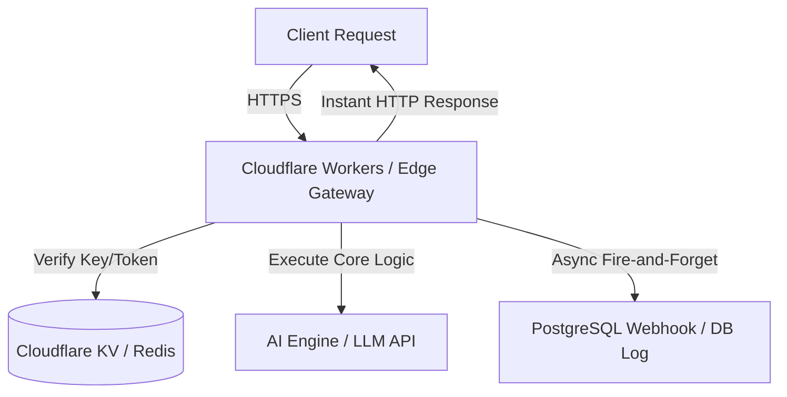
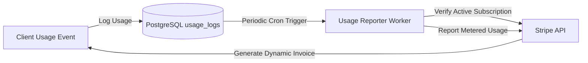

# THE INFINITE MICRO-SAAS ENGINE
### A Guide to Building, Scaling, and Automating Hyper-Niche, Zero-Maintenance Software Businesses

---

## Phase 1: The Zero-Cost Architecture

### Chapter 1: The Micro-SaaS Manifesto

The era of bloated enterprise software is giving way to a new paradigm: the hyper-niche, automated utility. Traditional SaaS models are burdened by massive operational overhead, sprawling engineering teams, and unsustainable customer acquisition costs (CAC). The modern developer does not need a venture-backed runway to build a highly profitable software business. Instead, the path to sustainable cash flow lies in the deployment of lightweight, single-purpose Micro-SaaS engines.

```
+-------------------------------------------------------------+
|                     Legacy SaaS Model                       |
|  [Sales Team] -> [Product Team] -> [Ops] -> [Heavy VM/DB]   |
|                 High Overhead / Low Margin                  |
+-------------------------------------------------------------+
                              vs.
+-------------------------------------------------------------+
|                 The Infinite Micro-SaaS                     |
|  [User] -> [Edge Compute] -> [Serverless DB/AI API]         |
|                 Zero Idle Cost / 95%+ Margin                |
+-------------------------------------------------------------+
```

A Micro-SaaS is defined by its architectural efficiency and narrow focus. It targets a highly specific workflow pain point—such as generating formatted real estate listings, automating programmatic image generation for e-commerce, or translating localized schema files—and solves it with zero friction. 

By leveraging serverless platforms, edge compute networks, and utility-based pricing structures, you can run dozens of separate applications at a near-zero baseline cost. If an app receives zero traffic, your operational cost is exactly $0.00. If it scales to millions of requests, the infrastructure scales dynamically, keeping profit margins consistently above 90%.

The core principles of the Infinite Micro-SaaS Engine are:
1. **Zero Idle Infrastructure:** Never pay for idle CPU cycles or unused database allocations.
2. **Frictionless UX:** Eliminate barriers to entry. Minimize sign-up steps, use passwordless authentication, and provide immediate value within three seconds of landing on the page.
3. **Autonomous Operations:** Programmatic marketing, self-healing codebases, and automated billing must be integrated directly into the software's architecture from day one.

---

### Chapter 2: Serverless Foundations

To support an infinite fleet of Micro-SaaS applications without compounding maintenance overhead, your database layer must be serverless, relationally robust, and strictly isolated. Supabase (built on top of PostgreSQL) provides the ideal foundation, combining SQL flexibility with row-level security (RLS) and real-time webhook triggers.

Below is the production-grade schema blueprint for a multi-tenant, usage-tracked Micro-SaaS. This schema handles users, programmatic API keys, metered usage tracking, and automated audit logs.

```sql
-- Enable necessary extensions
create extension if pgcrypto not exists;

-- Users Profile (Linked to Supabase Auth)
create table public.profiles (
    id uuid references auth.users on delete cascade primary key,
    email text unique not null,
    created_at timestamp with time zone default timezone('utc'::text, now()) not null,
    billing_tier text default 'free' check (billing_tier in ('free', 'pro', 'enterprise')),
    stripe_customer_id text unique,
    is_active boolean default true not null
);

-- API Keys Table for programmatic access
create table public.api_keys (
    id uuid default gen_random_uuid() primary key,
    user_id uuid references public.profiles(id) on delete cascade not null,
    hashed_key text unique not null,
    key_prefix text not null, -- e.g., "sk_live_"
    name text not null,
    created_at timestamp with time zone default timezone('utc'::text, now()) not null,
    expires_at timestamp with time zone,
    last_used_at timestamp with time zone
);

-- Metered Usage Logs (Highly optimized for high-write volumes)
create table public.usage_logs (
    id uuid default gen_random_uuid() primary key,
    user_id uuid references public.profiles(id) on delete cascade not null,
    resource_consumed integer not null, -- e.g., number of AI tokens or API calls
    action_type text not null,          -- e.g., "ai_generation", "pdf_render"
    created_at timestamp with time zone default timezone('utc'::text, now()) not null
);

-- Enable Row Level Security (RLS)
alter table public.profiles enable row level security;
alter table public.api_keys enable row level security;
alter table public.usage_logs enable row level security;

-- RLS Policies
create policy "Users can view their own profile" 
    on public.profiles for select 
    using (auth.uid() = id);

create policy "Users can view their own API keys" 
    on public.api_keys for select 
    using (auth.uid() = user_id);

create policy "Users can insert their own API keys" 
    on public.api_keys for insert 
    with check (auth.uid() = user_id);

create policy "Users can view their own usage logs" 
    on public.usage_logs for select 
    using (auth.uid() = user_id);

-- Performance Indexes
create index idx_profiles_stripe_customer on public.profiles(stripe_customer_id);
create index idx_api_keys_hash on public.api_keys(hashed_key);
create index idx_usage_logs_user_date on public.usage_logs(user_id, created_at desc);
```

---

### Chapter 3: Edge Compute Mastery

Traditional centralized servers introduce latency and represent a single point of failure. Edge computing moves your application logic to the physical edge of the internet, executing code in over 300 data centers globally within milliseconds of the user.

Using Cloudflare Workers or Vercel Edge Functions, you can intercept incoming HTTP requests, validate API keys, check rate limits in Redis, and route requests to downstream AI engines without ever spinning up a virtual machine.



Here is a production-grade Cloudflare Worker written in TypeScript. It acts as an API Gateway, validating bearer tokens, verifying usage limits, and forwarding requests to downstream processing nodes.

```typescript
interface Env {
  DATABASE_URL: string;
  SUPABASE_SERVICE_ROLE_KEY: string;
  REDIS_URL: string;
  REDIS_TOKEN: string;
}

export default {
  async fetch(request: Request, env: Env, ctx: ExecutionContext): Promise<Response> {
    const url = new URL(request.url);
    
    // Health check endpoint
    if (url.pathname === "/health") {
      return new Response(JSON.stringify({ status: "healthy" }), {
        status: 200,
        headers: { "Content-Type": "application/json" }
      });
    }

    const authHeader = request.headers.get("Authorization");
    if (!authHeader || !authHeader.startsWith("Bearer ")) {
      return new Response(JSON.stringify({ error: "Unauthorized: Missing or invalid token format." }), {
        status: 401,
        headers: { "Content-Type": "application/json" }
      });
    }

    const apiKey = authHeader.split(" ")[1];
    
    // Validate API Key against external Redis Cache for sub-millisecond lookups
    const cacheKey = `apikey:${apiKey}`;
    const redisCheck = await fetch(`${env.REDIS_URL}/get/${cacheKey}`, {
      headers: { Authorization: `Bearer ${env.REDIS_TOKEN}` }
    });

    const cacheData = await redisCheck.json() as { result: string | null };
    
    if (!cacheData.result) {
      // Cache miss: Fallback to database check
      const dbResponse = await fetch(`${env.DATABASE_URL}/rest/v1/api_keys?hashed_key=eq.${apiKey}&select=user_id,profiles(is_active,billing_tier)`, {
        headers: {
          "apikey": env.SUPABASE_SERVICE_ROLE_KEY,
          "Authorization": `Bearer ${env.SUPABASE_SERVICE_ROLE_KEY}`
        }
      });

      const dbData = await dbResponse.json() as any[];
      if (dbData.length === 0 || !dbData[0].profiles.is_active) {
        return new Response(JSON.stringify({ error: "Forbidden: Revoked or inactive credentials." }), {
          status: 403,
          headers: { "Content-Type": "application/json" }
        });
      }

      // Populate Cache asynchronously (Write-Through)
      const userData = JSON.stringify({
        userId: dbData[0].user_id,
        tier: dbData[0].profiles.billing_tier
      });
      
      ctx.waitUntil(
        fetch(`${env.REDIS_URL}/set/${cacheKey}/${encodeURIComponent(userData)}/EX/3600`, {
          headers: { Authorization: `Bearer ${env.REDIS_TOKEN}` }
        })
      );
    }

    // Route request to core logic engine
    return new Response(JSON.stringify({ success: true, message: "Gateway validation successful." }), {
      status: 200,
      headers: { "Content-Type": "application/json" }
    });
  }
};
```

---

### Chapter 4: The "No-Login" Paradigm

Every added form field and authentication step dramatically degrades your conversion rates. Traditional passwords are an unnecessary barrier to entry. To maximize conversions and retain users instantly, the Infinite Micro-SaaS Engine employs a passwordless, frictionless onboarding matrix utilizing Magic Links and WebAuthn (passkeys).

```
[User landing page] -> [Enter Email] -> [Instant Magic Link / Passkey] -> [Authenticated Dashboard]
```

WebAuthn allows biometric authentication (TouchID, FaceID, Windows Hello) directly within the browser, eliminating passwords completely.

Below is the client-side implementation for initiating passwordless sign-up/sign-in using the WebAuthn API, pairing it with a serverless auth handler.

```javascript
// Client-side execution script for zero-friction biometric registration
async function registerPasskey(userEmail) {
  try {
    // Fetch creation options from serverless backend
    const response = await fetch('/api/auth/register-challenge', {
      method: 'POST',
      headers: { 'Content-Type': 'application/json' },
      body: JSON.stringify({ email: userEmail })
    });
    
    const options = await response.json();
    
    // Convert base64url strings to ArrayBuffers as required by the WebAuthn API
    options.publicKey.challenge = Uint8Array.from(atob(options.publicKey.challenge), c => c.charCodeAt(0));
    options.publicKey.user.id = Uint8Array.from(atob(options.publicKey.user.id), c => c.charCodeAt(0));
    
    // Trigger browser native biometric prompt
    const credential = await navigator.credentials.create({
      publicKey: options.publicKey
    });
    
    // Serialize credential for server-side verification
    const serializedCredential = {
      id: credential.id,
      rawId: btoa(String.fromCharCode(...new Uint8Array(credential.rawId))),
      type: credential.type,
      response: {
        clientDataJSON: btoa(String.fromCharCode(...new Uint8Array(credential.response.clientDataJSON))),
        attestationObject: btoa(String.fromCharCode(...new Uint8Array(credential.response.attestationObject)))
      }
    };
    
    // Verify credential on backend
    const verificationResponse = await fetch('/api/auth/verify-registration', {
      method: 'POST',
      headers: { 'Content-Type': 'application/json' },
      body: JSON.stringify(serializedCredential)
    });
    
    if (verificationResponse.ok) {
      window.location.href = '/dashboard';
    } else {
      throw new Error("Verification failed on server.");
    }
  } catch (error) {
    console.error("Passkey registration failed:", error);
  }
}
```

---

### Chapter 5: Database Webhooks

To decouple user-facing operations from intensive backend tasks, database-level webhooks are used to trigger asynchronous AI jobs. In PostgreSQL, we can monitor specific table insertions (e.g., when a user requests an AI generation) and immediately fire an HTTP POST request to an edge function or task queue using the `pg_net` extension.

This approach ensures your API returns a `202 Accepted` status to the client instantly, while heavy lifting occurs in the background.

```sql
-- Enable pg_net extension for asynchronous HTTP requests
create extension if not exists pg_net;

-- Create the trigger function
create or replace function public.fn_trigger_ai_generation()
returns trigger as $$
begin
    perform net.http_post(
        url := 'https://api.yourdomain.com/v1/jobs/process',
        headers := jsonb_build_object(
            'Content-Type', 'application/json',
            'X-Webhook-Secret', 'sec_prod_key_771829'
        ),
        body := jsonb_build_object(
            'job_id', new.id,
            'user_id', new.user_id,
            'prompt_payload', new.prompt_payload,
            'action_type', new.action_type
        )::text
    );
    return new;
end;
$$ language plpgsql security definer;

-- Bind the trigger to the usage_logs or a custom jobs table
create table public.background_jobs (
    id uuid default gen_random_uuid() primary key,
    user_id uuid references public.profiles(id) on delete cascade not null,
    prompt_payload jsonb not null,
    action_type text not null,
    status text default 'pending' not null,
    created_at timestamp with time zone default timezone('utc'::text, now()) not null
);

create trigger tr_async_job_inserted
    after insert on public.background_jobs
    for each row
    execute function public.fn_trigger_ai_generation();
```

---

## Phase 2: The AI Automation Core

### Chapter 6: LLM Routing Layers

Running advanced LLMs like GPT-4o or Claude 3.5 Sonnet for every single API request is a recipe for rapid margin erosion. To build a highly profitable Micro-SaaS, your application must implement an intelligent routing layer. This middleware dynamically evaluates incoming prompts and routes them to the cheapest and fastest model capable of handling the request, falling back to larger models only when high complexity is detected.

```
                  [Incoming Prompt]
                          |
               (Evaluate Complexity)
              /                     \
      [Low Complexity]        [High Complexity]
            /                         \
[Gemini Flash / GPT-4o-mini]     [Claude 3.5 Sonnet / GPT-4o]
 ($0.00015 / 1k tokens)             ($0.003 / 1k tokens)
```

Below is a production-ready routing middleware written in TypeScript. It analyzes prompt length, semantic complexity indicators, and token estimates to dynamically route the request.

```typescript
import { OpenAI } from "openai";

interface RouteConfig {
  model: string;
  provider: "openai" | "anthropic" | "google";
}

export async function routeLLMRequest(prompt: string): Promise<RouteConfig> {
  const wordCount = prompt.split(/\s+/).length;
  
  // Semantic complexity markers
  const complexKeywords = [
    "analyze", "refactor", "optimize", "evaluate", "compile", 
    "translate code", "architect", "summarize clinical", "mathematical"
  ];
  
  const containsComplexTask = complexKeywords.some(keyword => 
    prompt.toLowerCase().includes(keyword)
  );

  // Decision matrix: Simple, low-token queries are routed to ultra-cheap edge models
  if (wordCount < 100 && !containsComplexTask) {
    return {
      model: "gpt-4o-mini",
      provider: "openai"
    };
  }

  if (wordCount > 1000 || containsComplexTask) {
    return {
      model: "claude-3-5-sonnet-20240620",
      provider: "anthropic"
    };
  }

  // Balanced default route
  return {
    model: "gemini-1.5-flash",
    provider: "google"
  };
}
```

---

### Chapter 7: Vector Search (RAG) on a Budget

Retrieval-Augmented Generation (RAG) adds domain-specific memory to your AI application. However, hosted vector databases can cost hundreds of dollars per month. To maintain a zero-cost baseline, you can implement vector search directly inside your PostgreSQL database using the open-source `pgvector` extension.

This approach lets you store relational user data and high-dimensional vector embeddings in the exact same database engine, eliminating external API calls and synchronization layers.

```sql
-- Enable pgvector extension
create extension if not exists vector;

-- Create table to store document chunks and their vector embeddings
create table public.document_embeddings (
    id uuid default gen_random_uuid() primary key,
    document_id uuid not null,
    content text not null,
    embedding vector(1536), -- 1536 dimensions for standard OpenAI text-embedding-3-small
    metadata jsonb,
    created_at timestamp with time zone default timezone('utc'::text, now()) not null
);

-- Create an HNSW index for high-speed, approximate nearest neighbor search
create index idx_embeddings_hnsw 
on public.document_embeddings 
using hnsw (embedding vector_cosine_ops);

-- PostgreSQL function to perform vector similarity search
create or replace function match_documents (
  query_embedding vector(1536),
  match_threshold float,
  match_count int
)
returns table (
  id uuid,
  content text,
  similarity float,
  metadata jsonb
)
language plpgsql stable
as $$
begin
  return query
  select
    document_embeddings.id,
    document_embeddings.content,
    1 - (document_embeddings.embedding <=> query_embedding) as similarity,
    document_embeddings.metadata
  from document_embeddings
  where 1 - (document_embeddings.embedding <=> query_embedding) > match_threshold
  order Bird <=> query_embedding
  limit match_count;
end;
$$;
```

---

### Chapter 8: Asynchronous Task Queues

When dealing with resource-intensive AI generation requests, processing synchronously within the HTTP request lifecycle will lead to gateway timeouts. You must decouple your API response from the execution layer using a serverless task queue.

Upstash Redis offers a completely serverless Redis engine with a generous free tier, making it ideal for managing asynchronous jobs via BullMQ or a lightweight custom queue.

```typescript
// Producer: Edge function pushing jobs to Upstash Redis Queue
export async function pushJobToQueue(jobId: string, payload: any, env: any) {
  const queuePayload = {
    id: jobId,
    data: payload,
    timestamp: Date.now(),
    retries: 0
  };

  const response = await fetch(`${env.UPSTASH_REDIS_REST_URL}/rpush/ai_job_queue/${JSON.stringify(queuePayload)}`, {
    headers: {
      Authorization: `Bearer ${env.UPSTASH_REDIS_REST_TOKEN}`
    }
  });

  if (!response.ok) {
    throw new Error("Failed to queue task in serverless Redis.");
  }
}

// Consumer: Triggered by a scheduled Cron Worker or Cloudflare Queue
export async function processQueue(env: any): Promise<void> {
  // Atomically pop job from the queue
  const response = await fetch(`${env.UPSTASH_REDIS_REST_URL}/lpop/ai_job_queue`, {
    headers: {
      Authorization: `Bearer ${env.UPSTASH_REDIS_REST_TOKEN}`
    }
  });

  const data = await response.json() as { result: string | null };
  if (!data.result) return; // Queue is empty

  const job = JSON.parse(data.result);
  
  try {
    // Process the heavy AI generation task
    await executeAITask(job.data);
  } catch (err) {
    if (job.retries < 3) {
      job.retries += 1;
      // Re-queue for retry with backoff
      await fetch(`${env.UPSTASH_REDIS_REST_URL}/rpush/ai_job_queue/${JSON.stringify(job)}`, {
        headers: { Authorization: `Bearer ${env.UPSTASH_REDIS_REST_TOKEN}` }
      });
    } else {
      // Mark job as permanently failed in DB
      await markJobFailed(job.id, err.message);
    }
  }
}
```

---

### Chapter 9: Prompt Version Control

In an AI-driven Micro-SaaS, system prompts are critical business logic. Treating them as hardcoded strings in your application code is an anti-pattern. Prompts must be versioned, tested, and updated via CI/CD pipelines without requiring a full redeployment of your edge services.

```
[Git Commit: New Prompt Version] -> [GitHub Actions Run Tests] -> [Deploy to Supabase/Redis KV] -> [Edge App Automatically Uses Latest]
```

Here is a schema to store and version prompts in your database, along with a fallback strategy implemented in code.

```sql
create table public.prompt_registry (
    id uuid default gen_random_uuid() primary key,
    prompt_key text not null, -- e.g., "marketing_copy_generator"
    version integer not null,
    system_prompt text not null,
    user_template text not null,
    is_active boolean default false not null,
    created_at timestamp with time zone default timezone('utc'::text, now()) not null,
    unique(prompt_key, version)
);

create index idx_prompts_lookup on public.prompt_registry(prompt_key, is_active desc);
```

To fetch and run a versioned prompt with high performance, use a caching layer:

```typescript
export async function getActivePrompt(promptKey: string, env: any): Promise<{ system: string; template: string }> {
  const cacheKey = `prompt:${promptKey}`;
  
  // Try to fetch from Redis Cache first
  const cached = await fetch(`${env.REDIS_URL}/get/${cacheKey}`, {
    headers: { Authorization: `Bearer ${env.REDIS_TOKEN}` }
  });
  const cacheData = await cached.json() as { result: string | null };

  if (cacheData.result) {
    return JSON.parse(cacheData.result);
  }

  // Fallback to database query
  const dbResponse = await fetch(`${env.DATABASE_URL}/rest/v1/prompt_registry?prompt_key=eq.${promptKey}&is_active=eq.true&limit=1`, {
    headers: {
      "apikey": env.SUPABASE_SERVICE_ROLE_KEY,
      "Authorization": `Bearer ${env.SUPABASE_SERVICE_ROLE_KEY}`
    }
  });
  
  const prompts = await dbResponse.json() as any[];
  if (prompts.length === 0) {
    throw new Error(`System Prompt with key '${promptKey}' not found.`);
  }

  const activePrompt = {
    system: prompts[0].system_prompt,
    template: prompts[0].user_template
  };

  // Cache prompt for 24 hours (86400s)
  await fetch(`${env.REDIS_URL}/set/${cacheKey}/${encodeURIComponent(JSON.stringify(activePrompt))}/EX/86400`, {
    headers: { Authorization: `Bearer ${env.REDIS_TOKEN}` }
  });

  return activePrompt;
}
```

---

### Chapter 10: Automated Error Handling

Third-party AI APIs are prone to rate limits, transient network drops, and upstream service outages. Your architecture must incorporate self-correcting retry logic and structural fallbacks to ensure high availability.

The snippet below demonstrates a robust execution wrapper featuring **exponential backoff with jitter** and an automatic fallback model strategy.

```typescript
export async function executeWithFallback(
  openai: OpenAI, 
  primaryModel: string, 
  fallbackModel: string, 
  messages: any[], 
  maxRetries = 3
): Promise<any> {
  let attempt = 0;
  
  while (attempt < maxRetries) {
    try {
      // Execute call using primary model
      const response = await openai.chat.completions.create({
        model: primaryModel,
        messages: messages,
        temperature: 0.7,
      });
      return response;
    } catch (error: any) {
      attempt++;
      const isRateLimit = error.status === 429;
      const isServerError = error.status >= 500;
      
      if (attempt >= maxRetries || (!isRateLimit && !isServerError)) {
        // If we exhausted retries or encountered a non-retryable error, switch to fallback model
        console.warn(`Primary model (${primaryModel}) failed. Switching to fallback (${fallbackModel}).`);
        try {
          const fallbackResponse = await openai.chat.completions.create({
            model: fallbackModel,
            messages: messages,
            temperature: 0.5,
          });
          return fallbackResponse;
        } catch (fallbackError) {
          throw new Error(`Both primary and fallback models failed. Execution aborted. Error: ${fallbackError}`);
        }
      }

      // Exponential backoff calculation: (2^attempt) * 1000ms + random jitter
      const backoffDelay = Math.pow(2, attempt) * 1000 + Math.random() * 1000;
      console.log(`Attempt ${attempt} failed. Retrying in ${backoffDelay.toFixed(0)}ms...`);
      await new Promise(resolve => setTimeout(resolve, backoffDelay));
    }
  }
}
```

---

## Phase 3: The Frictionless Revenue Matrix

### Chapter 11: Stripe Billing Architecture

To capture revenue cleanly, your metered billing engine must automatically track consumption and sync with Stripe’s usage-based billing features. Instead of charging flat monthly fees, you bill users dynamically based on their exact resource consumption (e.g., number of image generations or processed document tokens).



Here is the complete webhook handler to handle incoming Stripe events (e.g., subscription creations, updates, and cancellations) to dynamically adjust user account privileges.

```typescript
import stripe from "stripe";

export async function handleStripeWebhook(request: Request, env: any): Promise<Response> {
  const stripeClient = new stripe(env.STRIPE_SECRET_KEY, { apiVersion: "2023-10-16" });
  const signature = request.headers.get("stripe-signature") || "";
  
  let event: stripe.Event;
  
  try {
    const rawBody = await request.text();
    event = stripeClient.webhooks.constructEvent(rawBody, signature, env.STRIPE_WEBHOOK_SECRET);
  } catch (err: any) {
    return new Response(`Webhook Signature Verification Failed: ${err.message}`, { status: 400 });
  }

  const dbHeaders = {
    "apikey": env.SUPABASE_SERVICE_ROLE_KEY,
    "Authorization": `Bearer ${env.SUPABASE_SERVICE_ROLE_KEY}`,
    "Content-Type": "application/json"
  };

  switch (event.type) {
    case "customer.subscription.created":
    case "customer.subscription.updated": {
      const subscription = event.data.object as stripe.Subscription;
      const customerId = subscription.customer as string;
      const status = subscription.status;
      
      // Map subscription status to tier
      const billingTier = status === "active" ? "pro" : "free";

      // Update user tier in PostgreSQL
      await fetch(`${env.DATABASE_URL}/rest/v1/profiles?stripe_customer_id=eq.${customerId}`, {
        method: "PATCH",
        headers: dbHeaders,
        body: JSON.stringify({ billing_tier: billingTier, is_active: status === "active" })
      });
      break;
    }
    
    case "customer.subscription.deleted": {
      const subscription = event.data.object as stripe.Subscription;
      const customerId = subscription.customer as string;

      // Revert user to free tier immediately
      await fetch(`${env.DATABASE_URL}/rest/v1/profiles?stripe_customer_id=eq.${customerId}`, {
        method: "PATCH",
        headers: dbHeaders,
        body: JSON.stringify({ billing_tier: "free", is_active: true })
      });
      break;
    }
  }

  return new Response(JSON.stringify({ received: true }), { status: 200 });
}
```

---

### Chapter 12: Automated Trial Conversion

To maximize the conversion of free trial users, you should run automated background routines that evaluate trial usage patterns. If a user approaches their trial limit, they are automatically prompted to upgrade. If their usage drops off, personalized re-engagement sequences are triggered.

Below is an edge function script that runs on a daily schedule to identify users approaching trial exhaustion and flags them for automated upgrade campaigns.

```typescript
export async function checkTrialStatuses(env: any): Promise<void> {
  const dbHeaders = {
    "apikey": env.SUPABASE_SERVICE_ROLE_KEY,
    "Authorization": `Bearer ${env.SUPABASE_SERVICE_ROLE_KEY}`,
    "Content-Type": "application/json"
  };

  // 1. Fetch all free users and aggregate their usage logs over the last 7 days
  const dbResponse = await fetch(
    `${env.DATABASE_URL}/rest/v1/profiles?billing_tier=eq.free&select=id,email,usage_logs(resource_consumed)`,
    { headers: dbHeaders }
  );
  
  const users = await dbResponse.json() as any[];
  const TRIAL_THRESHOLD = 1000; // Max allowed free units before hard lock

  for (const user of users) {
    const totalConsumed = user.usage_logs.reduce((sum: number, log: any) => sum + log.resource_consumed, 0);

    if (totalConsumed >= TRIAL_THRESHOLD) {
      // Lock account and trigger transactional upgrade email
      await fetch(`${env.DATABASE_URL}/rest/v1/profiles?id=eq.${user.id}`, {
        method: "PATCH",
        headers: dbHeaders,
        body: JSON.stringify({ is_active: false })
      });

      await triggerUpgradeEmail(user.email, totalConsumed, env);
    } else if (totalConsumed >= TRIAL_THRESHOLD * 0.8) {
      // Send warning email (80% usage milestone reached)
      await triggerWarningEmail(user.email, totalConsumed, env);
    }
  }
}

async function triggerUpgradeEmail(email: string, consumed: number, env: any) {
  await fetch("https://api.resend.com/emails", {
    method: "POST",
    headers: {
      Authorization: `Bearer ${env.RESEND_API_KEY}`,
      "Content-Type": "application/json"
    },
    body: JSON.stringify({
      from: "billing@yourdomain.com",
      to: email,
      subject: "Action Required: Your free trial has been exhausted",
      html: `<p>You have consumed <strong>${consumed}</strong> units. Upgrade to Pro today to unlock unlimited generation without losing your data.</p>`
    })
  });
}

async function triggerWarningEmail(email: string, consumed: number, env: any) {
  // Logic to send warning email omitted for brevity...
}
```

---

### Chapter 13: Crypto Gateways

For privacy-centric developers and global markets where standard banking is restricted, integrating a decentralized, trustless payment gateway is essential. Solana Pay provides high-speed transactions with fees under $0.001.

This implementation verified incoming Solana transfers directly on-chain using public RPC nodes.

```typescript
import { Connection, PublicKey } from "@solana/web3.js";

interface PaymentVerification {
  transactionSignature: string;
  expectedMerchantWallet: string;
  expectedAmountUSDC: number; // Amount in USDC (6 decimal places)
}

export async function verifySolanaPayment({
  transactionSignature,
  expectedMerchantWallet,
  expectedAmountUSDC
}: PaymentVerification, env: any): Promise<boolean> {
  
  // Connect to Solana Mainnet RPC
  const connection = new Connection(env.SOLANA_RPC_URL, "confirmed");
  
  // Fetch transaction details
  const tx = await connection.getParsedTransaction(transactionSignature, {
    maxSupportedTransactionVersion: 0
  });

  if (!tx || !tx.meta) {
    return false;
  }

  // Verify that the transaction did not fail on-chain
  if (tx.meta.err !== null) {
    return false;
  }

  // Token transfer validation (USDC Mint Address: EPjFWdd5AufqSSqeM2qN1xzybapC8G4wEGGkZwyTDt1v)
  const USDCMint = "EPjFWdd5AufqSSqeM2qN1xzybapC8G4wEGGkZwyTDt1v";
  const postTokenBalances = tx.meta.postTokenBalances || [];
  const preTokenBalances = tx.meta.preTokenBalances || [];

  // Find merchant's token account details in the transaction
  const merchantBalanceChange = postTokenBalances.find(balance => 
    balance.owner === expectedMerchantWallet && balance.mint === USDCMint
  );

  if (!merchantBalanceChange) {
    return false;
  }

  const preBalance = preTokenBalances.find(balance => 
    balance.owner === expectedMerchantWallet && balance.mint === USDCMint
  )?.uiTokenAmount.uiAmount || 0;

  const postBalance = merchantBalanceChange.uiTokenAmount.uiAmount || 0;
  const netReceived = postBalance - preBalance;

  // Check if the received amount matches the expected price (within tiny rounding margins)
  return netReceived >= expectedAmountUSDC - 0.01;
}
```

---

### Chapter 14: Dynamic Tiering

To maximize revenue during periods of high demand and recover infrastructure costs during traffic spikes, you can implement an algorithmic, load-based dynamic pricing engine. By tracking server load or API consumption in Redis, you can dynamically adjust pricing tiers, offering discounted rates during low-traffic periods and charging premium premiums during peak load.

```typescript
export async function calculateDynamicPrice(basePrice: number, env: any): Promise<number> {
  const currentLoadKey = "system:current_active_connections";
  
  // Fetch current active connections from Redis
  const loadCheck = await fetch(`${env.REDIS_URL}/get/${currentLoadKey}`, {
    headers: { Authorization: `Bearer ${env.REDIS_TOKEN}` }
  });
  
  const loadData = await loadCheck.json() as { result: string | null };
  const activeConnections = loadData.result ? parseInt(loadData.result) : 0;

  // Dynamic multiplier logic
  let multiplier = 1.0;
  
  if (activeConnections > 10000) {
    multiplier = 1.5; // High demand: 50% surcharge
  } else if (activeConnections > 5000) {
    multiplier = 1.25; // Moderate demand: 25% surcharge
  } else if (activeConnections < 500) {
    multiplier = 0.9;  // Low demand: 10% discount to incentivize usage
  }

  return parseFloat((basePrice * multiplier).toFixed(2));
}
```

---

### Chapter 15: The Affiliate Engine

An automated affiliate engine turns your users into an unpaid marketing force. Your system can generate tracking codes, track referrals via cookies, and automatically calculate payouts via database triggers.

```sql
-- Affiliate Program Schema
create table public.affiliates (
    id uuid default gen_random_uuid() primary key,
    affiliate_user_id uuid references public.profiles(id) on delete cascade not null,
    referral_code text unique not null,
    commission_percentage numeric(5,2) default 20.00 not null, -- e.g., 20.00%
    created_at timestamp with time zone default timezone('utc'::text, now()) not null
);

create table public.referrals (
    id uuid default gen_random_uuid() primary key,
    affiliate_id uuid references public.affiliates(id) on delete cascade not null,
    referred_user_id uuid references public.profiles(id) on delete cascade unique not null,
    converted_at timestamp with time zone default timezone('utc'::text, now()) not null,
    payout_status text default 'pending' check (payout_status in ('pending', 'paid', 'void'))
);

create index idx_affiliate_code on public.affiliates(referral_code);
```

To capture referral conversions, intercept signup parameters:

```typescript
export async function trackConversion(referredUserId: string, referralCode: string, env: any): Promise<void> {
  const dbHeaders = {
    "apikey": env.SUPABASE_SERVICE_ROLE_KEY,
    "Authorization": `Bearer ${env.SUPABASE_SERVICE_ROLE_KEY}`,
    "Content-Type": "application/json"
  };

  // Find affiliate ID
  const affResponse = await fetch(`${env.DATABASE_URL}/rest/v1/affiliates?referral_code=eq.${referralCode}&select=id`, {
    headers: dbHeaders
  });
  const affiliates = await affResponse.json() as any[];

  if (affiliates.length > 0) {
    const affiliateId = affiliates[0].id;

    // Log referral
    await fetch(`${env.DATABASE_URL}/rest/v1/referrals`, {
      method: "POST",
      headers: dbHeaders,
      body: JSON.stringify({
        affiliate_id: affiliateId,
        referred_user_id: referredUserId
      })
    });
  }
}
```

---

## Phase 4: CI/CD & Zero-Touch Maintenance

### Chapter 16: GitHub Actions for Infrastructure

To deploy and tear down Micro-SaaS instances programmatically, your infrastructure should be fully defined as code (IaC). Using Pulumi or Terraform inside GitHub Actions pipelines, you can spin up databases, deploy edge functions, and configure custom domains with a single repository merge.

Below is a production-ready GitHub Actions workflow file that automatically validates, builds, and deploys your serverless edge worker to Cloudflare.

```yaml
name: Continuous Infrastructure Deployment

on:
  push:
    branches:
      - main

jobs:
  deploy:
    runs-on: ubuntu-latest
    steps:
      - name: Checkout Source Code
        uses: actions/checkout@v3

      - name: Setup Node.js Environment
        uses: actions/setup-node@v3
        with:
          node-version: 18
          cache: 'npm'

      - name: Install Dependencies
        run: npm ci

      - name: Run Code Linter & Tests
        run: |
          npm run lint
          npm run test:ci

      - name: Deploy Edge Function to Cloudflare Workers
        uses: cloudflare/wrangler-action@v3
        with:
          apiToken: ${{ secrets.CLOUDFLARE_API_TOKEN }}
          accountId: ${{ secrets.CLOUDFLARE_ACCOUNT_ID }}
          command: deploy --name micro-saas-engine-prod
```

---

### Chapter 17: Automated Security Patching

Dependencies with security vulnerabilities are a major vector for supply-chain attacks. To achieve a zero-touch maintenance posture, you must configure automated patching engines that verify, test, and merge dependency security updates without manual intervention.

Create a `.github/dependabot.yml` file to enforce daily security dependency sweeps:

```yaml
version: 2
updates:
  - package-ecosystem: "npm"
    directory: "/"
    schedule:
      interval: "daily"
    open-pull-requests-limit: 10
    target-branch: "main"
    labels:
      - "security"
      - "dependencies"
    groups:
      production-deps:
        patterns:
          - "*"
```

Combine this with a GitHub Action to auto-merge security PRs if all automated integration tests pass:

```yaml
name: Auto-Merge Security Patches

on:
  pull_request:
    types: [labeled, opened, synchronize, reopened]

jobs:
  automerge:
    runs-on: ubuntu-latest
    if: |
      github.actor == 'dependabot[bot]' &&
      contains(github.event.pull_request.labels.*.name, 'security')
    steps:
      - name: Checkout Repository
        uses: actions/checkout@v3

      - name: Run Verification Suite
        run: |
          npm ci
          npm run test:integration

      - name: Auto-Merge Pull Request
        uses: pascalgn/automerge-action@v0.15.6
        env:
          GITHUB_TOKEN: "${{ secrets.GITHUB_TOKEN }}"
          MERGE_METHOD: "squash"
```

---

### Chapter 18: Uptime & Telemetry

To monitor application performance without introducing latency-inducing libraries to your edge functions, you should stream telemetry data asynchronously to third-party collectors like Datadog or Grafana.

Using Cloudflare Workers, you can utilize `ctx.waitUntil()` to push structured log payloads *after* the client has already received their response. This keeps performance metrics high while maintaining complete observability.

```typescript
export async function streamTelemetry(
  request: Request, 
  response: Response, 
  duration: number, 
  env: any, 
  ctx: ExecutionContext
): Promise<void> {
  const logPayload = {
    timestamp: new Date().toISOString(),
    environment: "production",
    service: "edge-gateway",
    request: {
      method: request.method,
      url: request.url,
      userAgent: request.headers.get("user-agent"),
      cfRay: request.headers.get("cf-ray")
    },
    response: {
      statusCode: response.status,
      durationMs: duration
    }
  };

  // Fire-and-forget logging execution (runs after response delivery)
  ctx.waitUntil(
    fetch("https://http-intake.logs.datadoghq.com/api/v2/logs", {
      method: "POST",
      headers: {
        "Content-Type": "application/json",
        "DD-API-KEY": env.DATADOG_API_KEY
      },
      body: JSON.stringify(logPayload)
    })
  );
}
```

---

### Chapter 19: Dark Launching

To safely test new AI models or core business logic changes under production loads, you should implement feature flags. This allows you to "dark launch" features to a tiny subset of users (e.g., 5% of traffic) and monitor the results before rolling them out globally.

Using Redis, we can evaluate percentage-based rollouts in sub-milliseconds.

```typescript
export async function isFeatureEnabled(userId: string, featureKey: string, env: any): Promise<boolean> {
  // Check if feature is globally active or deactivated
  const featureCheck = await fetch(`${env.REDIS_URL}/get/feature:${featureKey}:rollout`, {
    headers: { Authorization: `Bearer ${env.REDIS_TOKEN}` }
  });
  
  const rolloutData = await featureCheck.json() as { result: string | null };
  if (!rolloutData.result) return false;

  const rolloutPercentage = parseInt(rolloutData.result); // e.g., "5" for 5%
  
  if (rolloutPercentage === 100) return true;
  if (rolloutPercentage === 0) return false;

  // Consistent hashing algorithm to determine user group assignment
  const hash = await crypto.subtle.digest("SHA-1", new TextEncoder().encode(userId + featureKey));
  const hashArray = Array.from(new Uint8Array(hash));
  const userScore = hashArray[0] % 100; // Value between 0 and 99

  return userScore < rolloutPercentage;
}
```

---

### Chapter 20: The Self-Healing App

An autonomous Micro-SaaS must detect its own system failures and execute automated recovery routines. If an external API dependency experiences an outage, your application can dynamically reconfigure its routing table, notify your operations room (via Discord or Slack), and spin up backup resources.

```typescript
export async function handleSystemAnomaly(error: Error, context: string, env: any, ctx: ExecutionContext): Promise<void> {
  console.error(`CRITICAL ANOMALY DETECTED IN [${context}]:`, error.message);

  // 1. Log failure to Redis to track error density
  const errorKey = `anomaly:${context}:count`;
  ctx.waitUntil(
    fetch(`${env.REDIS_URL}/incr/${errorKey}`, {
      headers: { Authorization: `Bearer ${env.REDIS_TOKEN}` }
    }).then(async (res) => {
      const data = await res.json() as { result: number };
      
      // If error density exceeds threshold, trigger circuit breaker and alert
      if (data.result > 50) {
        await triggerCircuitBreaker(context, env);
      }
    })
  );

  // 2. Format and stream emergency webhook to Discord
  const discordPayload = {
    username: "Self-Healing Engine",
    avatar_url: "https://img.shields.io/badge/Status-Emergency-red",
    embeds: [{
      title: "🚨 Critical System Anomaly Detected",
      color: 15158332, // Red
      fields: [
        { name: "Context", value: context, inline: true },
        { name: "Error Message", value: error.message, inline: false },
        { name: "Timestamp", value: new Date().toISOString(), inline: true }
      ],
      footer: { text: "Self-healing protocols initiated." }
    }]
  };

  ctx.waitUntil(
    fetch(env.DISCORD_ALERTS_WEBHOOK_URL, {
      method: "POST",
      headers: { "Content-Type": "application/json" },
      body: JSON.stringify(discordPayload)
    })
  );
}

async function triggerCircuitBreaker(context: string, env: any) {
  // Set global circuit breaker flag in Redis to route traffic away from the failing service
  await fetch(`${env.REDIS_URL}/set/circuit:${context}/open/EX/300`, {
    headers: { Authorization: `Bearer ${env.REDIS_TOKEN}` }
  });
}
```

---

## Phase 5: Growth & Autonomous Marketing

### Chapter 21: Programmatic SEO (pSEO)

Programmatic SEO is the automated generation of thousands of highly optimized landing pages targeting long-tail search queries. Instead of writing pages manually, your database dynamically structures landing pages based on user intent templates.

For example, a PDF conversion tool can dynamically generate pages for:
* "Convert PDF to Excel for Real Estate Agents"
* "Convert PDF to Excel for Medical Clinics"

```sql
-- Programmatic SEO Page Schema
create table public.seo_landing_pages (
    id uuid default gen_random_uuid() primary key,
    slug text unique not null,
    target_keyword text not null,
    industry text not null,
    use_case text not null,
    meta_title text not null,
    meta_description text not null,
    dynamic_h1 text not null,
    structured_content jsonb not null,
    is_published boolean default true not null,
    created_at timestamp with time zone default timezone('utc'::text, now()) not null
);

create index idx_seo_slug on public.seo_landing_pages(slug) where is_published = true;
```

To render these pages dynamically at the edge:

```typescript
export async function getDynamicSEOPage(slug: string, env: any): Promise<Response | null> {
  const dbResponse = await fetch(`${env.DATABASE_URL}/rest/v1/seo_landing_pages?slug=eq.${slug}&is_published=eq.true&limit=1`, {
    headers: {
      "apikey": env.SUPABASE_SERVICE_ROLE_KEY,
      "Authorization": `Bearer ${env.SUPABASE_SERVICE_ROLE_KEY}`
    }
  });

  const pages = await dbResponse.json() as any[];
  if (pages.length === 0) return null;

  const page = pages[0];

  // Return structured data to your frontend framework for rendering
  return new Response(JSON.stringify({
    title: page.meta_title,
    description: page.meta_description,
    h1: page.dynamic_h1,
    content: page.structured_content,
    industry: page.industry
  }), {
    status: 200,
    headers: { "Content-Type": "application/json", "Cache-Control": "public, max-age=86400" }
  });
}
```

---

### Chapter 22: The Social Auto-Poster

To maintain a consistent social media presence without manual scheduling, your Micro-SaaS should autonomously broadcast product updates, milestones, and user success stories directly to platforms like Twitter/X and LinkedIn.

This script runs on a weekly cron, pulls aggregated milestone data (e.g., total processing tasks completed), and posts it to Twitter.

```typescript
export async function runSocialScheduler(env: any): Promise<void> {
  // 1. Gather milestone data
  const statsResponse = await fetch(`${env.DATABASE_URL}/rest/v1/usage_logs?select=resource_consumed`, {
    headers: {
      "apikey": env.SUPABASE_SERVICE_ROLE_KEY,
      "Authorization": `Bearer ${env.SUPABASE_SERVICE_ROLE_KEY}`
    }
  });
  
  const logs = await statsResponse.json() as any[];
  const totalCompleted = logs.length;

  // Only post milestones at specific counts
  if (totalCompleted % 1000 !== 0) return;

  const tweetText = `🚀 Milestone Alert! Our processing engines have officially completed ${totalCompleted} tasks for users worldwide. Speed, precision, and zero-servers. Try it now: yourdomain.com`;

  // 2. Dispatch to Twitter API
  await postToTwitter(tweetText, env);
}

async function postToTwitter(text: string, env: any): Promise<void> {
  const response = await fetch("https://api.twitter.com/2/tweets", {
    method: "POST",
    headers: {
      "Authorization": `Bearer ${env.TWITTER_BEARER_TOKEN}`,
      "Content-Type": "application/json"
    },
    body: JSON.stringify({ text: text })
  });

  if (!response.ok) {
    throw new Error("Failed to broadcast update to Twitter API.");
  }
}
```

---

### Chapter 23: Automated Churn Recovery

Customer churn is the silent killer of subscription models. Rather than waiting for users to cancel, your system must actively monitor user engagement. If a user's activity drops below their historical baseline, an automated churn-prevention flow is initiated.

```typescript
export async function processChurnPrevention(env: any): Promise<void> {
  const dbHeaders = {
    "apikey": env.SUPABASE_SERVICE_ROLE_KEY,
    "Authorization": `Bearer ${env.SUPABASE_SERVICE_ROLE_KEY}`,
    "Content-Type": "application/json"
  };

  // Fetch active premium users
  const activeUsersResponse = await fetch(`${env.DATABASE_URL}/rest/v1/profiles?billing_tier=eq.pro&is_active=eq.true&select=id,email`, {
    headers: dbHeaders
  });
  const users = await activeUsersResponse.json() as any[];

  const sevenDaysAgo = new Date();
  sevenDaysAgo.setDate(sevenDaysAgo.getDate() - 7);

  for (const user of users) {
    // Check if user has logged any usage events in the last 7 days
    const usageCheckResponse = await fetch(
      `${env.DATABASE_URL}/rest/v1/usage_logs?user_id=eq.${user.id}&created_at=gt.${sevenDaysAgo.toISOString()}&limit=1`,
      { headers: dbHeaders }
    );
    
    const usage = await usageCheckResponse.json() as any[];

    if (usage.length === 0) {
      // User is inactive. Send win-back email with an automated discount offer.
      await triggerWinbackEmail(user.email, env);
    }
  }
}

async function triggerWinbackEmail(email: string, env: any): Promise<void> {
  await fetch("https://api.resend.com/emails", {
    method: "POST",
    headers: {
      Authorization: `Bearer ${env.RESEND_API_KEY}`,
      "Content-Type": "application/json"
    },
    body: JSON.stringify({
      from: "support@yourdomain.com",
      to: email,
      subject: "We notice you've been away...",
      html: `<h3>We miss you!</h3><p>We notice you haven't used our platform this week. Here is a <strong>30% discount</strong> coupon for your next billing cycle: <strong>WINBACK30</strong>. Let us know if we can help you with anything!</p>`
    })
  });
}
```

---

### Chapter 24: Community Flywheels

A strong community can act as a powerful organic acquisition engine. By integrating Discord or Slack directly into your product lifecycle, you can automatically invite new users, assign roles based on their billing tier, and broadcast major milestones to a public channel.

```typescript
export async function syncUserToDiscord(email: string, tier: string, env: any): Promise<void> {
  const discordWebhookUrl = env.DISCORD_COMMUNITY_WEBHOOK;

  const discordPayload = {
    username: "Community Onboarding",
    embeds: [{
      title: "🎉 New Community Member!",
      color: 3447003, // Blue
      description: `Please welcome **${email.split('@')[0]}** to the family!`,
      fields: [
        { name: "Membership Tier", value: tier.toUpperCase(), inline: true }
      ],
      timestamp: new Date().toISOString()
    }]
  };

  await fetch(discordWebhookUrl, {
    method: "POST",
    headers: { "Content-Type": "application/json" },
    body: JSON.stringify(discordPayload)
  });
}
```

---

### Chapter 25: The Exit Strategy

The ultimate goal of building a portfolio of automated, zero-maintenance Micro-SaaS engines is to position them for lucrative acquisitions on platforms like Acquire.com or Flippa. To secure a premium valuation (often 4x-6x ARR), your codebase must be meticulously documented, modular, and easy to hand over to a buyer.

When preparing your Micro-SaaS for acquisition, structure your repository with an exit-ready architecture:

```
/root
  ├── /docs
  │     ├── ARCHITECTURE.md      <-- System design and data flow diagrams
  │     ├── RUNBOOK.md           <-- Step-by-step recovery and maintenance procedures
  │     └── ENVIRONMENT_VARS.md  <-- Complete guide to all secret keys
  ├── /infrastructure
  │     └── wrangler.toml        <-- Complete Edge runtime configuration
  ├── /database
  │     └── schema.sql           <-- Clean, documented SQL migrations
  └── /src
        └── index.ts             <-- Modular, linted edge function code
```

#### The Ultimate Handover Check-list:
1. **Zero Personal Server Dependencies:** Ensure all serverless components are hosted on standard developer accounts (Cloudflare Workers, Supabase, Upstash Redis, Stripe, Resend) that can be transferred with a single email change.
2. **Clean Financial Ledgers:** Export clean Stripe reports detailing Monthly Recurring Revenue (MRR), Customer Acquisition Cost (CAC), and Lifetime Value (LTV) with zero commingling of personal funds.
3. **Comprehensive Runbook:** Document every API integration point, fallback route, and model configuration so a non-technical buyer can operate the software without writing a single line of code.

By building with clean architectural separation, automated operational routines, and zero idle costs from day one, you build an asset that is not only highly profitable today but also primed for a seamless, highly valued exit tomorrow.